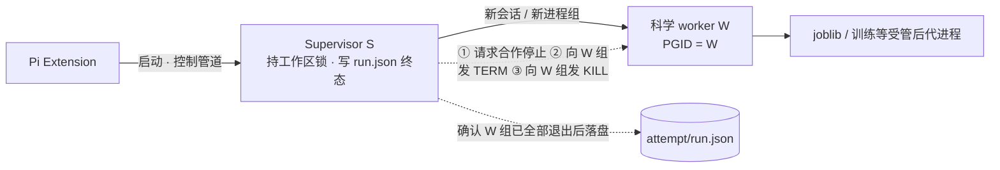
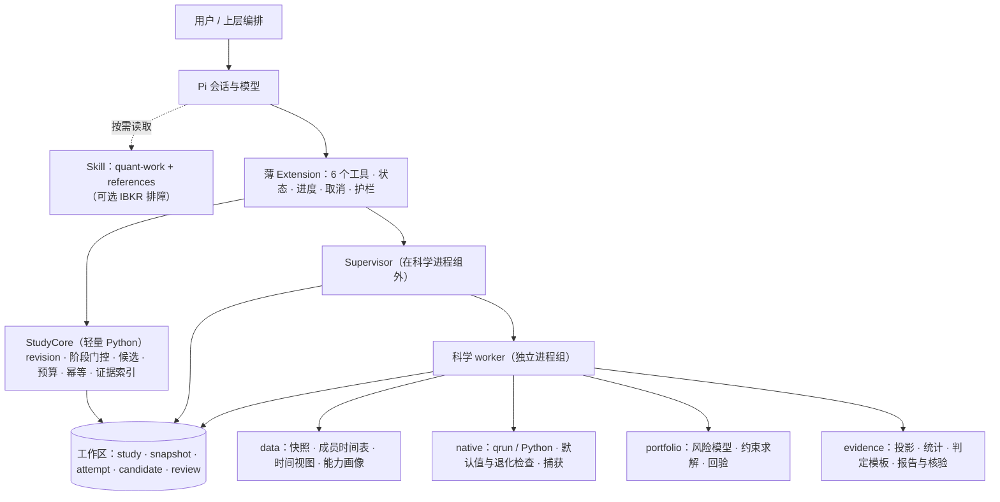

# Pi Quant 两套 package 方案全景对比（A v2.0 × B v1.0）

| 项 | 内容 |
| --- | --- |
| 日期 | 2026-09-28 |
| A 方案 | 对方团队《01_Pi_Quant_完整产品与架构设计_v2.0》《02_官方机制研究与来源_v2.0》 |
| B 方案 | 本仓库 `docs/2026-09-28_pi_quant_package_design.md`（v1.0，同日） |
| 证据 | Qlib `v0.9.7` 标签源码逐行核对；Pi 主干 `6f75515` 源码；实验 E0–E6（CPython 3.11.14／3.12.12 × `pyqlib==0.9.7`），脚本与结果见 `docs/evidence/2026-09-28_comparison_lab/` |
| 利益声明 | B 由本文作者撰写。为抵消偏向：凡属事实的分歧一律以源码或实验裁定；B 被证实的缺陷单独登记（§7.1），不以"已在路线图中"为由降级 |
| 范围限制 | A 引用的《03 实施契约与验收计划》《04 变更与审计采纳记录》及此前的 A-compare 审计均未提供。01／02 中没写到的内容标注为"01/02 未见"——这**不等于 A 缺失**，可能已写在 03 中 |
| 版本谱系 | A v2.0 已把 B v1.0 列为输入之一（02 §1.1），并把用户最新澄清列为最高优先级：研究对象不限于单票，目标是让现有 Agent 具备量化研究与交易工作能力。B v1.0 写成时还没有这条澄清。B 附录 D 对照的是交接文档里描述的 A 旧版，不是 A v2.0 |

> **勘误（2026-09-29）**：以下五处判断已被 A v2.1 纠正，经复核确认 A 正确，正文相应位置已改正：
>
> 1. E5"全零权重满足约束回验"——原问题含 `sum(w)==1`，全零会被回验拦住；
> 2. 用"返回的不是旧权重"判断求解是否发生——正常最优解可以恰好等于旧权重；
> 3. "每个（候选、评价窗口）只评价一次、重复即降级"——已由协议级评价合同取代；
> 4. "幂等键由内容哈希派生"——幂等键应与输入摘要分开；
> 5. "每次更新约 1 GB 新环境"——同一文件系统下物理增量约 2.9 MB。
>
> 详见 `docs/2026-09-29_pi_quant_v2.1_alignment_audit.md` §3；原始措辞可在提交 `32b0bff` 中查到。

**标记**：「已核实」= 源码确认；「已实测」= 本次实验复现；「判断」= 本文评估；「01/02 未见」含义见上表。

---

## 目录

0. 结论先行
1. 对比方法与证据
2. 定位与设计哲学
3. 需求覆盖矩阵
4. 共识：双方一致的决策
5. 分歧全景
6. 对照前沿实践
7. 缺陷登记
8. 架构优劣
9. 可实施性
10. 互补与融合方案
11. 需要你决定的问题

附录 A 实验细节 · 附录 B 源码核对索引 · 附录 C A 的来源编号与本文核实对照

---

## 0. 结论先行

1. **两者不是谁对谁错，而是重心不同。**
   - A 是"工作能力"型：范围宽，研发、多证券联合研究、组合、复评都放在 v1；金融与账户语义更细；工程边界谨慎；信任 Agent 的研究判断，程序只负责事实、预算和已知的不一致。
   - B 是"研究完整性 harness"型：强制点更硬（时间视图、样本外单次使用、预算、判定、证据渲染）；验证工程更完整（统计校准、Agent 行为评测、分发测试）；接口契约更具体；但 v1 范围窄。
2. **对照用户最新需求，A 的产品范围是对的。** B 的 v1 缺"组合构建与风险"和"冻结策略在新数据上的复评"，研发循环放在 v1.x、前向跟踪放在 v2，不满足"研发、联合研究、组合、复评都是 v1 必需能力"。
3. **A 对 B 的批评大多成立。** 本文共登记 B 的已证实缺陷 15 项（§7.1）：
   - 4 项已由实验复现：回撤漏算期初资产（E4）；持有基线默认只投入 95%（E3）；venv 改名后脚本失效（E1）；单标的研究的标签全部变成 NaN（E6）。
   - 3 项由源码核实：`setActiveTools` 会替换整个工具集；qrun 模板会把引用到的环境变量写进 Recorder；`extra_quote` 缺字段时静默补默认值。
4. **A 同样有缺口。**
   - 最具体的一项是 E5。A 发现增强指数优化器失败时会放宽换手约束或返回旧权重，但没有指出全新安装时最可能的触发条件：CVXPY ≥ 1.6 已不再默认安装 ECOS，而这个优化器写死了 `cp.ECOS`。结果它直接返回当前持仓（期初就是全现金），只留下一条 warning。（2026-09-29 勘误：原问题含 `sum(w)==1`，全零会被最终权重约束回验拦住；真正拦不住的是期中 w0 本身可行时"失败后返回旧仓位"，因此还需要求解过程证据。）
   - A 的研究纪律以"记录与披露"为主。01/02 里既没有管线级统计校准，也没写明确认性评价的单次使用是否由程序阻断。
5. **建议的融合方案**：以 A v2.0 为主骨架，嵌入 B 的两部分，并修掉双方已证实的缺陷。逐项决策见 §10。
   - 取自 A：产品范围、StudyCore 四阶段、前台作业约定、在最终路径上构建环境、账户与指标口径、组合与复评。
   - 取自 B 的"完整性内核"：受管时间视图、确认性评价只能做一次、关键数字只能来自证据、判定模板不可被 Agent 改写。
   - 取自 B 的"验证工程"：管线的零假设与功效校准、Agent 行为评测、三种安装路径的分发测试、IBKR 运维细节。

### 0.1 分项对比一览

| 维度 | A v2.0 | B v1.0 | 更优 | 一句话理由 |
| --- | --- | --- | --- | --- |
| 与最新需求对齐 | 强 | 中 | A | 多证券联合、组合、复评、研发都在 v1 |
| 金融与账户语义 | 强 | 中 | A | 期初资产计入回撤、相对收益分别命名、目标与持仓分离、`risk_degree` 尺度 |
| 组合构建与风险 | 强 | 弱 | A | B 基本空白 |
| 复评与持续工作 | 强 | 弱（v2） | A | A 有候选／复评契约与 `executable:false` |
| 研究完整性强制力 | 中 | 强 | B | B 在数据路径与评价门控上硬拦截 |
| 统计方法 | 中 | 强 | 互补 | B 工具更全；A 在有效试验数与样本相关性上更严谨 |
| 反幻觉交付 | 中 | 强 | B | B 所有指标数字都经证据渲染；A 只要求关键数字 |
| 进程与生命周期正确性 | 强 | 中 | A | B 的监督进程和会被 SIGKILL 的 worker 在同一进程组 |
| 环境构建正确性 | 强 | 中 | A | B 构建后改名会让脚本失效（E1） |
| 多包共存 | 强 | 中 | A | B 修改系统提示；工具激活若按字面实现会关掉他包工具 |
| 可测试性与验收工程 | 中（01/02） | 强 | B | B 有统计校准、故障注入、Agent 评测、分发测试 |
| 接口契约具体度 | 弱（01/02；03 未提供） | 强 | B | B 有工具动作、错误码、schema 草案 |
| IBKR 运维细节 | 中 | 强 | B | B 有节流调度、错误码映射、断点续传 |
| 上游来源精度 | 强 | 中 | A | A 的源码引用固定在 v0.9.7 标签；B 部分引用主干（本次已复核，所引行为在 v0.9.7 中同样成立） |
| 实施体量 | 大 | 大 | 持平 | A 重在金融功能，B 重在治理与验证；合并后比任何一方都大（§9） |

---

## 1. 对比方法与证据

### 1.1 对比维度

产品与范围、研究方法与完整性、Pi 集成、执行与生命周期、环境与分发、数据、金融语义、交付、安全、可实施性、架构质量属性、互补性。每个议题标注为"共识""互补""分歧"或"冲突"。

### 1.2 实验摘要（细节见附录 A）

| 编号 | 验证什么 | 结果（3.11 与 3.12 相同） | 对两方案的影响 |
| --- | --- | --- | --- |
| E0 | `pyqlib==0.9.7` 加上游约束能否在 3.11／3.12 安装 | 都能装，`uv pip check` 通过；解析出 numpy 2.x、mlflow 3.12.0、cvxpy 1.9.3；**不含** ecos 和 plotly；单个环境约 0.97 GB | Python 版本不构成实质分歧；两方的锁都必须显式加入 plotly（报告图表）和 ecos（如果用增强指数优化器） |
| E1 | 在临时路径构建 venv 后改名 | `python -m` 正常；控制台脚本 `qrun` 退出码 127；旧路径如果还在，脚本会**悄悄使用旧环境**；用 `uv venv --relocatable` 构建则改名后正常 | B 的"构建后原子改名"有缺陷；A 的"在最终路径构建"正确 |
| E2 | MLflow 3.12 的文件存储 | 能用，但有弃用警告（自 2026 年 2 月起） | 双方对 `mlflow<3.13` 的判断正确；中期都需要规划迁移 |
| E3 | 默认 `risk_degree` 下的全仓持有 | 实际只投入 94.96% | B 的持有／常数权重基线若沿用默认值，比较就不公平；A 的"尺度只应用一次"成立 |
| E4 | 第一期亏损 10% 时的最大回撤 | Qlib 两种累计模式算出来都是 0；把期初资产 A₀ 计入净值后是 −10% | B 用原生 `risk_analysis` 算回撤是缺陷；A 的口径正确 |
| E5 | 全新安装下的增强指数优化器 | 没有 ecos 时返回当前持仓（全零），只记 warning；装上 ecos 后正常求解 | 双方都没覆盖这个触发条件。全零违反原问题的 `sum(w)==1`，约束回验能拦住；但期中 w0 可行时的回退拦不住，需要求解过程证据（2026-09-29 勘误） |
| E6 | 单标的研究沿用 Alpha158 默认标签处理 | 标签 100% 变成 NaN | A 的"退化组合必须检测"成立；B 的陷阱清单缺这一条 |
| — | 新进程导入耗时 | 裸解释器 0.02 s；`import qlib` 约 0.5 s；`import qlib.backtest` 1.33 s | 双方"状态与控制命令不启动科学计算栈"的共识有实测依据 |

局限：只测了 Linux x86_64，没测 macOS、IBKR 或 Pi 本体；数据是合成的。

---

## 2. 定位与设计哲学

| 维度 | A v2.0 | B v1.0 |
| --- | --- | --- |
| 一句话 | 嵌入现有 Agent 的量化工作能力：研究与策略决策支持 | 诚实的量化研究员：研究完整性 harness |
| 组织单元 | 工作任务：六项岗位能力；四类任务可直接进入 | 研究问题与确认性证据：研究模式 A→D 的能力阶梯 |
| 对 Agent 的假设 | 有能力的研究者；程序管事实、预算与已知不一致，不用统一裁决代替金融理解 | 可能自我欺骗的执行者；关键规则由代码裁决，LLM 不作为强制点 |
| 使用者 | 用户、既有负责人或上层编排（其他 Agent 员工、日程调度）；强调与其他 package 共存 | 本机个人研究者，以交互确认为主 |
| 人在回路 | 只在涉及风险偏好、真实执行、付费资源等真实授权时询问；冻结可由 Agent 完成 | 最多三次确认：构建环境、冻结协议、大批量下载 |
| v1 终点 | 所有岗位能力可用，包括研发、联合研究、组合、复评和一种非日线路径 | 确认性研究与探索可用；研发循环在 v1.x，前向跟踪在 v2 |
| 对"SOTA"的理解 | 正确完成任务的比例和证据质量，不以治理层数量衡量 | 决策级证据质量：防过拟合、防泄漏、防幻觉默认生效 |
| 风险取向 | 宁可少承诺，也不越界声称；不把合理研究全部拦住 | 宁可多拦截，也不产出伪结论 |

**判断**：两种哲学分别针对两类错误。B 降低"假发现"（把噪声当成 alpha），代价是更多摩擦，对非标准研究的覆盖也更差；A 降低"做不成事"和"过度治理"，代价是更依赖 Agent 自律。

- LLM alpha 挖掘的文献（过拟合与 alpha 衰减、训练记忆造成的前视偏差）支持在少数决定假发现率的环节设置硬门控。
- A 指出的另一件事也成立：任意代码可以在一次调用里藏起内部搜索，计数器和哈希无法强制"理解"策略语义。
- 合理的分界是：**只在 package 控制数据路径和评价路径的地方硬拦截；语义层面的解释交给 Agent，但必须披露**（§10.3）。

---

## 3. 需求覆盖矩阵

R1–R8 取自交接文档的八条要求；R9、R10 是 A 02 §1.1 记录的用户最新澄清。

| 需求 | A v2.0 | B v1.0 | 评价 |
| --- | --- | --- | --- |
| R1 用户只提方向，由 Agent 操作 | 四类任务可直接进入；没给 ticker 也能研究；工程信息自动解析 | 研究流程 + 6 个工具；最多 3 次确认 | 相当。A 更适合被自动调用；B 的确认点在交互场景中更可控 |
| R2 可装入、停用、移除 | 正式发行包、安装根只读、卸载不删成果；更新前必须结束作业 | 同上，另外作业能跨重载和包更新存活，并提供 `/quant-purge` | B 能力更强但更复杂；A 更简单，边界清楚 |
| R3 优先使用 Qlib 原生能力 | 双入口、原生映射表、组合 Rolling 组件、明确 Online 的定位、检查原生默认值 | 双入口、产物捕获、有效配置审计、覆盖矩阵 | 相当。A 对 Rolling、RiskModel、Online 的映射更全；B 的默认值审计更具体 |
| R4 符合金融实际 | 成员时间表、五种时间角色、期初资产计入回撤、相对收益分别命名、目标与持仓分离、约束回验 | 能力画像、15 条协议检查、暴露匹配基线、现金收益口径、统计方法 | A 在账户与组合语义上更细；B 在检查规则与统计上更具体 |
| R5 交付能看懂且能核验 | 按成果类型组织报告；五类判断分开；关键数字由证据格式化 | 证据登记 + 所有指标数字必须引用 + 禁用词；三种状态 | B 防幻觉更强；A 的报告分型更适合多种研究 |
| R6 有限尝试、明确终点 | 记录预算和选择作用；负结果正常结束；不承诺能强制理解策略语义 | 账本 + 预算 + 样本外单次使用 + 停止规则，都由代码执行 | B 更硬；A 更坦率地承认强制的边界 |
| R7 不继承旧债 | 明确 | 明确 | 相当 |
| R8 实用、不过度设计 | 明确拒绝 PBO、全局注册中心、自动进化、独立审稿和全套后台模式 | 没有常驻服务和第二数据库，但 v1 的治理组件多 | A 更克制 |
| R9（最新澄清）多证券、组合与交易工作能力 | 必需：联合研究、受约束组合、连续账户、复评 | 有横截面研究；缺组合优化、风险模型与复评 | **这是 B 的主要缺口** |
| R10 工作连续性 | 上下文压缩或换会话后能接着研究；有候选与复评记录；继承已观察过的区间 | 会话指针 + 状态卡；继承父研究的已观察区间 | A 更完整（有复评契约） |

---

## 4. 共识：双方一致的决策

以下 18 项是双方各自独立得出的相同结论，可以视为已定，实施时无需再讨论：

1. 单一 Pi package：Extension + Skill + 内嵌 Python 项目。不另建 LLM 服务、Web 工作台、常驻服务、任务队列或第二套账户数据库。
2. Extension 保持薄，金融逻辑全部放在 Python。
3. 共 6 个工具，其中 `quant_study` 是研究状态转换的程序化入口。
4. 每次调用启动"监督进程 + 科学 worker"；先落盘事实，再按 Pi 协议抛出失败。
5. 原生入口：
   - `qrun` 与 Python 双入口；保留 `BASE_CONFIG_PATH`、相对路径与自定义类。
   - 不假定 `qrun` 会返回单个 Recorder；零个、一个或多个 Recorder 以及直接返回值都登记。
   - 默认每次运行使用独占的 Recorder 存储。
6. 原生账户是业绩权威；不自己另算交易账；不同成本情景分别运行原生账户。
7. 公平基线是同条件下的原生账户；原生的 benchmark 列不等于同成本的买入持有账户。
8. 先冻结再评价；探索与确认分开；"无优势"和"证据不足"都是正常结束。
9. 用受管时间视图隔离开发数据与最终评价数据。
10. 快照清单记录来源、请求、取数时间、复权口径、成交量单位、时区与数据质量；不伪造 `$factor`、VWAP 或单位。
11. IBKR 相关：
    - 只读历史数据，不下单。
    - `TRADES` 与 `ADJUSTED_LAST` 的复权口径不同；成交量单位取决于 TWS 设置。
    - 已停止交易的证券拿不到数据，因此当前可请求的证券集合带有幸存者偏差。
12. 环境与依赖：
    - 锁定依赖，吸收上游 `mlflow<3.13` 等约束，并做 Recorder 冒烟测试。
    - 非 editable 安装；冷启动不依赖尚未安装的科学计算库；不用 postinstall。
13. 安装根与研究工作区分离；卸载不删除研究成果；外部 store 不因被引用而获得删除权。
14. 报告：
    - 离线 HTML，用真实浏览器核验，核验记录绑定 HTML 哈希。
    - 自动断言与目视检查分开记录；修改报告不触发重算。
15. 执行状态、交付检查与研究结论分开表达。
16. 记录所用模型；知识截止日拿不到时如实记为"未知"。
17. 首批平台为 macOS 与 Linux；不声称原生支持 Windows。
18. 实施基线：Pi 0.87.1（Node ≥ 22.19）、`pyqlib==0.9.7`。

---

## 5. 分歧全景

每行给出双方立场、评估依据和建议取舍；"E"编号指 §1.2 的实验。

### 5.1 产品与范围

| # | 议题 | A v2.0 | B v1.0 | 评估 | 建议 |
| --- | --- | --- | --- | --- | --- |
| D1 | v1 范围 | 研发、多证券联合研究、受约束组合、复评和一种非日线路径都是 v1 必需；单股 demo 只算工程切片 | 确认性研究 + 探索扫描；研发循环在 v1.x；前向跟踪在 v2；日内数据在 v1.x | 按最新需求 A 正确；但 A 的 v1 体量大，首次交付更晚 | 采纳 A 的范围，把非日线放到 v1 最后一个里程碑 |
| D2 | 多证券行为 | 区分三类：多票批处理、联合研究、组合／多策略，不允许互相冒充 | 只区分单资产与横截面 | A 的区分更准确，可以直接写成验收用例 | 采纳 A |
| D3 | 分析维度 | `analysis_axis`（时序／横截面／面板／组合）与 `intent`（探索／确认／描述／复评）互相独立 | 按问题类型分：择时、横截面、因子、模型、风险 | A 的建模更清晰，能避免"按证券个数选方法" | 采纳 A；B 的基线规则按分析维度挂接 |
| D4 | 组合构建与风险 | 完整闭环： ① 只用决策前数据的协方差（Qlib RiskModel） ② 在原生策略里用 cvxpy 求解小型配置问题 ③ 区分硬约束与软目标 ④ 回验最终权重 ⑤ 目标权重与实际持仓分开 ⑥ 多策略合成到同一个连续账户 | 只有基线和 TopkDropout；增强指数被列为"需要外部数据" | **B 的最大缺口** | 采纳 A，并补上 E5 暴露的"求解确实发生"检查 |
| D5 | 复评与持续工作 | 候选冻结的是策略规则，不是未来的全部状态；有复评的输入输出契约；输出标 `executable:false`；回溯补做与实时发出分开标识；可重放连续账户 | v2 做前向跟踪（记录影子信号） | A 更完整，时间也更早；B"前向跟踪提供无污染样本"的思路可以并入 A 的复评 | 采纳 A；B 的"带时间戳的信号记录"作为复评的实现细节 |
| D6 | 人在回路 | 只为真实授权询问；冻结由 Agent 完成；不为凑"最多几次确认"越过授权 | 构建环境、冻结协议、大批量下载三处确认 | 自动化场景下 A 正确；交互场景下 B 的冻结确认是有效的约束机制 | 默认由 Agent 冻结并记录批准者；提供"冻结须用户确认"的开关 |
| D7 | 使用者模型 | 可被上层编排与其他员工调用；不内建员工目录、收件箱或队列 | 以个人交互为主；可选调用子 Agent 和网络检索 | A 的边界更清楚；B 的软集成不构成依赖，二者不冲突 | 采纳 A 的边界 |

### 5.2 研究方法与完整性

| # | 议题 | A v2.0 | B v1.0 | 评估 | 建议 |
| --- | --- | --- | --- | --- | --- |
| D8 | 强制哲学 | 针对性防错；记录暴露、预算和选择；承认任意代码能藏起搜索 | 协议、视图、账本、预算、判定都由代码裁决 | 见 §2 的判断；可以按"路径是否由 package 控制"分层 | 按 §10.3 的三层分工 |
| D9 | 研究阶段 | 4 个：draft → exploring → locked → closed；运行状态、核验、结论都不复制为阶段 | 8 个：scoping → frozen → developing → candidates_locked → evaluated → reported → closed，另有 aborted | A 更简洁，避免同一事实记两处；B 的 evaluated、reported 与运行和报告记录重复 | 采纳 A 的 4 个阶段；B 的门控条件挂在 exploring → locked 的转换上 |
| D10 | 判定机制 | 不建字符串判定语言；可选 θ／δ 模板：区间下界 > δ 为支持，上界 < δ 为不支持，其余为证据不足，三支互斥 | 在协议里写字符串规则，例如"primary <= 0 or ci90.upper < 0.01"判为无优势 | A 更严谨：B 的"点估计 ≤ 0 即无优势"没考虑区间宽度，字符串规则也可能重叠或遗漏 | 采纳 A 的模板；保留 B 的"判定语句由构建器插入，Agent 不能改写" |
| D11 | 多重检验与 DSR | 按任务选择方法；不把登记次数直接当独立试验数；不输出未校准的"成功概率"；注意重叠标签与跨资产的共同冲击 | 默认计算 PSR／DSR，试验数 N 取账本计数；自助法区间；MinTRL | B 的 N 两个方向都可能有偏：相关的试验让 N 偏大（DSR 过严），一次调用里的隐藏网格让 N 偏小（DSR 过松）。A 的原则正确，但 01/02 没给具体方法 | 保留 B 的工具；DSR 作为诊断而非闸门；有效试验数用试验收益相关性聚类估计；网格内的候选必须申报 |
| D12 | 时间角色与泄漏检查 | 五种时间角色；四类泄漏分别控制；v1 就做前缀不变性测试（扰动未来数据）；指出"视图截断挡不住窗口内偷看" | 窗口 + 禁区；对 `shift=1` 做 AST 启发式检查；动态扰动测试放在 v1.x | A 正确：时间视图只隔离开发期与评价期，挡不住回测窗口内读 t+1 的数据 | 采纳 A 的五种时间角色和 v1 前缀不变性测试；B 的 AST 检查降为警告 |
| D13 | 预算计量 | 记录研究候选及其选择作用、工程修复、数据刷新、报告重绘；网格必须披露实际候选集合 | 账本分类 + 预算上限 + 按哈希把"工程修复"重新归类为试验 | 方向相同；A 的"修复不会自动免除选择影响"表述更准确 | 采纳 A 的计量口径；B 的预算上限保留为硬约束 |
| D14 | LLM 前视 | 记录模型、已知的暴露；做真实的前向观察；不让用户猜知识截止日 | 知识截止日、污染标记、截止日后留出期、先写先验；v2 做前向 | B 更具体；A 的"不让用户猜"更稳妥 | 合并：截止日取提供商元数据，拿不到就记"未知"，但照样标记风险 |
| D15 | 暴露匹配基线 | 正式的低暴露基线必须事前确定，或只用开发期估计；按评价期平均仓位匹配只能作事后诊断 | 示例 `weight: match_avg_exposure_of(S1)` 没限定估计区间 | 如果按评价期估计，基线就用了事后信息——B 的缺陷 | 采纳 A |
| D16 | 指标口径 | 从账户序列计算，净值包含期初资产 A₀；累计收益差、相对财富、CAGR 差、主动收益分别命名 | 用原生 `risk_analysis(N=252, mode="product")` 计算回撤和年化 | E4：原生两种模式都漏掉第一期亏损造成的回撤——B 的缺陷 | 采纳 A 的口径；原生默认输出只作附表 |

### 5.3 Pi 集成

| # | 议题 | A v2.0 | B v1.0 | 评估 | 建议 |
| --- | --- | --- | --- | --- | --- |
| D17 | 工具划分 | `quant_prepare`、`quant_data`、`quant_study`、`quant_run(mode=native｜analyze｜review)`、`quant_inspect`（只读、分页）、`quant_report` | `quant_workspace`、`quant_data`、`quant_study`、`quant_run`、`quant_analyze`（含 inspect 动作）、`quant_report` | A 按读写分：只读查询永远不会被写锁阻塞，重分析与复评共用受管运行器。B 按领域分，动作级契约更具体 | 采纳 A 的划分，沿用 B 的动作级契约和错误码 |
| D18 | Skill 组织 | 1 个入口 Skill `quant-work` + 按需读取的 references；没有提示模板 | 3 个 Skill（研究、Qlib 原生、IBKR）+ 3 个提示模板 | 单一入口能避免加载漏掉；但 description 上限 1024 字符，IBKR 排障的路由精度可能下降 | 单一入口 + references；另设一个可选的 IBKR 排障 Skill；保留提示模板（成本很低） |
| D19 | 工具可见性 | 默认 6 个都可见；如需动态激活，只增删本包自己的工具，并验证与他包共存 | 默认只激活 1 个，其余按需激活 | 已核实：`setActiveTools` 用给定列表**替换**整个激活集（包括内置的 read／bash／edit 和他包工具），并重建系统提示；扩展工具默认全部激活，要默认隐藏必须在 `session_start` 显式调用 | 默认可见（A）；如果实测上下文开销明显，再以"取并集"的方式隐藏 |
| D20 | 系统提示注入 | 不改他包的工具与系统提示；状态卡按需读取 | 有活动研究时，每轮在 `before_agent_start` 追加状态卡 | 每轮注入有 token 成本，还会和他包的提示修改互相干扰；B 的收益是上下文压缩后不迷失方向 | 状态卡只在压缩后或阶段变化时注入一次，平时由工具结果携带 |
| D21 | 终端 UI | 不依赖自定义终端控件；子命令以固定 Pi 版本验收 | 仪表盘浮层、进度组件、自定义确认对话框 | A 在 TUI／RPC／print 各模式下更稳；B 体验更好 | v1 只用 Pi 标准对话框、状态栏和工具渲染；自定义组件以后再做 |
| D22 | 独立审稿、因子原创性、PBO | 都不做；需要协作时由上层机制负责 | v1.x 路线：独立审稿（嵌套模型调用）、AST 原创性检查、PBO | A 的克制合理；候选多时 PBO 有真实价值 | 都放到 v1 之后；PBO 作为按需诊断，不做成平台 |

### 5.4 执行与生命周期

| # | 议题 | A v2.0 | B v1.0 | 评估 | 建议 |
| --- | --- | --- | --- | --- | --- |
| D23 | 前台与后台 | 作业在前台受管；控制管道一关闭就终止（Pi 退出后不继续）；更新包前必须结束作业；后台作为以后的独立关口 | 作业脱离 Pi 的进程组运行，能跨重载、Pi 退出和包更新存活；支持 `wait:false` 后台运行，结束后用 followUp 唤起 Agent | Pi 会把工具执行期间用户发来的消息排队，长时间的前台训练会阻塞对话，这是 A 的真实体验成本。B 能力更强，但孤儿作业、重新挂接、唤醒语义都需要验收 | v1 采纳 A；B 的后台设计作为 v1.x 关口 |
| D24 | 进程拓扑 | 监督进程 S 持锁、写终态，**不在**科学进程组内；worker W 自成进程组；先请求合作停止，再向 W 组发 TERM，最后 KILL；防止误杀复用的 PID | 监督进程是组长，worker 在同一组；取消时向整组发 TERM，之后发 KILL | B 的缺陷：整组 SIGKILL 会把监督进程一起杀掉，它就无法写终态，违背 B 自己的"失败可见"原则 | 采纳 A |
| D25 | 并发 | 同一工作区同时只能有一个会修改科学事实的长作业；只读查询和取消不被写锁阻塞 | 每项研究一把写锁，加全局并发上限（1–2） | 效果接近；A 更简单，B 允许两项研究并行 | 采纳 A；并行作为以后的选项 |
| D26 | 幂等 | 请求 ID 与内容都相同时返回已有结果；同一 ID 内容不同则报冲突；候选身份由依赖内容决定 | 没有定义 | B 的缺陷：模型可能重试工具调用 | 采纳 A；操作 ID 由程序生成并在产生副作用前持久化，与输入摘要分开（2026-09-29 勘误：不应由内容哈希派生，否则会误伤合法复现） |
| D27 | 同进程批量运行 | 可以共享只读输入，但不能共享可变的模型、账户、缓存和随机状态；用独立执行对照与顺序互换测试来证明 | 一个 worker 只初始化一次 Qlib，批量运行候选、基线和成本情景 | B 的性能收益是真的，但 Qlib 有全局配置和表达式、数据集缓存，存在串扰风险 | 保留批量运行；把顺序互换和独立执行对照列为验收测试 |

### 5.5 环境与分发

| # | 议题 | A v2.0 | B v1.0 | 评估 | 建议 |
| --- | --- | --- | --- | --- | --- |
| D28 | 环境位置与身份 | 放在工作区 `.quant/runtime/<id>`；ID 覆盖本包代码与资源、Python、平台、完整锁和 extras；本包以非 editable 方式安装进去 | 放在包主目录共享：`envs/<profile>-<lockhash>`；每次运行快照 harness 代码 | A 让环境不依赖安装根，身份也完整；代价是每次包更新都要建一个新环境（逻辑体积约 1 GB；同一文件系统上 uv 缓存的硬链接能大幅减少实际占用），而且每个工作区各有一份。B 更省空间，更新时不用重建 | 分两层：科学计算层按锁哈希共享，代码层按包版本做小型非 editable 安装；两层都在最终路径构建 |
| D29 | 构建方式 | 直接在最终路径构建，原子写入 READY 清单；不移动已经装好的环境 | 在 `.building-<id>` 构建，再原子改名 | E1：改名后控制台脚本失效，旧路径还在时会悄悄用旧环境——B 的缺陷 | 采纳 A；也可以用 `uv venv --relocatable`（E1 已验证） |
| D30 | 锁文件形式 | `uv.lock` + `uv sync`，非 editable | 每个 profile 用 `uv pip compile --universal` 生成一份锁 | 都可行；`uv.lock` 和项目元数据一体，extras 更好管理 | 采纳 `uv.lock`；与核心冲突的依赖（如 RL 需要 `numpy<2`）用独立 runtime |
| D31 | Python 版本 | 3.11 | 3.12 | E0–E6：两个版本的安装和行为完全一致；3.11 支持到 2027-10，3.12 支持到 2028-10 | 选 3.12（支持期更长），可选 profile 各自验证 |
| D32 | 作业期间更新包 | 必须先完成或取消作业 | 作业使用快照代码和不可变环境，不受影响 | 与 D23 绑定；前台模式下 A 的规则足够 | 跟随 D23 |

### 5.6 数据

| # | 议题 | A v2.0 | B v1.0 | 评估 | 建议 |
| --- | --- | --- | --- | --- | --- |
| D33 | 证券集合与成员 | 成员记录包含合约身份、有效区间、可知时间、纳入／排除理由和来源；区分"研究可见""当期可买""实际持有"三种集合；动态资格规则只用决策前可知的数据；按合约身份而不是 ticker 关联 | 标的与 conId 的映射；幸存者偏差标记 | A 更完整，是多证券研究的前提 | 采纳 A |
| D34 | 能力画像与门控 | 按研究定义限制结论（"复权价上的连续仓位"与"有真实价格和股数映射的账户"是两种定义） | 显式能力画像表 + 门控规则 + 协议检查 L10 | 同一思想；B 的表可以直接执行，A 的"研究定义"措辞更好 | 合并：画像字段用 B 的，结论措辞用 A 的 |
| D35 | IBKR 连接 | 不改共享 Gateway 的端口，也不重启共享 Gateway；client ID 只是连接身份，不是隔离手段 | 自动探测 7497／7496／4002／4001（含实盘端口），连到实盘端口时发警告 | 用户可能在同一个 Gateway 上跑其他交易系统，A 更安全 | 只用配置好的端口；探测要先征得同意，且默认不探测实盘端口 |
| D36 | 节流与错误处理 | 只写原则：按错误类型有限次重试，遵守适用的节流规则 | 有节流调度器、错误码映射、断点续传，`reqHeadTimeStamp` 用完即取消 | B 可以直接施工 | 采纳 B 的细节 |

### 5.7 交付

| # | 议题 | A v2.0 | B v1.0 | 评估 | 建议 |
| --- | --- | --- | --- | --- | --- |
| D37 | 报告组织 | 按成果类型组织：描述、因子与预测、策略与组合、风险诊断、复评与交接 | 固定 12 节，按条件显示 | 研究类型多时 A 更合适 | 采纳 A 的分型；每种类型内部沿用 B 的章节和证据索引 |
| D38 | 数字政策 | 数字卡、表格和关键比较数字由证据格式化；自由解释不强制用占位符；不靠禁用词表 | 叙述里所有指标类数字都必须引用证据；检查自由出现的数字；出现禁用词直接报错 | B 防幻觉更强，但日期、窗口长度、参数值、计数容易误报，禁用词直接报错也过于生硬 | 关键数字强制引用（A 与 B 一致）；自由数字若看起来是指标且与证据不符则报错，否则只警告；禁用词降为警告 |
| D39 | 判断粒度 | 五类：软件执行、研究检查、冻结的数值条件、Agent 的研究解释、报告核验 | 三类：计算、交付检查、研究结论 | A 把"研究检查覆盖了什么"和"Agent 的解释"单独列出，更诚实 | 采纳 A 的五类；界面上可以合并展示 |

### 5.8 安全

| # | 议题 | A v2.0 | B v1.0 | 评估 | 建议 |
| --- | --- | --- | --- | --- | --- |
| D40 | qrun 模板变量 | 模板只能用明确允许的环境变量 | 通过 `PIQUANT_*` 环境变量注入参数 | 已核实：`render_template` 会渲染模板里引用的任何环境变量，渲染后的配置会经 `recorder.save_objects(config=...)` 存进 Recorder。模板一旦引用了含密钥的变量，密钥就会落盘 | 采纳 A：在白名单环境中运行 qrun |
| D41 | pickle 与报告注入 | 不自动反序列化来源不明的 pickle；报告文字要转义，不执行模型生成的脚本 | 没有涉及（只用 CSP 禁止外部请求） | 本包自己运行产生的 Recorder pickle 可信；外部登记的 store 不可信 | 采纳 A |
| D42 | "不下单"的保证 | 不注册交易工具；`trade_proposal` 标 `executable:false`；强隔离靠环境权限；不改共享 Gateway 的设置 | 三层：代码里没有下单路径，CI 用 AST 检查禁止调用下单 API；推荐开启 TWS 只读 API；`readonly=True` 只有客户端语义 | 互补 | 两边合并 |

---

## 6. 对照前沿实践

| 前沿实践 | 代表依据 | A v2.0 | B v1.0 | 融合建议 |
| --- | --- | --- | --- | --- |
| 预注册与冻结 | 多重检验与 DSR 相关研究 | 冻结 revision，锁定候选 | 冻结协议 + 用户确认 + 哈希 | 内核相同，授权方式可配置 |
| 清除与禁区 | López de Prado 的 purged CV | 五种时间角色；由标签实际结束时间决定清除区间 | 窗口 + 禁区（≥ 标签期限） | 用 A 的时间角色模型 |
| 动态泄漏检测 | 前缀不变性／扰动测试 | v1 | v1.x | 放在 v1 |
| 多重检验校正 | DSR、PBO | 谨慎使用，要求有效试验数 | 默认计算 PSR／DSR，PBO 放 v1.x | 作为诊断 + 估计有效 N |
| 管线级校准 | 零假设模拟、植入信号的功效测试 | 01/02 未见 | 有 | 采纳 B |
| 时点数据与幸存者偏差 | 数据方法学 | 成员可知时间、三种集合 | 能力画像 + 强制披露 | 合并 |
| 成本与执行真实性 | 业界实务 | 每个成本情景分别原生运行；不冒充券商账单；决策、成交、持仓变化分开 | 每个成本情景分别原生运行；近似要声明 | 合并 |
| 组合约束确实被满足 | 优化实务 | 回验最终权重 | 无 | 用 A 的做法，并加上求解真实性检查 |
| LLM 记忆前视 | Gao, Jiang & Yan（2026）；Didisheim 等（2025） | 模型身份 + 前向观察 | 知识截止日 + 污染标记 + 留出期 | 合并 |
| 研究—开发—反馈循环 | RD-Agent(Q)（NeurIPS 2025） | 由 Pi Agent 自己在有限范围内完成，v1 | 模式 C，v1.x | 时间点用 A 的，试验账本用 B 的 |
| 正则化探索 | AlphaAgent（KDD 2025） | 相关性、覆盖、消融分析；不建平台 | v1.x 做 AST 原创性平台 | v1 用 A 的做法，AST 以后再做 |
| 反幻觉数字 | Agent 工程实践 | 关键数字必须引用 | 所有指标数字都必须引用 | 分级（D38） |
| 独立审查 | critic 模式 | 交给上层协作 | v1.x 用嵌套模型调用 | 以后再做 |
| Agent 行为评测 | Agent 评测实践 | 岗位任务评测 | 事件流断言，至少两个模型家族 | 合并 |
| 可复现性 | 内容寻址 | attempt 快照、runtime ID | 快照、锁哈希、代码快照 | 合并 |
| 前向检验 | 业界实务 | 复评契约，v1 | v2 | 用 A 的 |

---

## 7. 缺陷登记

### 7.1 B v1.0 的缺陷（已核实）

| # | 缺陷 | 严重度 | 证据 | 来源 | 修正 |
| --- | --- | --- | --- | --- | --- |
| B-1 | 用原生 `risk_analysis` 计算最大回撤，漏掉第一期亏损 | 高 | E4 | A 指出，实验复现 | 净值包含 A₀；原生默认输出只作附表 |
| B-2 | 持有与常数权重基线若继承 `risk_degree=0.95`，实际只投入 95% | 高 | E3；`signal_strategy.py:32`、`order_generator.py:187` | A 指出尺度问题，本文推出它对 B 基线的影响 | 基线与候选使用同一个显式的 `risk_degree`；目标权重定义为占总资产的比例，尺度只应用一次 |
| B-3 | 在临时目录构建环境后改名：控制台脚本失效，旧路径还在时会悄悄用错环境 | 高 | E1 | A 指出，实验复现 | 在最终路径构建，或用 `uv venv --relocatable` |
| B-4 | 监督进程与 worker 在同一进程组，整组 SIGKILL 后无法写终态 | 高 | SIGKILL 无法捕获（Python `signal` 文档）；B §7.3、§15.7 | A 指出 | 把监督进程放到科学进程组之外 |
| B-5 | 暴露匹配基线可能用了评价期的平均仓位 | 中 | B 附录 B：`match_avg_exposure_of(S1)` | A 指出 | 事前确定，或只用开发期估计 |
| B-6 | DSR 的试验数 N 直接取账本计数 | 中 | 相关试验会让 N 偏大，隐藏网格会让 N 偏小 | A 指出 | 聚类估计有效 N；网格内候选必须申报；DSR 只作诊断 |
| B-7 | 判定规则把"点估计 ≤ 0"直接判为"无优势"；字符串规则可能重叠或遗漏 | 中 | B §13.10、附录 B | A 指出 | 改用 θ／δ 区间模板 |
| B-8 | 默认隐藏工具若按字面调用 `setActiveTools`，会关掉内置工具和他包工具 | 中 | `agent-session.ts:1282–1294` | A 提出共存原则，本文源码核实 | 默认可见；需要隐藏时取并集 |
| B-9 | 单标的研究若沿用 Alpha158／Alpha360 默认处理器，标签全为 NaN；B 的陷阱清单没列这一条 | 中 | E6；`handler.py:37–39` | A 指出 | 检测"单标的 + 截面处理器"组合，并拒绝运行 |
| B-10 | 没有请求级幂等 | 中 | B 未定义 | A 指出 | 用请求内容哈希作幂等键 |
| B-11 | 同进程批量运行没有要求隔离验证 | 中 | Qlib 的全局配置 `C` 与各种缓存 | A 指出 | 加入顺序互换测试和独立执行对照 |
| B-12 | qrun 模板会渲染任何被引用的环境变量，并存进 Recorder | 中 | `run.py:77`、`run.py:148` | A 提出原则，本文源码核实 | 在白名单环境中运行 |
| B-13 | 自动探测包括实盘端口，可能碰到共享 Gateway | 中 | B §12.2 | A 指出 | 只用配置的端口；探测需征得同意 |
| B-14 | 默认值审计漏掉了 `extra_quote` 的静默补值（成交价补 `$close`、`$factor` 补 1、涨跌停补 False） | 低 | `exchange.py:239–254` | A 指出，本文源码核实 | 并入有效配置审计 |
| B-15 | 范围缺口：v1 没有组合构建与风险，也没有冻结策略的复评 | 高（相对最新需求） | §3 的 R9、R10 | A 指出 | 采纳 A 的第 10、11 章 |

### 7.2 A v2.0 的缺陷与风险

| # | 问题 | 严重度 | 证据 | 建议 |
| --- | --- | --- | --- | --- |
| A-1 | 没覆盖增强指数优化器在全新安装下的实际触发条件：CVXPY ≥ 1.6 不再默认安装 ECOS，而该优化器写死了 `cp.ECOS`，于是直接返回当前持仓，期初就是全现金。（2026-09-29 勘误：全零违反原问题的 `sum(w)==1`，会被约束回验拦住。）A 的严格路径不默认使用这个便利类，所以影响主要在"保留上游行为"的诊断路径和原生 `EnhancedIndexingStrategy`；但只要 w0 本身可行，"约束回验拦不住回退到旧权重"这一点对任何带回退的求解路径都成立 | 中 | E5；`enhanced_indexing.py:154,171,183,189–192`；cvxpy 1.6.0 起 ecos 只作为可选 extra | 锁里显式加入 ecos，或在自有策略中显式指定求解器；记录求解过程证据（是否尝试求解、原始状态、结果来源、solver_stats），不以权重是否变化作判据（2026-09-29 勘误） |
| A-2 | v1 范围宽，所有岗位能力要到 M3 才宣布完成，首次交付周期长；IBKR 专项没有证据时一直是 BLOCKED | 高（进度风险） | 01 §22 | 按纵向切片尽早交付：M1 结束时单资产研究和联合研究就能给用户用；非日线放到最后 |
| A-3 | 研究纪律以记录与披露为主；01/02 没写明重复做确认性评价时是否由程序阻断 | 中 | 01 §12–13 | 在受管路径上硬性限制为一次（§10.3）；重复评价必须带理由，并降级判定 |
| A-4 | 01/02 中没有管线级统计校准（零假设下判"支持"的比例、植入信号时的功效） | 中 | 01 §13.3、§22 | 采纳 B §18.4 |
| A-5 | 前台模式下，长时间训练会阻塞对话；Pi 退出即取消；由上层日程触发的复评也必须在前台完成 | 中（体验） | Pi 在工具结束后才处理用户消息 | v1 接受；把 B 的后台设计作为 v1.x 关口 |
| A-6 | 环境身份包含本包代码，每次包更新都要生成一个新环境；多个工作区各有一份（2026-09-29 勘误：逻辑大小约 1 GB，但同一文件系统、uv 缓存已热时物理增量约 2.9 MB，见 v2.1 审计 E9） | 低 | 01 §18.3；E0 测得的体积 | 先实测跨文件系统的情况，再决定是否分两层（D28） |
| A-7 | 自由解释里的数字不强制来自证据，模型抄错或编造的数字可能出现在正文 | 中 | 01 §16.1 | 按 D38 折中 |
| A-8 | 冻结由 Agent 完成，交互式用户失去了在协议上签字的机会 | 低 | 01 §12.2 | 冻结策略可配置（D6） |
| A-9 | 单一入口 Skill 要同时路由研究、组合、复评和 IBKR 排障，而 description 只有 1024 字符 | 低 | Pi Skills 文档 | 按 D18 |
| A-10 | 01/02 的契约多用"不……"来表述约束，缺少可直接施工的 schema、错误码和工具参数 | 低（文档问题，03 可能已有） | 01/02 | 用 B 的附录 B／C 作为 03 的输入 |
| A-11 | 默认 6 个工具在非量化会话中也可见，增加上下文开销和误选工具的可能（01 已说明需要实测） | 低 | 01 §19 | 实测后再决定 |

---

## 8. 架构优劣

### 8.1 质量属性

| 属性 | A v2.0 | B v1.0 | 说明 |
| --- | --- | --- | --- |
| 金融正确性 | 强 | 中 | B 有 B-1、B-2、B-5、B-7、B-9 |
| 工程正确性 | 强 | 中 | B 有 B-3、B-4、B-8；A 有 A-1 |
| 简洁性 | 强 | 中 | A：4 个阶段、只有前台、没有判定语言；B：8 个阶段、后台作业、判定规则、叙述检查 |
| 可扩展性 | 强 | 强 | 都是单包 + 单个科学项目；A 的原生映射覆盖更广，B 列出了每类变更会触及哪些模块 |
| 可测试性 | 中 | 强 | B 的规则是确定性的，可以做单元测试，还有统计校准；A 把部分判断交给 Agent，只能靠任务评测验证 |
| 可运维性 | 强 | 中 | A 只有前台作业，不会留下孤儿作业；B 需要重新挂接、心跳和回收 |
| 性能 | 中 | 强 | B：同进程批量、共享环境、后台作业；A：只有前台，每次包更新都要重建环境 |
| 安全 | 强 | 中 | A：模板变量白名单、pickle 策略、不碰共享 Gateway；B：用 AST 检查禁止下单 API |
| 多包共存 | 强 | 中 | 见 B-8、D20 |
| 用户体验 | 中 | 强 | B：仪表盘、进度组件、后台作业；A：只用标准控件 |
| 证据可信度 | 中 | 强 | B 有硬门控和证据渲染 |

### 8.2 组件逐项

| 组件 | A v2.0 | B v1.0 | 建议 |
| --- | --- | --- | --- |
| Extension | 注册 6 个工具；状态、进度、取消；没有自定义控件 | 同样的能力，另有护栏钩子、状态卡注入、动态激活、确认对话框、仪表盘 | 以 A 为基础，加上 B 的受保护路径护栏和标准确认对话框 |
| Skill | 1 个入口 + references | 3 个 Skill + 3 个提示模板 | 1 个入口 + references + 可选的 IBKR 排障 Skill + 提示模板 |
| 状态核心 | StudyCore：revision、阶段、候选、预算、引用；计数与索引都能重建 | 控制面：状态机、协议检查、账本、证据、作业索引 | StudyCore 为骨架，加上 B 的协议检查规则与账本。账本只作可重建的索引，`run.json` 是唯一事实来源 |
| 运行器 | S 在进程组外持锁；W 是独立进程组；控制管道收到 EOF 就终止 | 监督进程与 worker 同组，脱离 Pi 运行 | 采用 A |
| 数据 | 成员时间表、三种集合、快照身份 | 能力画像、质量检查、时间视图、IBKR 细节 | 合并 |
| 原生适配 | 原生映射表、组合 Rolling 组件、`risk_degree` 尺度、`extra_quote` 检查 | qrun 与脚本适配、有效配置审计、捕获与投影、基线类、批量运行 | 合并，并补上 E5、E6 两项检查 |
| 证据与报告 | 按成果分型；五类判断；关键数字引用证据 | 证据登记、叙述检查、12 节报告、两级核验 | 合并（D37–D39） |
| 环境 | 工作区 runtime、在最终路径构建、READY 清单 | 包主目录共享、按锁哈希标识、冷启动时自行引导 uv | 两层 runtime（D28），冷启动引导沿用 B |

### 8.3 进程拓扑的正确形态

- B 的形态：S 与 W 同组，整组收到 SIGKILL 时 S 也会被杀。
- A 的形态：S 一直存活到终态落盘为止。
- S 自己被强杀时，下次进入按 PID、启动时间、nonce 与 PGID 核对，并记为 interrupted（A 的做法）；B 的"心跳过期"判定可以作为补充信号。

---

## 9. 可实施性

### 9.1 v1 工作量构成（相对规模，判断）

| 能力块 | A v1 | B v1 | 融合后的 v1 |
| --- | --- | --- | --- |
| 分发、环境、冷启动 | 中 | 中 | 中 |
| 监督进程与生命周期 | 小（只有前台） | 大（后台、重新挂接） | 小 |
| 状态核心与协议 | 小 | 大（8 个阶段、15 条检查、判定规则） | 中 |
| 数据：IBKR + 文件 + provider | 中 | 中 | 中 |
| 数据：成员时间表与动态资格 | 中 | — | 中 |
| 原生双入口、捕获、审计 | 中 | 中 | 中 |
| 时间视图 | 小 | 小 | 小 |
| 泄漏动态测试 | 中 | （v1.x） | 中 |
| 研发诊断（相关性、覆盖、消融） | 中 | （v1.x） | 中 |
| 组合与风险（协方差、约束、回验） | 大 | — | 大 |
| 复评与连续账户 | 大 | — | 大 |
| 非日线路径 | 中 | （v1.x） | 中（放最后） |
| 统计工具 | 小到中 | 中 | 中 |
| 证据、报告、核验 | 中 | 大 | 大 |
| 统计校准、Agent 评测、分发测试 | 中（岗位评测） | 大 | 大 |

结论：A 的 v1 重在金融功能，B 的 v1 重在治理与验证，两者体量接近。融合后的 v1 比任何一方都大，需要按 §10.5 的顺序推进，并严格执行延后清单。

### 9.2 关键外部依赖

| 依赖 | 对 A 的影响 | 对 B 的影响 |
| --- | --- | --- |
| IBKR 实连（TWS 或 Gateway、行情权限） | M1 可以先用授权的外部快照推进；IBKR 专项没有证据就保持 BLOCKED | M2 的退出标准需要一份实连快照 |
| macOS 上的 OpenMP（LightGBM 需要） | 必须处理；01/02 没提到 | doctor 检测并引导安装 |
| 求解器（ECOS、Clarabel、OSQP） | 组合能力依赖它，受 E5 影响 | 不涉及 |
| MLflow 文件存储被弃用（E2） | 双方相同 | 双方相同 |
| 用于核验的浏览器 | 双方相同 | 双方相同 |

### 9.3 完成定义

- A：每个里程碑都写了"不得偷换的完成定义"，最后以岗位任务评测收口，并把研究能力验收与盈利证明分开。
- B：每个里程碑都有必须附带运行证据的退出标准，另外还有统计校准和 Agent 行为评测。
- 两者都拒绝"API 能调用就算通过"。

融合时两种验收缺一不可：A 的岗位任务评测回答"能不能把事做成"，B 的零假设与功效校准回答"做出来的结论可不可信"。

---

## 10. 互补与融合方案

### 10.1 融合原则

1. 产品范围与金融语义以 A 为准。
2. 研究完整性只在 package 控制数据路径和评价路径的地方硬拦截；其余部分记录、披露，并交给 Agent 解释。
3. 工程上采用更简单且已证明正确的做法（A 的前台作业、进程拓扑、最终路径构建）；更强的能力（B 的后台作业）作为以后的关口。
4. 验证工程以 B 为准，并加入 A 的岗位任务评测。
5. 双方已证实的缺陷全部修正，不以"放到后续版本"为由保留。

### 10.2 逐项融合决策

| 议题 | 采用 | 来源 |
| --- | --- | --- |
| 产品范围 | 研发、多证券联合研究、受约束组合、复评进入 v1；非日线放在 v1 最后一个里程碑 | A（调整了顺序） |
| 研究对象模型 | `subject` + `analysis_axis` + `intent` | A |
| 研究阶段 | draft → exploring → locked → closed | A |
| 冻结授权 | 默认由 Agent 冻结，并记录批准者与渠道；可配置为"须用户确认" | A + B |
| 确认性评价 | 以 A v2.1 §12.5 的协议级评价合同为准：冻结评价协议与研究谱系、允许运行集和选择规则；复现不增加独立证据，也不降级；看过结果后再修改即失去"未接触确认"标签（2026-09-29 勘误：取代原先的"每个（候选、评价窗口）只评价一次、重复即降级"） | A v2.1 |
| 判定 | θ／δ 区间模板；判定语句由构建器插入，Agent 不能改写，但可以拒绝做出"可以部署"的推断 | A + B |
| 统计 | 块自助法区间（考虑重叠标签）、PSR、MinTRL 预警；DSR 作诊断，有效 N 用聚类估计；网格候选必须申报 | B + A |
| 泄漏 | 时间视图（隔离开发期与评价期）+ 前缀不变性测试（标准路径，v1）+ AST 检查（仅警告） | A + B |
| 指标 | 净值包含 A₀；各类相对收益分别命名；原生默认输出作附表 | A |
| 基线 | 同条件原生账户；统一显式的 `risk_degree`；暴露匹配只用开发期估计 | A + E3 |
| 组合 | 在原生策略中用 cvxpy 求解小型问题并显式指定求解器；回验最终权重，并检查"求解确实发生"；严格路径不用会静默放松约束的便利类 | A + E5 |
| 复评 | 候选与复评契约；`executable:false`；回溯补做与实时发出分开 | A |
| 工具 | prepare／data／study／run(mode)／inspect／report，沿用 B 的动作级契约和错误码 | A + B |
| Skill | 1 个入口 + references；可选的 IBKR 排障 Skill；3 个提示模板 | A + B |
| 工具可见性与提示 | 默认可见；状态卡只在压缩后或阶段变化时注入 | A + B |
| 生命周期 | 前台作业；S 在进程组外；控制管道 EOF 即终止；工作区内单一写作业；幂等键 | A |
| 后台作业 | 作为 v1.x 关口，采用 B 的设计并单独验收 | B（延后） |
| 环境 | 两层 runtime（科学计算层按锁哈希共享，代码层按包版本），都在最终路径构建；`uv.lock`；Python 3.12；锁中显式包含 plotly 与 ecos | A + B + E0／E1／E5 |
| 数据 | A 的成员时间表与三种集合 + B 的能力画像、质量检查与 IBKR 运维细节；只用配置好的端口 | A + B |
| 交付 | 按成果分型；五类判断；关键数字强制引用，自由数字分级检查；两级浏览器核验 | A + B |
| 安全 | qrun 白名单环境；pickle 策略；AST 检查禁止下单 API；`executable:false` | A + B |
| 验收 | B 的统计校准、故障注入、三路径分发测试 + A 的岗位任务评测与金融回归测试 | B + A |

### 10.3 强制、记录与判断的三层分工

| 层 | 内容 | 机制 |
| --- | --- | --- |
| 程序硬拦截（package 控制的路径） | 开发期运行只能挂载截断视图；候选锁定前不能在评价窗口运行；正式评价只能执行冻结协议中的允许运行集（2026-09-29 勘误）；所有受管运行都要登记；数字卡、表格和判定语句只能来自证据；判定按模板计算 | 时间视图、阶段门控、`run.json`、证据渲染器 |
| 记录与披露（程序看得见，但判断不了语义） | 预算与选择路径、网格候选、工程修复、数据重取、已暴露的窗口、所用 LLM 与知识截止日、工具之外产生的产物、协议修订 | 账本（可重建的索引），以及报告中的"试验全景"和"限制"章节 |
| Agent 判断（需要金融理解） | 经济机制、比较对象、反证设计、异常归因、是否继续研发、是否拒绝做"可以部署"的推断 | Skill 中的方法、研究解释（必须引用证据） |

这样分工同时照顾了三点：
- A 的判断之一："任意代码能藏起内部搜索，计数器无法强制理解策略语义"。
- A 的判断之二："数值条件不能垄断研究结论"。
- B 的核心主张：决定假发现率的少数环节不能只靠提示词。

### 10.4 融合后的架构

### 10.5 融合路线

| 里程碑 | 内容 | 退出标准 |
| --- | --- | --- |
| M0 薄切片 | 三种安装路径（npm／git／本地）；两层 runtime 在最终路径构建；S 在进程组外；6 个工具的骨架；跑通一个小型多证券原生作业；取消与失败事实落盘 | 三种路径都能安装并发现资源；冷启动成功；取消后无残留进程；E1／E3／E5 的回归测试通过 |
| M1 研究内核 | StudyCore 四阶段 + 门控；快照、成员与时间视图；双入口 + 默认值与退化检查；证据、报告与核验；判定模板；单资产研究与多证券联合研究 | 单资产与联合研究各走通一次，其中一次得出负结果；前缀不变性测试通过；零假设校准达标 |
| M2 组合与复评 | 风险模型、受约束组合与回验、多策略联合账户、候选与复评、连续账户重放 | 带约束的组合闭环跑通；多时点复评不偷偷重训；E5 这类故障能被检测出来 |
| M3 岗位评测与收口 | 岗位任务评测 + Agent 行为评测（至少两个模型家族）；一种非日线路径；与他包共存、重载、卸载；IBKR 实连专项 | 各项评测达标；移除包后报告仍可阅读 |
| 之后 | 后台作业关口、PBO、独立审稿、因子原创性、模拟盘 | 各自单独验收 |

### 10.6 双方的修订清单

**B v1.0 → v1.1**：
- 修正 B-1 至 B-15。
- 采纳 A 的以下内容：§8.1–8.2（成员与数据对齐）、第 10 章（组合）、第 11 章（复评）、第 12 章（四阶段）、第 15 章（账户口径）、§17.2（进程拓扑）、§18.3（在最终路径构建）。

**A v2.0 → v2.1（建议）**：
- 补上 A-1：显式加入 ecos，增加"求解确实发生"检查。
- 明确确认性评价的单次门控（A-3）。
- 加入管线零假设与功效校准（A-4）。
- 环境身份改为两层（A-6）。
- 数字政策补上"自由数字分级检查"（A-7）。
- 冻结策略可配置（A-8）。
- 采纳 B 的 IBKR 运维细节、协议检查规则、工具动作级契约与错误码，以及三种安装路径的分发测试。

---

## 11. 需要你决定的问题

1. **v1 范围**：是否接受 A 的完整范围？建议接受，但把非日线放到 v1 最后一个里程碑。
2. **冻结授权**：默认由 Agent 冻结（A），还是必须用户确认（B）？建议默认由 Agent 冻结，交互模式下可以开启用户确认。
3. **确认性评价是否硬性只能做一次**：建议在受管路径上硬性只做一次，重复评价时降级判定。
4. **后台作业**：v1 是否只做前台（A）？建议是，后台作为 v1.x 关口。
5. **环境布局**：用工作区 runtime（A）、共享环境（B），还是两层 runtime（本文建议）？
6. **Python 版本**：3.11（A）还是 3.12（B）？实验显示两者等价，建议 3.12。
7. **增强指数优化器**：v1 的严格路径是否使用原生便利类？建议不用，改用自有小型策略并显式指定求解器。
8. **DSR 的定位**：作为闸门还是诊断？建议作为诊断，有效 N 用聚类估计。
9. **报告数字政策**：所有数字都强制引用（B），还是只强制关键数字（A）？建议关键数字强制，自由数字分级检查。

---

## 附录 A　实验细节

脚本、约束文件与原始结果都在 `docs/evidence/2026-09-28_comparison_lab/`。

| 编号 | 做法 | 关键输出 |
| --- | --- | --- |
| E0 | `uv pip install "pyqlib==0.9.7" -c constraints.txt`，Python 3.11 与 3.12 各做一次；`uv pip check`；用上游 `dump_bin.py` 把合成日线写成 provider | 两个版本都成功；191／190 个包；80 个交易日写入成功；环境约 0.97 GB |
| E1 | 普通 venv 在 `.building` 构建后改名为 `final`（旧路径已不存在）；另建一个 `uv venv --relocatable` 做同样操作 | 普通 venv：shebang 仍指向 `.building`，`qrun` 退出码 127，`python -m qlib.cli.run` 正常；relocatable：`qrun` 正常 |
| E2 | 不设 `MLFLOW_ALLOW_FILE_STORE`，在 `file:` URI 上 `R.start` → `log_metrics` → `save_objects` → `load_object` | 成功；`FutureWarning`：文件系统跟踪后端自 2026 年 2 月弃用 |
| E3 | 继承 `WeightStrategyBase` 的"全仓持有 AAA"，零成本，收盘价成交，分别用默认 `risk_degree` 与 1.0 回测 | 股票市值占账户价值：0.9496 与 1.0 |
| E4 | `risk_analysis(pd.Series([-0.10, 0.0, 0.02]))`，product 与 sum 两种模式 | 两种模式都为 0.0；包含 A₀ 的净值口径为 −0.10 |
| E5 | `EnhancedIndexingOptimizer(delta=0.2)`，4 个资产、1 个因子、`w0` 为零向量 | 没有 ecos 时返回 `[0, 0, 0, 0]`，日志为 "trial 1 failed The solver ECOS is not installed" 和 "optimization failed, will return current holding weight"；装上 ecos 2.0.14 后返回 `[0.26, 0.26, 0.24, 0.24]` |
| E6 | `CSZScoreNorm(fields_group="label")` 分别作用于 1 个和 2 个标的 | 1 个标的：5／5 为 NaN；2 个标的：0 个 NaN |

## 附录 B　源码核对索引（Qlib v0.9.7）

| 论断 | 位置 |
| --- | --- |
| 增强指数优化器写死 ECOS；失败后去掉换手约束重试；再失败则返回 `w0`；成功后清除小权重并归一化 | `qlib/contrib/strategy/optimizer/enhanced_indexing.py:167–200` |
| 默认订单生成器按 `risk_degree × 总资产 × 目标权重` 计算股数 | `qlib/contrib/strategy/order_generator.py:187`（带交互检查的版本见第 111 行） |
| 信号策略默认 `risk_degree=0.95`；`WeightStrategyBase` 默认使用 `OrderGenWOInteract`；用上一步预测做当前步交易（`shift=1`） | `qlib/contrib/strategy/signal_strategy.py:32、142、306` |
| `extra_quote` 缺字段时：成交价补 `$close`、`$factor` 补 1.0、涨跌停补 False | `qlib/backtest/exchange.py:239–254` |
| Alpha158／Alpha360 的默认学习处理器是 `DropnaLabel` + 标签上的 `CSZScoreNorm` | `qlib/contrib/data/handler.py:37–40` |
| `risk_analysis` 的 `mode` 参数、日频年化系数 238、两种回撤公式 | `qlib/contrib/evaluate.py:27、53、70、81` |
| `PortAnaRecord` 默认基准 SH000300 | `qlib/workflow/record_temp.py:411` |
| qrun 用环境变量渲染模板，并把渲染后的配置存进 Recorder | `qlib/cli/run.py:52–77、148` |
| Pi 的 `setActiveTools` 替换整个激活工具集并重建系统提示；扩展工具默认全部激活 | `packages/coding-agent/src/core/agent-session.ts:1282–1294、444–447`（Pi `6f75515`） |
| CVXPY 从 1.6.0 起不再把 ecos 列为必需依赖 | PyPI 元数据：cvxpy 1.5.4 必需 `ecos>=2`；1.6.0 起只在 `ecos` extra 中 |

## 附录 C　A 的来源编号与本文核实对照

| A 的引用 | 论断 | 本文核实结果 |
| --- | --- | --- |
| [Q12] | 增强指数优化器会放宽约束、返回旧权重、清除小权重后归一化 | 源码确认；另经 E5 发现新的触发条件（缺少 ECOS） |
| [Q3]、[Q13] | `risk_degree` 与目标权重相乘 | 源码确认；E3 量化为少投入 5% |
| [Q7] | `extra_quote` 缺字段时补默认值 | 源码确认 |
| [Q6] | Alpha handler 含截面标签处理 | 源码确认；E6 显示单标的标签全为 NaN |
| [Q9] | 原生累计方式与年化尺度不能直接当作美股净值口径 | 源码确认（238、默认 sum）；E4 显示回撤漏算 |
| [Q5] | `qrun` 不直接返回 Recorder ID | 源码确认：`workflow()` 没有返回值 |
| [Q16] | 主干 CI 的兼容约束 | 与 B 引用的是同一组约束；E0、E2 验证可用 |
| [E1] | venv 不能默认移动 | E1 复现 |
| [E3] | SIGKILL 无法捕获 | Python `signal` 文档 |
| [P5] | Pi 扩展类型接口 | 与 B 核对的是同一提交 `6f75515` |
| [I1]–[I5] | IBKR 口径、限制与节流 | 与 B 引用同一组官方页面，结论一致 |

---

*本文是对两份设计文档的对比，不是任何一方的运行验收。实验只验证了双方所依赖的库行为。*
