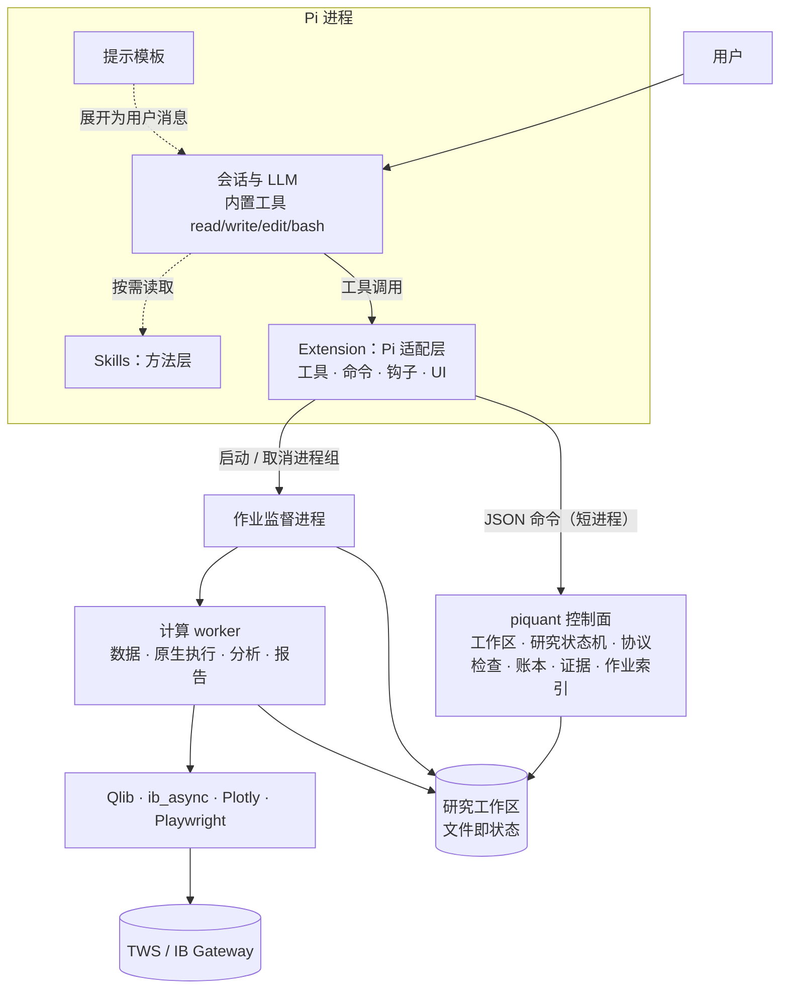
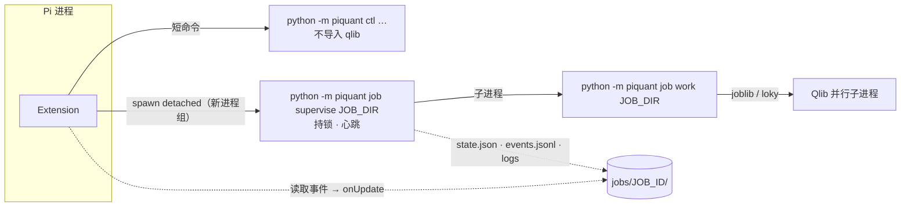
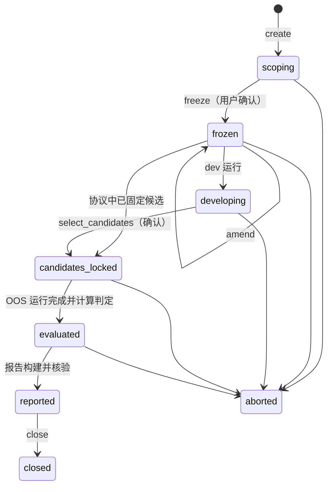

# Pi 量化研究 Package 完整设计方案（工作名 `pi-quant`）

| 项 | 内容 |
| --- | --- |
| 版本 | v1.0 设计草案 |
| 日期 | 2026-09-28 |
| 性质 | 独立设计方案。**尚无实现、安装产物或运行证据**；文中耗时、体积、延迟等数字一律是待实测目标。 |
| 事实基线 | Pi `@earendil-works/pi-coding-agent` 0.87.1（`earendil-works/pi` 主干 `6f75515`，2026-09-28）；Qlib：PyPI `pyqlib` 0.9.7（2025-08-15）与 GitHub 主干 `be72549`（2026-09-16）；IBKR TWS API 官方文档（2026-09-28 抓取）；`ib_async` 2.1.0；RD-Agent 1.0.0（2026-09-23） |
| 输入 | 《独立 Pi 量化研究 package：项目背景与外部审计交接说明》（2026-09-28）的需求部分（§1–3、§6、§9–10）。其设计章节（§4、§5、§7、§8）在本方案成形后才作参考对照，差异见附录 D。 |

**标记约定**：「已核实」= 当日阅读源码或官方文档确认，来源见附录 F；「设计」= 本方案的选择，可被推翻；「待实测」= 只能在实现后测量，不得预先宣称。

---

## 目录

1. 执行摘要
2. 对开发者意图的理解
3. 基础知识：Pi package 的机制与能力边界
4. 基础知识：Qlib 与 IBKR 的关键事实
5. SOTA 对标与设计原则
6. 产品形态
7. 总体架构
8. 领域模型与研究工作区
9. Extension 设计（Pi 适配层）
10. Skills 与提示模板（方法层）
11. Python 核心 `piquant`（规则与计算层）
12. 数据层
13. 研究完整性引擎
14. 交付：报告与核验
15. 环境、分发与生命周期
16. 安全、隐私与合规
17. Qlib 原生能力覆盖矩阵
18. 质量保障与评测
19. 实施路线与验收
20. 风险与缓解
21. 待开发者决策的问题

附录 A 端到端示例 · 附录 B 协议 schema 草案 · 附录 C 工具参数草案 · 附录 D 与现行方案的差异 · 附录 E 对交接文档 §10 问题的回应 · 附录 F 事实核查与来源

---

## 1. 执行摘要

**一句话**：`pi-quant` 把 Pi 变成一个"诚实的量化研究员"——LLM 负责理解问题、提出假设、编写 Qlib 原生代码和解释结果；package 提供确定性的数据快照、原生 Qlib 执行、机器强制的研究协议、统计证据和可核验交付；报告里的每个数字都能追溯到原生产物。

**八个核心设计判断**

1. **形态**：一个 Pi package = 1 个 Extension（Pi 适配层）+ 3 个 Skill（方法层）+ 3 个提示模板 + 1 个内嵌 Python 核心库 `piquant`（规则与计算层）。Python 环境不随 npm 安装，而是首次使用时按锁文件构建的隔离环境。
2. **规则放在 Python 核心，Extension 只做 Pi 适配**（参数 schema、进度、取消、确认对话、护栏钩子、状态注入）。同一套规则同时服务 Pi 工具、命令行和测试，不存在两份实现。
3. **研究协议是一等公民并由代码强制**：协议冻结前物理上读不到样本外（OOS）数据；每次尝试进入账本；预算、停止和结论判定由确定性代码执行。这是相对"由 Skill 指导 LLM 自觉遵守"最关键的升级——LLM 不是强制点。
4. **Qlib 原生优先、没有白名单**：保留 `qrun` YAML 与 Python 脚本两条原生入口，任何 Qlib 组件、自定义类和零／一／多个 Recorder 都能运行。package 只注入数据快照、Recorder 位置与协议参数，并审计"A 股默认值泄漏到美股研究"这类隐性错误。
5. **单一事实源**：原生账户、Recorder 与直接回测返回值是唯一权威；派生指标只能在同一原生序列上用 Qlib 原生函数或声明过的公式计算，并登记为证据。
6. **金融现实与 LLM 特有风险并重**：复权口径、成交量单位、幸存者偏差、成本近似、信号可知时点、闲置现金收益，以及 LLM 训练记忆造成的"前视"污染（2025–2026 年已有多项实证）。
7. **环境内容寻址且不可变**：按锁哈希构建环境；每次运行快照 harness 代码和锁文件。因此更新 package 不必等待作业结束，旧研究也能按原锁重建。
8. **首版边界清晰**：本机、单用户、只做研究、不下单。能力阶梯为 A 确认性研究（v1）→ B 探索扫描（v1）→ C 因子／模型 R&D 循环（v1.x）→ D 前向跟踪（v2）。

**v1 的用户结果**：用户在 Pi 里用自然语言提问；Agent 自动完成环境准备、数据快照、研究协议、原生运行、统计分析和报告；用户最多确认三次（环境下载、协议冻结、必要时的大批量数据下载），最终得到先给结论的聊天摘要，以及研究目录中的 `summary.md`、离线可读的 `report.html`、`evidence.json` 和完整原生产物。结论可以是"支持""无优势""证据不足"或"无法评估"，四者同等有效。

---

## 2. 对开发者意图的理解

### 2.1 需求复述与设计落点

下表左列是交接文档 §2 的八条用户要求；中列是本方案的落点；右列是验收时要看的证据。

| # | 用户要求 | 本方案落点 | 验收证据 |
| --- | --- | --- | --- |
| R1 | 用户只提研究方向，由 Agent 操作 | Skill 研究流程 + 6 个确定性工具；环境、数据、协议、运行、报告全部由 Agent 驱动；最多 3 次确认 | Agent 评测：从一句话问题到核验报告（§18.5） |
| R2 | 可装入、停用、移除的独立能力 | 标准 Pi package；包外状态集中在一个目录；`/quant-purge`；作业可跨 package 更新存活 | npm／git／本地三种分发测试；移除后报告仍可读（§18.6） |
| R3 | 尽量使用 Qlib 原生能力 | `qrun` + Python 两入口，无白名单，零／一／多 Recorder 捕获，默认值审计 | 覆盖矩阵"已验收"项（§17）+ 自定义组件测试 |
| R4 | 研究符合金融实际 | 快照清单与能力画像、协议检查、公平基线、暴露／择时分解、成本情景原生重跑、现金收益口径 | 检查规则单测；统计校准测试（§18.4） |
| R5 | 交付能看懂且能核验 | 证据登记、叙述数字检查、离线 HTML、无头浏览器核验、三种状态分离 | 核验记录绑定 HTML 内容哈希（§14.5） |
| R6 | 有限尝试、有明确终点 | 试验账本、预算、OOS 单次使用、预声明判定规则、停止规则，全部由代码执行 | OOS 门控与预算测试；负结果用例 |
| R7 | 不继承旧债 | 全新代码与工作区；旧项目只作为金融语义与反例测试的来源 | 静态检查：无旧项目路径或依赖 |
| R8 | 实用且不过度设计 | 无常驻服务、队列、第二数据库或策略注册表；单一发行包；TS 侧零第三方依赖 | 架构审查清单（§7.4） |

### 2.2 深层意图

1. **要的是"可信"，不只是"自动化"**。LLM 量化 Agent 最大的风险是产出看似合理却错误的结论：过拟合、时间泄漏、编造数字、沿用错误默认值。八条需求中有五条（R3–R6、R8 的一部分）本质上关于认知诚实。因此 package 的核心价值是一个**研究完整性 harness**：它让 Agent 很难犯错，而犯错时会被看见。
2. **要 Qlib 的全部能力，而不是被包装成玩具 API**。package 提供管道与护栏，不提供替代 API；Agent 写的是普通 Qlib 代码。
3. **用户零运维，但不虚构"一切自动"**。Python、依赖、端口、clientId、YAML、MLflow 都由 package 处理；启动 TWS、行情权限、2FA 这类外部前置必须如实告知。
4. **能装能卸、能复现、能长期维护**。研究成果不能绑死在某个安装目录或某个环境上。
5. **范围克制**。个人本机研究；研究员能力完整，"交易员"能力在首版只做研究层面的成本、换手、风险分析，不做下单。

### 2.3 对交接文档表述的修正意见

交接文档不是金标准。以下几处表述会误导实现，本方案给出了修正：

| 交接文档中的表述或隐含假设 | 问题 | 本方案的修正 |
| --- | --- | --- |
| 研究方法由 Skill 指导 Agent 形成协议和停止条件 | LLM 可能跳过、误读或在压缩上下文后遗忘 Skill；"先冻结后看结果"和"有限尝试"无法由提示词保证 | 协议、OOS 门控、账本、预算、判定规则由 Python 核心强制（§13） |
| 原生结果是权威，不重算收益 | 「已核实」Qlib `risk_analysis` 默认算术累加、日频年化系数 238（A 股交易日数）；`PortAnaRecord` 调用时不传这两个参数，默认配置还用 SH000300 与 A 股费率。对美股，"只用原生默认"本身就会产生误导数字 | 原生序列唯一；派生计算显式参数化（例如原生 `risk_analysis(r, N=252, mode="product")`）并登记为证据（§13.6） |
| 更新 package 前必须结束或取消受管作业 | 这是实现选择造成的限制 | 作业使用启动时快照的 harness 代码与不可变环境，更新不影响在跑作业（§15.7） |
| 披露其他研究中已看过的区间 | 只覆盖了"人看过"，漏掉了 LLM 在预训练中"记住"的历史结果 | 记录模型与知识截止日，标记污染窗口，推荐截止后留出期（§13.8） |
| 以 pyqlib 作为依赖 | 「已核实」PyPI 上 0.9.7 的元数据只写 `mlflow`（无上限），今天裸装会解析到 mlflow 3.16.1；上游主干已加 `mlflow<3.13` 等约束 | 完整锁文件，吸收上游全部兼容约束，并设置 `MLFLOW_ALLOW_FILE_STORE=true`（§4.2、§15.4） |
| IBKR 历史行情按字段、频率、RTH、时区检查 | 「已核实」成交量单位取决于 TWS 的一个设置；已停止交易的证券无历史数据 | 成交量单位缺省为"未知"并门控依赖它的研究；横截面研究强制披露幸存者偏差（§12） |
| 四类工具（环境、数据、运行、报告） | 没有承载研究状态机的强制点，协议和判定只能靠提示词 | 增加 `quant_study` 与 `quant_analyze`，共 6 个工具（§9.1） |

### 2.4 成功的样子

- 不懂 Python 和 Qlib 的用户，一次会话内能从问题走到经过核验的报告。
- "无优势"和"证据不足"的研究，交付质量与"支持"相同。
- 任何人拿到研究目录，都能看懂结论依据、找到每个数字的来源，并按记录的锁文件和快照复跑。
- 移除 package 后，研究成果仍可阅读。

---

## 3. 基础知识：Pi package 的机制与能力边界

以下事实均来自 Pi 0.87.1 的官方文档与源码（附录 F-1）。

### 3.1 机制与设计含义

| 机制 | 事实（已核实） | 对本设计的含义 |
| --- | --- | --- |
| 组成 | package 把 extensions、skills、prompt templates、themes 作为一个单元分发；用 `package.json` 的 `pi` 字段显式声明路径，或使用约定目录；`pi-package` 关键词可进入 pi.dev 画廊 | 一个包承载全部资源，显式声明 `pi` 清单，避免约定目录误发现 |
| 来源与安装 | npm 包安装到 `~/.pi/agent/npm`（`npm install --prefix`，未显式禁用生命周期脚本）；git 包克隆后执行 `npm install --omit=dev`；本地路径直接加载，不复制也不安装；`pi -e` 做一次性临时加载 | 不能依赖 `postinstall` 准备 Python 环境（本地路径根本不执行安装）；环境由扩展在首次使用时引导 |
| 移除 | `pi remove` 删除包与设置项；**没有卸载钩子** | 包外状态必须集中在一个目录，并提供显式清理命令 |
| 版本 | 带版本号的 npm 规格与 git tag／commit 是固定的；`pi update --extensions` 统一更新 | 锁文件随包版本走；环境按锁哈希区分 |
| 依赖 | Pi 向扩展提供 `pi-ai`、`pi-agent-core`、`pi-coding-agent`、`pi-tui`、`typebox`，它们必须放在 `peerDependencies`（`"*"`），不得放进 `dependencies`；不同包使用各自的模块根 | TS 侧只用 Node 内置模块和宿主包，零第三方依赖 |
| 作用域与信任 | 个人安装写入 `~/.pi/agent/settings.json`；`-l` 写入项目 `.pi/settings.json`，须先获得项目信任；`pi config` 可按资源启停 | 支持个人和项目两种安装；项目级安装的信任提示写进 README |
| Extension 生命周期 | 在 Pi 进程内以相同 OS 权限运行；工厂函数里不得启动进程、套接字、监听器或定时器；长期资源在 `session_start` 或工具中启动；`session_shutdown` 做幂等清理；`/reload` 会替换整个扩展运行时 | 作业不能依附于扩展内存，必须由独立进程持有，并能在重载后被重新发现 |
| 工具 | TypeBox 参数；`execute(toolCallId, params, signal, onUpdate, ctx)`；抛出异常 = 失败结果；`details` 用于渲染和随分支重建状态；`promptSnippet`／`promptGuidelines` 写入系统提示；`executionMode: "sequential"`；自定义 `renderCall`／`renderResult`；同一消息中的多个工具调用可能并行 | 会修改研究状态的工具一律串行执行；进度走 `onUpdate`；失败先落盘事实再抛错 |
| 输出截断 | 内置截断默认 50KB／2000 行，文档要求自定义工具自行截断并指明完整输出位置 | 工具只返回紧凑摘要与文件路径 |
| 动态工具 | 先注册全部工具，再用 `pi.setActiveTools()` 激活子集 | 非量化会话中只暴露一个轻量入口工具（§9.6） |
| 状态 | 随分支的工具状态放 `details`；不进上下文的持久数据用 `appendEntry`；进入上下文的自定义内容用 `sendMessage`；跨会话数据用外部存储。会话是树，可以分叉 | 研究事实放在外部工作区；会话里只存"当前研究"指针 |
| UI 与模式 | 交互式 TUI 有完整 UI；RPC 可转发对话框和通知；JSON／print 模式没有 UI；`ctx.hasUI`、`ctx.mode` 用于判断 | 冻结确认等交互需要非交互降级策略（§9.5） |
| 子进程 | `pi.exec` 只对直接子进程发送 SIGTERM，5 秒后 SIGKILL，不管理进程组 | 自行以独立进程组启动作业，按组取消（§15.7） |
| 嵌套模型调用 | `ctx.modelRegistry.streamSimple()` 可做与提供商无关的嵌套调用，结果中应回报 usage | 可选的独立审稿直接用 Pi 当前模型，不另建 LLM 服务 |
| 异步通知 | `pi.sendMessage(..., { triggerTurn, deliverAs: "steer" \| "followUp" \| "nextTurn" })` | 后台作业结束后可自动唤起 Agent 继续 |
| 事件 | `before_agent_start` 可修改提示分段；`tool_call` 可拦截或改参；`tool_result` 可组合追加；另有 `session_before_compact`、`session_shutdown`（原因：quit／reload／new／resume／fork）等 | 状态卡片注入、受保护路径护栏、压缩后仍能恢复方向 |
| Skills | 实现 Agent Skills 规范；启动时只把 name、description、路径写入系统提示，全文按需读取；name ≤ 64 字符，description ≤ 1024 字符；`/skill:name` 强制加载；用相对路径引用脚本与资源 | 方法论按"渐进披露"组织：SKILL.md 精简，细节放 references |
| 提示模板 | Markdown 文件即 `/命令`，支持 `$1`、`$@`、`${1:-默认}` 等参数 | 提供 `/research`、`/ideas`、`/study` 三个入口 |
| 安全 | Pi 不是沙箱；扩展与技能可执行任意代码；项目信任只控制加载，不限制工具行为 | 研究事实的完整性依靠哈希校验，而不是"阻止写入"（§8.4） |

### 3.2 能力边界小结

- **package 能做**：新增工具、命令、快捷键、CLI 标志、事件钩子、TUI 组件、技能、提示模板、主题、模型提供商；读写会话自定义条目；发起嵌套模型调用。
- **package 不能做**：提供安全沙箱；在卸载时执行清理；保证 LLM 遵守技能；在 JSON／print 模式弹出对话框；与其他 package 共享模块实例；把 Python 科学环境作为 npm 依赖分发。
- **推论**：凡是"必须成立"的研究规则，都要落在确定性代码里；凡是"应该这样做"的研究方法，放在技能里。

---

## 4. 基础知识：Qlib 与 IBKR 的关键事实

### 4.1 版本与平台（已核实）

- `pyqlib` 最新发行版是 0.9.7（2025-08-15），wheel 覆盖 CPython 3.8–3.12 × {manylinux2014 x86_64、macOS universal2／x86_64、Windows amd64}。**没有 3.13 及以上版本的 wheel，也没有 Linux aarch64 wheel**。因此环境锁定 Python 3.12；Linux ARM 在首版不列为支持平台（需要编译 Cython 扩展）。
- GitHub 主干 `be72549`（2026-09-16）仍标注 `Development Status :: 3 - Alpha`。
- wheel 只含 `qlib/` 包与元数据（cp312 manylinux wheel 共 285 个文件），**不含 `scripts/`**（`dump_bin.py`、`dump_pit.py`、各类数据采集器）。本方案必须把 `dump_bin.py` 固定版本 vendoring 进来（MIT 许可，保留署名）。

### 4.2 依赖约束（已核实）

上游 2026-09-16 的提交（PR #2308）新增了一组兼容约束，并在 CI 中统一施加：

| 依赖 | 约束 | 上游给出的原因 |
| --- | --- | --- |
| mlflow | `<3.13` | Qlib 使用 MLflow 文件存储后端，新版本默认禁用该后端；CI 另设 `MLFLOW_ALLOW_FILE_STORE=true` |
| filelock | `>=3.16.0,<3.30` | 新的 fork 安全检查与 DataQueue 生产者线程和多进程 worker 冲突 |
| plotly | `<7` | Qlib 仍导入 `figure_factory.create_distplot`，Plotly 7 已移除 |
| lxml、osqp、fastjsonschema、black | 平台或 Python 版本相关的上限 | Windows、旧 Python 的构建或导入问题 |

上游明确说明这是"兼容基线，不是完整锁"，而 PyPI 上 0.9.7 的元数据**不包含**这些上限。设计结论：发行包必须携带完整锁文件，吸收上述约束，设置环境变量，并用冒烟测试验证 Recorder 能写入文件存储。

### 4.3 原生入口语义（已核实）

- **`qrun`**（`qlib/cli/run.py`）：用环境变量渲染 Jinja2 模板；支持 `BASE_CONFIG_PATH`；用 `sys.path`／`sys.rel_path` 加载自定义模块；未配置 `exp_manager` 时，Recorder 位置为 `file:<当前工作目录>/<uri_folder>`；执行 `task_train`，**要求配置同时包含 model 与 dataset**，随后按 `record` 列表生成预测、回测和分析记录。
- **Python API**：没有模型的研究（纯规则择时等）走 `qlib.backtest.backtest(...)`，返回组合指标与交易指标，可以不产生 Recorder；滚动训练、在线更新、强化学习等特殊流程也只有 Python 入口。
- **信号时点**：`BaseSignalStrategy` 用 `get_step_time(trade_step, shift=1)` 取上一步的预测来交易当前步，是原生的防前视设计；Agent 编写的自定义策略必须遵守同样的约定。
- `FileOrderStrategy` 可以从 CSV 读取订单（数量为复权后股数）。

### 4.4 默认值陷阱（已核实）

| 位置 | 默认值 | 对美股研究的问题 |
| --- | --- | --- |
| `get_exchange()` | `open_cost=0.0015`、`close_cost=0.0025`、`min_cost=5.0` | A 股费率与人民币最低佣金 |
| `backtest()` | `benchmark="SH000300"`、`account=1e9` | 基准为沪深 300 |
| `PortAnaRecord` 默认配置 | SH000300、`limit_threshold=0.095`、`open_cost=0.0005`、`close_cost=0.0015`、`min_cost=5` | 同上 |
| 区域配置 | CN：`trade_unit=100`、`limit_threshold=0.095`；US：`trade_unit=1`、`limit_threshold=None` | `region` 必须显式指定 |
| `risk_analysis()` | `mode="sum"`（算术累加）；日频年化系数 N=238 | 美股约 252 个交易日；复利口径需要 `mode="product"` |
| `PortAnaRecord` 内部 | 调用 `risk_analysis(..., freq=...)` 时不传 `mode` 与 `N` | 原生分析输出即为"238、算术"口径 |
| `report_normal` 列 | `return = (账户变动 + 当日成本) / 上日账户值`，即**不含成本**；`cost` 单列；净收益 = `return − cost` | 比较时必须明确用净值口径 |
| `Exchange` | `$factor` 缺失时关闭交易单位取整，按复权价下单 | 美股 `trade_unit=1` 时相当于允许"复权股数"的小数股 |
| 成本模型 | 比例费率 + 最低费用 + 冲击成本（与成交量占比的平方相关） | 无按股计费（IBKR 常见方案）；冲击成本依赖成交量单位 |
| 账户 | `qlib/backtest` 中没有利息或无风险收益参数 | 闲置现金收益为 0；低仓位择时策略会被系统性低估 |

### 4.5 IBKR 历史数据事实（已核实，IB 官方文档，2026-09-28）

- **过滤与可变性**：历史数据会剔除远离 NBBO 的成交类型（组合腿、大宗、衍生品成交等），因此成交量小于实时数据；数据默认经过调整、压缩和过滤，**不同时点请求可能得到不同结果**。
- **成交量单位**：取决于 TWS 设置 "Send market data in lots for US Stocks for dual-mode API clients"——勾选时按手（round lot）返回，否则按股。
- **复权**：`TRADES` 只做拆股调整、不含分红；`ADJUSTED_LAST` 同时调整拆股和分红（支持股票、ETF、期权）。
- **节流（30 秒及以下的小 bar）**：15 秒内发出相同请求；2 秒内对同一合约、交易所、类型发出 6 次及以上请求；任意 10 分钟内超过 60 次请求；`BID_ASK` 请求按两次计。更大的 bar 也应保守限速。
- **不可得的数据**：已停止交易的证券；30 秒及以下 bar 超过 6 个月的历史；证券迁移交易所之前的数据（即使合约用 `SMART`）；等等。
- **最早数据点**：用 `reqHeadTimestamp` 查询，它按小 bar 的节流规则计数，用完需要取消。
- **Python 客户端**：`ib_async` 2.1.0（Python ≥ 3.10）。`connect(readonly=True)` 只是**告诉客户端 API 处于只读模式**，并不阻止下单；真正阻止下单的是 TWS／Gateway 的 "Read-Only API" 设置。`clientId=0` 会与手工 TWS 交易合并，必须禁止。

**设计含义**：快照身份必须包含请求参数和取数时间；成交量单位缺省为"未知"；横截面研究必然带有幸存者偏差；"不下单"需要三层保证——代码中不存在下单路径、推荐开启 TWS 只读设置、CI 静态检查禁止调用下单 API（§16）。

---

## 5. SOTA 对标与设计原则

### 5.1 前沿实践与吸收方式

| 前沿实践 | 代表工作（附录 F-4） | 本方案如何吸收 | 版本 |
| --- | --- | --- | --- |
| "研究 → 开发 → 反馈"闭环 | RD-Agent(Q)（NeurIPS 2025）：研究阶段提出假设并映射为任务，开发阶段由代码 Agent 实现并回测，反馈阶段评估结果并指导下一轮，用多臂老虎机调度方向；RD-Agent 1.0.0 于 2026-09-23 发布 | Pi 本身就是研究与开发 Agent；package 提供试验账本、结构化反馈、预算与方向统计，而不是再嵌一个 LLM 框架 | v1 基础；v1.x 模式 C |
| 正则化探索、对抗 alpha 衰减 | AlphaAgent（KDD 2025）：基于 AST 的原创性约束、假设与因子的一致性、复杂度控制 | 因子实验室：Qlib 表达式的 AST 相似度、复杂度、与已有因子的相关性检查 | v1.x |
| 轨迹级进化 | QuantaAlpha（2026 预印本）：以完整挖掘轨迹为单位做变异与交叉 | 账本完整保留轨迹，为后续扩展留接口 | 路线图 |
| 预注册与多重检验校正 | Deflated Sharpe Ratio（Bailey & López de Prado, 2014）；PBO／CSCV（Bailey 等, 2015） | 冻结协议 + 账本计数 → PSR／DSR；候选足够多时计算 PBO | v1：PSR／DSR；v1.x：PBO |
| 时间泄漏控制 | 清除（purge）与禁区（embargo）交叉验证；时点一致（PIT）数据 | 时间切片快照视图（§13.3）、标签期限检查、Processor 拟合区间检查、时点一致性检查、PIT 能力门控 | v1 |
| LLM 记忆前视 | Gao, Jiang & Yan（2026）"Detecting Lookahead Bias in LLM Forecasts"；Didisheim 等（2025, Economics Letters）；Look-Ahead-Bench（2026） | 记录模型与知识截止日，标记污染窗口，推荐截止后留出期；v2 前向跟踪提供真正的未来样本 | v1 披露与标记；v2 前向 |
| 数字来自产物（反幻觉） | Agent 工程实践 | 证据登记 + 叙述数字检查：报告里没有来源的数字无法渲染 | v1 |
| 确定性工具与 LLM 规划分工 | Agent 工程实践 | 规则全部在 `piquant`；LLM 负责界定问题、编码、解释 | v1 |
| 独立审查 | critic／red-team 模式 | 用全新上下文的嵌套模型调用审阅协议、结果与报告 | v1.x |
| 可复现 | 内容寻址的数据与环境、代码快照 | 内建（§8、§15） | v1 |

这里的"SOTA"不是指追求最高的回测收益，而是指**决策级证据质量**：在个人研究者能承受的成本内，把前沿研究中已证明有效的防过拟合、防泄漏、防幻觉手段，变成默认就生效的工程机制。

### 5.2 设计原则

| # | 原则 | 含义 |
| --- | --- | --- |
| P1 | 诚实优先于完成 | "无优势""证据不足""无法评估"是合法结论；失败与缺口必须呈现 |
| P2 | 原生优先、无白名单 | 首批演示用的 ticker、策略、模型、频率只是测试样例，不进入代码常量 |
| P3 | 单一事实源 | 原生产物是权威；任何派生必须声明函数、参数与输入 |
| P4 | 规则确定、强制点在核心层 | LLM 负责提议，代码负责裁决 |
| P5 | 研究事实外置、不可变、可校验 | 快照、冻结协议、运行目录一次写入；完成时记录哈希，交付时复核 |
| P6 | 能力分级诚实 | 接口存在 ≠ 依赖满足 ≠ 数据可得 ≠ 研究有效，四者分开陈述 |
| P7 | 默认安静 | 非量化会话中几乎零上下文开销、零干扰 |
| P8 | 最小依赖、无常驻服务、无第二数据库 | 文件即状态；Recorder 保留原生事实 |
| P9 | 失败可见 | 先落盘事实，再向 Pi 抛出失败 |
| P10 | 零运维但不隐瞒外部前置 | 能自动的全自动；不能自动的（TWS、权限、2FA）明确告知 |

### 5.3 Pi 生态现状（2026-09-28 检索 npm `pi-package` 关键词）

| 包 | 形态 | 与本方案的关系 |
| --- | --- | --- |
| `veil-quant` 0.1.0 | 扩展 + 技能 + 自有引擎（`@veilquant/engine`），强调合同、关卡、记忆与复现 | 理念最接近（证据优先），但不使用 Qlib，数据经其自有时间守卫读取；可借鉴其"推广前冻结组合构建"思路 |
| `@mporenta/pi-trading-quant-chain` 0.1.21 | 多角色 Agent 链（规划、研究、开发、审查） | 流程编排型，无原生量化引擎与证据体系 |
| `@artale/pi-quant` 1.0.0 | 简单的行情、组合、回测工具 | 功能浅，无研究完整性设计 |
| `@nteract/pi`、`pi-repl-py` 等 | 持久 Python REPL | 通用执行环境，不含量化语义 |

结论：生态中尚无"Qlib 原生 + 机器强制协议 + IBKR 语义 + 可核验报告"的组合，这正是本方案的差异化定位。检索结果只代表当日公开 npm 包。

---

## 6. 产品形态

### 6.1 用户与场景

- **目标用户**：在本机（macOS 或 Linux）使用 Pi 终端的个人投资研究者；可以有 IBKR 账户，也可以只有自己的数据文件。
- **核心场景**
  1. "某种主动操作相对持有，扣除成本后有没有价值？"（单资产择时）
  2. 多证券的因子／模型研究（例如 Alpha158 特征 + LightGBM + TopkDropout）
  3. 没有明确目标："帮我看看这几只 ETF 有什么值得研究的"
  4. 继续或复现一项旧研究
  5. 对已有结果追问（只读已有产物，不重算）

### 6.2 交付物

| 位置 | 内容 |
| --- | --- |
| 聊天中 | 先给结论的摘要：判定、3–5 个关键数字（附置信区间与来源）、收益来源、主要限制、报告路径 |
| 研究目录 | `summary.md`、`report.html`（单文件、离线可读）、`evidence.json`、冻结协议与修订、试验账本、每次运行的原生产物（Recorder、表格、日志）、核验记录与截图 |
| 报告页眉 | 三种状态分开显示：**计算状态**（完成／部分／失败）、**交付检查**（已核验／未核验／失败）、**研究结论**（支持／无优势／证据不足／无法评估） |

### 6.3 交互面

| 交互面 | 内容 |
| --- | --- |
| 自然语言 | 主入口；技能自动路由 |
| 提示模板 | `/research <问题>`、`/ideas [主题]`、`/study <continue\|replicate> [研究]` |
| 命令 | `/quant`（仪表盘）、`/quant-setup`、`/quant-doctor`、`/quant-jobs`、`/quant-open [研究]`、`/quant-purge` |
| TUI | 状态栏、作业进度组件、工具结果自定义渲染、冻结确认对话框、仪表盘浮层 |
| 浏览器 | 离线 HTML 报告（`/quant-open` 或工具调用打开） |
| 无头与集成 | print／JSON／RPC 模式与 SDK 可用；命令行 `piquant` 供测试与高级用户使用 |

### 6.4 谁做什么

- **用户永远不需要**：安装 Python、uv 或 Qlib；编写 YAML；选择端口或 clientId；手动运行脚本；配置 MLflow。
- **只能由用户完成的外部前置**：启动并登录 TWS 或 IB Gateway（含 2FA）；在 TWS 中启用 API（推荐同时开启 Read-Only API）；拥有所需的行情权限；在 macOS 上允许安装 OpenMP 运行库（Agent 可在获得同意后通过 Homebrew 代为执行）；确认环境下载与协议冻结。

### 6.5 研究模式（能力阶梯）

| 模式 | 用途 | 规则 | 版本 |
| --- | --- | --- | --- |
| A 确认性研究 | 回答一个具体问题 | 完整协议；OOS 单次使用；预声明判定规则 | v1 |
| B 探索扫描 | 用户没有明确目标时，便宜地寻找方向 | 只使用开发期数据；结果标为"探索性"，不能作为结论；产出候选方向，转入模式 A | v1 |
| C R&D 循环 | 因子／模型的迭代研发 | 在开发和验证期内按预算迭代；原创性与复杂度约束；最终候选一次性上 OOS；DSR 计入全部试验 | v1.x |
| D 前向跟踪 | 获得真正不受前视影响的样本外证据 | 冻结策略按日生成带时间戳的研究信号并记账，事后评估；**不下单** | v2 |

### 6.6 典型体验（简版，完整示例见附录 A）

1. 用户："XYZ 用趋势加短期回复做择时，扣完成本相对一直持有有没有价值？"
2. Agent 加载技能，检查环境；若未就绪，**确认一**：下载并构建环境。
3. Agent 探测合约与历史覆盖，报告能力画像（例如"有分红调整、成交量单位未知、无退市问题"）。
4. Agent 起草协议：窗口、信号与成交时点、成本（主情景与压力情景）、基线（持有、暴露匹配、现金）、主指标与判定规则、试验预算、LLM 污染披露。
5. **确认二**：冻结协议（对话框中展示摘要）。
6. Agent 在开发期内按预算实现和调参，选定候选；然后对候选、全部基线和成本情景在 OOS 上各运行一次（一次工具调用、一个作业）。
7. 统计分析得出判定；生成报告并用无头浏览器核验；在聊天中先给结论，再给依据、限制和报告路径。

### 6.7 非目标

真实下单；多用户或服务化部署；云端执行；Web 应用；策略市场或注册表；收益保证；投资建议；自动替用户决定投资目标与风险偏好。

---

## 7. 总体架构

### 7.1 分层视图



### 7.2 组件职责

| 组件 | 负责 | 不做 |
| --- | --- | --- |
| C1 Skills | 研究流程、问题界定、协议写法、Qlib 原生用法、IBKR 操作、报告措辞 | 不产生任何数字；不是强制点 |
| C2 提示模板 | 研究入口的一键展开 | 不含逻辑 |
| C3 Extension（TypeScript） | 工具 schema 与渲染；调用 `piquant`；作业进程组管理与进度；确认对话；护栏钩子；状态卡片；工具激活；uv 与环境的冷启动引导 | 不实现任何金融逻辑或研究规则 |
| C4 `piquant` 控制面 | 工作区、研究状态机、协议 schema 与检查、账本、证据登记、作业索引与锁 | 不导入 qlib、pandas、numpy（保证快速） |
| C5 作业监督进程 | 获取锁、启动 worker、写心跳、排空日志、确认后代进程结束、原子写入终态 | 不做计算 |
| C6 计算 worker | 快照构建、原生 Qlib 执行与捕获、分析、报告构建与核验 | 不修改冻结协议，不改写账本历史 |
| C7 环境 | TS 负责冷启动（uv、Python、依赖）；Python 负责体检 | 不触碰系统 Python |
| C8 研究工作区 | 全部研究事实（文件） | 不存储任何密钥 |

### 7.3 进程拓扑



采用"监督进程 + worker"两层，是因为 worker 可能因原生库崩溃或被 OOM 杀死，而监督进程仍能写出真实终态；监督进程是进程组组长，结束时清理 loky 等残留子进程。取消时向整个进程组发送 SIGTERM，宽限期后 SIGKILL（§15.7）。

### 7.4 依赖方向与架构审查清单

1. TS 与 Python 之间只通过带版本号的 CLI JSON 契约通信（`"api": 1`），TS 不了解 Python 内部结构。
2. 控制面命令不得导入 qlib、pandas、numpy；由 CI 测试检查 `sys.modules`。目标：控制面命令 p95 ≤ 300ms（待实测）。
3. 只有 `native/` 接触 Qlib 对象；`analyze/` 与 `report/` 只读取 Parquet 投影与证据文件。
4. 模块依赖无环：`control` ← `data`／`native`／`analyze`／`report`；`native` 不导入 `analyze` 或 `report`。
5. 没有常驻服务、队列或数据库：状态即文件，所有索引都能通过扫描目录重建。
6. 每个文件只有一个写入者（§8.2），其他组件只读。
7. 新增数据源只改 `data/sources/`；Pi 升级只影响 `extensions/`；Qlib 升级影响锁文件与 `native/`；页面改动只影响 `report/templates/`（附录 E 第 8 问）。

### 7.5 主数据流

问题 → 协议（草稿 → 冻结）→ 快照（及时间切片视图）→ 原生运行 → 投影 → 证据（指标、统计）→ 判定 → 报告（HTML 与摘要）→ 核验。每一步的产物都带内容哈希，下一步只引用上一步的哈希。

---

## 8. 领域模型与研究工作区

### 8.1 工作区布局

```text
<workspace>/                          # 默认 ~/pi-quant（可配置，见 §21）
├── quant.toml                        # 工作区标记与非敏感设置
├── data/
│   └── snapshots/<snapshot_id>/
│       ├── manifest.json             # 来源、请求、取数时间、口径、单位、覆盖、能力画像、哈希
│       ├── raw/                      # 数据源原始响应（Parquet）
│       ├── qlib/                     # Qlib provider 目录（calendars/ instruments/ features/）
│       └── views/<view_id>/qlib/     # 时间切片视图（按研究窗口截断，§13.3）
├── studies/<study_id>/
│   ├── study.json                    # 状态机、指针、预算计数（控制面独占写）
│   ├── question.md                   # 用户原话 + Agent 的可检验表述
│   ├── protocol/
│   │   ├── draft.yaml                # 可编辑草稿
│   │   ├── v1.yaml  v1.lock.json     # 冻结版本 + 哈希、批准来源、时间、模型信息
│   │   └── v2.yaml  v2.lock.json     # 修订（附理由）
│   ├── code/                         # Agent 编写的策略、处理器、模型、qrun 配置（普通 Qlib 代码）
│   ├── ledger.jsonl                  # 只追加的试验账本
│   ├── runs/<run_id>/
│   │   ├── run.json                  # 输入身份、状态分类、耗时、产物哈希
│   │   ├── spec/                     # 本次实际使用的配置／脚本与代码快照
│   │   ├── harness/                  # piquant 代码快照 + 环境锁副本
│   │   ├── mlruns/                   # 本次运行独占的 Recorder 存储
│   │   ├── projections/              # 规范化投影表（Parquet）
│   │   └── logs/
│   ├── analysis/<analysis_id>/       # 比较、归因、稳健性、判定（均为派生，带来源）
│   └── report/
│       ├── summary.md  report.html  evidence.json
│       └── verify/                   # 核验记录与截图（绑定 HTML 哈希）
└── jobs/<job_id>/                    # job.json、state.json、events.jsonl、日志（可清理）
```

每次运行使用独占的 `mlruns/`：运行之间不争用同一个 MLflow 存储，运行目录可以整体移动、归档或删除，不牵连其他运行。

### 8.2 领域对象

| 对象 | 身份 | 可变性 | 唯一写入者 | 关键内容 |
| --- | --- | --- | --- | --- |
| 快照 Snapshot | `snap_<hash12>`，由规范化请求与内容哈希共同决定 | 不可变 | 数据 worker | 来源、请求参数、取数时间、价格口径、`$factor` 语义、成交量单位、时区、RTH、日历、覆盖与缺口、能力画像、许可说明 |
| 时间切片视图 View | `view_<snapshot>_<截止日>` | 不可变 | 数据 worker | 截断到指定日期的 provider 目录 |
| 研究 Study | `S-<日期>-<slug>` | 只按状态机推进 | 控制面 | 阶段、当前协议版本、预算计数、候选集、判定引用 |
| 协议 Protocol | `v<n>` + 内容哈希 | 冻结后不可变；修订产生新版本 | 控制面 | 见附录 B |
| 运行 Run | `R-<序号>-<hash>` | 完成后不可变 | 监督进程 + worker | 协议哈希、快照／视图、split 角色、目的、配置与代码哈希、环境锁哈希、Recorder 列表、状态分类 |
| 账本条目 | 追加序号 | 只追加 | 控制面 | 运行引用、类别（试验、工程修复、数据重取、基线、成本情景、稳健性、探索）、触及的 split、摘要指标 |
| 投影 Projection | 运行内路径 + 哈希 | 不可变 | worker | 净值、持仓、决策、交易、预测、IC 等规范化表 |
| 证据 Evidence | `ev:<路径式 id>` | 随报告版本生成 | 分析与报告 worker | 数值、单位、定义、来源（运行／Recorder／产物／列）、派生函数与参数 |
| 判定 Verdict | 协议哈希 + 证据哈希 | 不可变 | 分析 worker | 结论、各条件满足情况、证据引用 |
| 报告 Report | HTML 内容哈希 | 每次构建产生新版本 | 报告 worker | 摘要、HTML、证据、核验记录 |

### 8.3 研究状态机



状态规则：

- `amend` 产生附理由的新协议版本，同样需要用户确认。
- `scoping` 阶段只允许在预热期和开发期做标记为"探索"的运行（模式 B）。
- OOS 视图只在 `candidates_locked` 之后才能挂载；每个候选只做一次 OOS 评估。工程修复导致的重跑必须保持配置哈希不变，并在报告中列出。
- OOS 之后仍可修订协议，但判定会被降级为"协议在看到 OOS 后修订"并醒目披露。
- `aborted` 保留全部事实，必须填写原因。

### 8.4 不可变性与完整性

- 一次写入的目录在完成后设为只读，并在 `run.json`、`manifest.json`、`*.lock.json` 中记录内容哈希。
- 构建报告时复核所有被引用产物的哈希；不一致时该证据失效，报告拒绝渲染对应结论，并记录完整性错误。
- Pi 的 `tool_call` 钩子阻止内置 write／edit 写入受保护路径——这是便利性护栏，不是安全边界。
- 完整性依靠**校验**而不是**阻止**：即使有人用 bash 改了文件，也会在交付时被发现。

### 8.5 Schema 版本

每个 JSON／YAML 文件都带 `schema: "piquant.<类型>/<n>"`。读取方只接受已知版本；遇到未知版本时明确报错并给出修复建议（例如升级 package），**不做静默降级**。本包自身格式演进时，新版本保留对本包旧格式的只读路径；这与"不为旧工作台写迁移或兼容层"并不冲突。

### 8.6 会话与研究的关系

- **对话可以分叉，研究事实不分叉**：数据与计算是真实发生的事，不随对话分支复制。
- 会话中只记录 `quant.active_study` 自定义条目（`appendEntry`）；`session_start` 时从当前分支（`getBranch`）重建"当前研究"指针。
- 工具结果的 `details` 里带研究与运行 id，只用于渲染，从不作为事实来源。

---

## 9. Extension 设计（Pi 适配层）

### 9.1 工具集

| 工具 | 动作 | 修改研究状态 | 执行模式 | 典型耗时 | 返回 |
| --- | --- | --- | --- | --- | --- |
| `quant_workspace` | status、open、setup_env、doctor、set_active_study | 是（工作区、环境） | sequential | 状态：毫秒级；环境构建：分钟级（待实测） | 状态卡片；问题清单与修复建议 |
| `quant_data` | probe、fetch、import、inspect、list | 是（新增快照） | sequential | 探测：秒级；下载：受 IBKR 节流约束 | 合约候选、覆盖、快照摘要、能力画像、质量问题 |
| `quant_study` | create、draft_protocol、freeze、select_candidates、amend、status、close | 是 | sequential | 毫秒级 | 检查报告、协议哈希、阶段、预算、下一步提示 |
| `quant_run` | submit、status、logs、cancel、list | 是（运行、账本） | sequential | 取决于研究 | 状态分类、Recorder、关键原生指标、产物路径 |
| `quant_analyze` | compare、attribution、robustness、verdict、inspect、full | 是（分析、判定） | sequential | 秒级到分钟级 | 对齐比较表、分解、置信区间、PSR／DSR、判定 |
| `quant_report` | build、verify、open（v1.x 增加 review） | 是（报告） | sequential | 秒级到分钟级 | 报告路径、核验结果、截图路径 |

**为什么是 6 个而不是 4 个**：每个工具对应一个权威域——工作区与环境、数据身份、研究协议（强制点）、原生执行、派生证据、交付。把协议并入运行，会让"声明规则"和"执行计算"共用一个庞大且易错的参数 schema；把分析并入报告，会让报告构建隐含重算，违背"报告不重算"。工具数量仍然很少，且每个都用动作枚举组织。

### 9.2 工具契约要点

**`quant_workspace`**
- `status` 廉价且安全；调用后激活其余量化工具（§9.6）。
- `setup_env(profile)` 在 TUI／RPC 中弹出确认，展示预计下载量与目标目录（数字待实测）；print／JSON 模式下需要 `--quant-approve` 标志，否则返回 `E_APPROVAL_REQUIRED`。
- `doctor(scope)` 返回带 `code／severity／message／remediation` 的问题清单，例如 `E_IBKR_UNREACHABLE`："TWS 未运行或未启用 API：请在 Global Configuration → API → Settings 中启用 socket 客户端。"

**`quant_data`**
- `probe` 不下载批量数据：返回合约候选（conId、主交易所、币种、时区、交易时段）、各口径最早数据时间、权限试探结果。
- `fetch` 是长作业：遵守节流、可断点续传；产出快照、清单摘要、能力画像与质量问题。请求规格相同且内容一致时复用已有快照，但记录这次取数事件。
- `import` 要求声明无法推断的口径（价格口径、时区、成交量单位）；允许声明"未知"，但依赖它的功能会被门控。
- `inspect` 报告覆盖、缺口、异常（零成交量、无法由拆股分红解释的跳变）和日历一致性。

**`quant_study`**
- `draft_protocol` 校验 schema 并运行检查规则（§13.2），返回错误与警告，保存为草稿。
- `freeze` 要求零错误；展示摘要；获批后写入 `v<n>.yaml` 与 `v<n>.lock.json`（哈希、批准人、批准渠道、时间、模型 id、知识截止日〔声明值或"未知"〕、package 版本）。
- `select_candidates` 在 OOS 之前锁定候选的代码与配置哈希。
- `amend` 产生附理由的新版本；若已触及 OOS，则设置降级标志。
- `status` 返回阶段、预算用量、下一步提示。

**`quant_run`**
- `submit` 参数：研究、入口（研究 `code/` 下的 qrun YAML 或 Python 脚本）、split 角色（warmup／dev／validation／oos／holdout）、目的（trial／engineering／baseline／cost_scenario／robustness／exploratory）、批量选项（按协议同时运行基线与成本情景）、`wait`（默认 true）、超时。
- 预检查（控制面，快速）：阶段是否允许该 split、预算、OOS 是否已锁定候选、入口是否存在、qrun 配置的静态审计。
- 执行：监督进程 + worker；按 split 角色挂载时间切片视图（§13.3）；持续发出进度事件。
- 后检查（worker）：有效配置审计（§11.4）、捕获、投影、哈希；向账本追加带结果的条目。
- 返回紧凑摘要与路径；失败时先落盘事实，再抛出带状态分类的错误。
- 等待期间用户按 Esc：取消前台作业（进程组 SIGTERM → 宽限期 → SIGKILL）；`wait: false` 的后台作业只能通过 `cancel` 或 `/quant-jobs` 取消。

**`quant_analyze`**
- 只读取投影，不重跑策略；不可比的运行（窗口、成交价、成本、日历、初始资金不同）默认拒绝比较，显式要求时也会被标注。
- `verdict` 以确定性方式计算协议中的判定规则。
- `inspect` 回答追问（例如"为什么 2024-08-05 卖出"），只依据投影和决策日志；没有原因日志时如实说明。
- `full` 一次完成比较、归因、稳健性与判定，减少模型往返。

**`quant_report`**
- `build(narrative)`：Agent 撰写的叙述中，数字必须以证据引用 `{{ev:…}}` 出现；自由书写的数字会被检查（§14.3）；产出 `summary.md`、`report.html` 与 `evidence.json`。
- `verify`：静态检查 + 无头浏览器检查；写入绑定 HTML 哈希的核验记录，并设置交付状态。
- `open`：在系统浏览器中打开（仅 TUI 模式或用户要求时）。

### 9.3 命令

| 命令 | 作用 |
| --- | --- |
| `/quant` | 仪表盘：工作区、环境、当前研究、作业、最近报告（TUI 浮层；其他模式输出文本）；`/quant off` 关闭量化工具 |
| `/quant-setup [profile]` | 引导构建环境 |
| `/quant-doctor` | 完整体检 |
| `/quant-jobs` | 列出、查看、取消作业 |
| `/quant-open [研究]` | 打开报告 |
| `/quant-purge` | 确认后删除包主目录（环境、缓存、uv），**不触碰任何研究工作区** |

### 9.4 事件钩子

| 事件 | 行为 |
| --- | --- |
| `session_start` | 从当前分支恢复当前研究；扫描 `jobs/` 与心跳，重新挂接运行中的作业；设置状态栏；在工作区内启动时激活量化工具 |
| `before_agent_start` | 有活动研究时，在系统提示中追加一张状态卡片（目标 ≤ 200 token，待实测） |
| `tool_call` | 阻止 write／edit 写入受保护路径并提示改用量化工具；对用受管 Python 运行 qlib 或 qrun 的 bash 命令追加提示"工具外产物只算探索，不能支撑结论"（不阻止） |
| `tool_result` | 对特定结果追加简短口径提醒 |
| `session_before_compact` | 提供压缩指令，保留研究 id、阶段与未完成事项 |
| `session_shutdown` | 幂等地停止轮询与渲染；不杀后台作业 |

状态栏示例：`quant · XYZ-timing · frozen v1 · dev 7/20 · 1 job 63%`

状态卡片示例：

```text
[pi-quant] workspace=~/pi-quant  study=S-20260928-xyz-timing  phase=developing  protocol=v1#a3f9c2
dev trials 7/20 · OOS locked until candidates are selected · jobs: R-0012 running (63%)
rules: numbers only from quant_* outputs or evidence.json · OOS is single-use · state the verdict verbatim, interpret separately
```

### 9.5 UI 与模式降级

| 场景 | TUI | RPC | print／JSON |
| --- | --- | --- | --- |
| 冻结、修订、锁定候选、构建环境 | 自定义组件展示摘要，确认或拒绝 | `ctx.ui.confirm` 转发给客户端 | 需要 `--quant-approve` 标志（`registerFlag`），否则返回 `E_APPROVAL_REQUIRED`；批准渠道记为 `flag` |
| 进度 | 工具行渲染 + 编辑器上方组件 | `onUpdate` 事件 | 只有最终结果 |
| 打开报告 | 系统浏览器 | 返回路径 | 返回路径 |

### 9.6 工具激活策略

`quant_workspace` 始终激活，描述尽量短（目标约 100 token，待实测）；其余 5 个工具已注册但默认不激活，直到满足以下任一条件：会话在工作区内启动；调用了 `quant_workspace status／open`；从分支恢复了活动研究；用户使用 `/quant`。这遵循 Pi 文档推荐的"先注册、再用 `setActiveTools` 激活"模式，保证非量化会话几乎没有额外上下文开销（P7）。

### 9.7 错误分类

| 类别 | 代码 |
| --- | --- |
| 环境 | `E_ENV_MISSING`、`E_ENV_STALE`、`E_ENV_BROKEN`、`E_PLATFORM_UNSUPPORTED` |
| 交互 | `E_APPROVAL_REQUIRED` |
| IBKR | `E_IBKR_UNREACHABLE`、`E_IBKR_CLIENTID_IN_USE`（自动换 id 重试）、`E_IBKR_NO_PERMISSION`、`E_IBKR_PACING`（自动退避）、`E_IBKR_NO_DATA` |
| 数据 | `E_DATA_SEMANTICS_UNDECLARED`、`E_DATA_COVERAGE` |
| 研究 | `E_PROTOCOL_INVALID`、`E_PHASE`（如候选未锁定就请求 OOS）、`E_BUDGET_EXHAUSTED` |
| 运行 | `E_BUSY`、`E_RUN_FAILED{user_code｜qlib｜oom｜timeout｜cancelled｜crashed}`、`E_NONCONFORMING_RUN` |
| 分析与交付 | `E_NOT_COMPARABLE`、`E_EVIDENCE_MISSING`、`E_INTEGRITY`、`E_REPORT_UNVERIFIED` |

每个错误包含代码、说明、修复建议和事实文件路径。顺序固定为：**先落盘事实，再抛出异常**，使 Pi 得到真正的失败工具结果，而磁盘上保留可追查的记录。

### 9.8 输出预算与上下文工程

- 工具返回内容保持紧凑（目标约 2KB，待实测），详细内容给路径，绝不整表倾倒。
- 工具激活时写入三条 `promptGuidelines`：数字只来自量化工具输出或证据文件；OOS 只用一次；判定照原文陈述，解释另起一段。
- 结果中附带确定性的"下一步"提示，降低模型规划出错的概率。
- 研究状态在外部文件中，上下文压缩后通过状态卡片恢复方向。

---

## 10. Skills 与提示模板（方法层）

### 10.1 技能集合

| 技能 | 描述草案（用于路由，中英双语关键词） | 内容 |
| --- | --- | --- |
| `quant-research` | Investment and quantitative research with Microsoft Qlib（量化研究、回测、择时、因子、模型、组合）: test whether a trading rule, factor, ML model or portfolio adds value after costs on real market data, with pre-registered protocols, fair baselines and verifiable HTML reports. Use when the user asks whether a strategy or signal works, wants a backtest, wants research ideas for stocks/ETFs, or wants to continue a quant study. | 研究流程、问题分类、追问策略、方向建议、协议写法、结论措辞、停止规则 |
| `qlib-native` | Write and debug native Qlib components and workflows（qrun YAML、DataHandler/Processor/表达式因子、模型、策略、执行器、Recorder、滚动训练）inside a pi-quant study. Use when implementing or fixing Qlib code for a study. | 原生能力地图、两条入口的选择、自定义组件模板、默认值陷阱、防泄漏写法 |
| `market-data-ibkr` | Acquire and troubleshoot IBKR historical market data for research（TWS/Gateway 设置、合约、复权口径、节流、错误码、成交量单位）. Use when fetching IBKR data or when IBKR connection or permission errors occur. | 连接前置、合约解析、口径、节流、错误码、单位确认 |

### 10.2 `quant-research` 的研究流程（SKILL.md 骨架）

0. **定位**：调用 `quant_workspace status`；环境未就绪时说明原因并请求构建。
1. **界定问题**：把用户问题改写为可检验的假设；判断问题类型（单资产择时／横截面选股／因子／模型／风险控制）。只在影响结论的关键歧义上追问，最多三问（资产、期限、成本情形）；其余采用文档化的默认值并披露。从不询问技术设置。
2. **方向建议**（用户没有明确目标时）：先用 `quant_data probe` 确认数据可得，再给出 3–5 个方向，每个包含问题、经济逻辑、所需数据及可得性、方法与基线、预计成本、假阳性风险；等待用户选择。
3. **数据可行性**：探测覆盖与能力画像；决定下载、导入或复用快照；记录限制。
4. **协议**：按模板起草；反复调用 `draft_protocol` 直到检查通过；向用户展示摘要；冻结。
5. **开发**：在研究 `code/` 下用原生 Qlib API 实现（参见 `qlib-native`）；先在预热期或开发期做冒烟测试；只在开发期内、按预算调参；所有产生证据的运行都经 `quant_run`。
6. **候选与 OOS**：需要选参时先 `select_candidates`；然后以一次批量作业对候选、全部基线和成本情景各运行一次 OOS。
7. **分析与交付**：`quant_analyze full`；撰写引用证据的叙述；`quant_report build → verify`；在聊天中先给判定，再给关键数字、收益来源、限制和报告路径。
8. **停止**：判定已算出、预算耗尽或出现阻断性数据缺口时停止；绝不在 OOS 上继续搜索；新的想法开启新的研究（新的协议）。

措辞规则：说"本次证据不支持存在优势"，而不是"该策略永远无效"；不提供投资建议；不承诺收益；不下单。

### 10.3 参考资料（按需读取）

| 文件 | 内容 |
| --- | --- |
| `quant-research/references/protocol-guide.md` | 窗口设计、标签期限与禁区、信号与成交时点、基线选择、成本情景、主指标与判定规则模板、预算建议 |
| `…/financial-realism.md` | 复权与 `$factor`、成交量单位、时区与 RTH、日历、幸存者偏差、PIT、费用与滑点、做空约束、分红与总收益、闲置现金收益 |
| `…/baselines-and-attribution.md` | 各问题类型的必需基线；暴露匹配；择时回归 |
| `…/statistics.md` | 平稳块自助法、PSR／DSR、最短记录长度、PBO、子区间稳定性 |
| `…/llm-lookahead.md` | 知识截止日、污染窗口、截止后留出期、先写先验再看数据 |
| `…/reporting-style.md` | 报告结构、三种状态、结论措辞、禁用表述 |
| `…/idea-generation.md` | 方向类别与各自的数据前置 |
| `qlib-native/references/native-map.md` | 研究需求 → 原生组件与入口的映射 |
| `qlib-native/references/pitfalls.md` | §4.4 中的默认值陷阱及正确写法 |
| `qlib-native/references/custom-components.md` | 自定义 Handler、Processor、Operator、Model、Strategy 的写法与测试 |
| `market-data-ibkr/references/{setup,semantics,errors}.md` | TWS／Gateway 设置、口径、错误码与处理 |

### 10.4 资产模板（示例，不是白名单）

- `protocol.template.yaml`
- `qrun/us_daily_lgbm_alpha158.yaml.j2`（provider、窗口、成本、基准通过环境变量注入，YAML 本身保持原生）
- `strategies/rule_signal_template.py`（`WeightStrategyBase` 子类，遵守 `shift=1` 约定，写决策原因日志）
- `handlers/custom_expression_handler.py`
- `rolling/two_fold_rolling.py`

CI 中有测试确保代码里不存在 ticker、策略名等"演示常量"（P2）。

### 10.5 提示模板

| 模板 | 展开内容 |
| --- | --- |
| `/research <问题>` | 使用 `quant-research` 技能研究该问题：先检查工作区与环境，再界定问题、确认数据、起草并冻结协议…… |
| `/ideas [主题]` | 进入探索模式 B：先探测数据可得性，再给出 3–5 个方向并等待选择 |
| `/study continue\|replicate [研究]` | 继续：读取研究状态与下一步；复现：按记录的快照、锁文件与代码重跑，并比较哈希与数值 |

### 10.6 与其他 Pi 包的软集成

若会话中存在 `subagent` 工具（例如 pi-subagents），技能可以把独立审稿交给全新上下文的子 Agent；若存在网络检索工具，可用于查找假设的先验文献。二者都是可选增强，不构成依赖。

---

## 11. Python 核心 `piquant`（规则与计算层）

### 11.1 模块结构

```text
python/
├── pyproject.toml
├── locks/                        # 每个 profile 一份通用锁（带平台标记与哈希）
│   └── core.txt  nn.txt  report.txt  rl.txt
└── src/piquant/
    ├── cli.py                    # python -m piquant <group> <cmd> --json
    ├── control/                  # 控制面：禁止导入 qlib / pandas / numpy
    │   ├── workspace.py  study.py  protocol_schema.py  lint.py
    │   └── ledger.py  evidence.py  jobs.py  locks.py  hashing.py
    ├── env/doctor.py
    ├── job/supervisor.py  worker.py  progress.py
    ├── data/
    │   ├── sources/ibkr.py  files.py  qlib_provider.py
    │   └── normalize.py  views.py  dump_bin_vendored.py  manifest.py  quality.py
    ├── native/
    │   └── runtime.py  qrun_adapter.py  script_adapter.py  audit.py
    │       capture.py  projections.py  baselines.py  api.py
    ├── analyze/compare.py  attribution.py  stats.py  verdict.py
    └── report/build.py  narrative_lint.py  verify.py  templates/
```

### 11.2 控制面契约

- 调用：`python -m piquant <group> <cmd> [--json-in <file>|-]`；输出为 stdout 上的单个 JSON 对象 `{ "api": 1, "ok": true, "result": … }` 或 `{ "api": 1, "ok": false, "error": { "code", "message", "remediation", "facts" } }`。
- 控制面模块禁止导入 qlib／pandas／numpy，由 CI 检查。
- 同一套命令同时是 Pi 工具的后端、高级用户的命令行和测试入口。

### 11.3 原生执行适配

**运行时初始化** `runtime.init(view, run_dir, region, kernels)`：设置 `MLFLOW_ALLOW_FILE_STORE=true`，然后调用
`qlib.init(provider_uri=<view>/qlib, region=<协议值>, exp_manager={"class": "MLflowExpManager", "module_path": "qlib.workflow.expm", "kwargs": {"uri": "file:<run_dir>/mlruns", "default_exp_name": <run_id>}}, kernels=…)`。

**qrun 适配**
- 把配置与研究代码复制进 `spec/`；通过环境变量（`PIQUANT_PROVIDER_URI`、`PIQUANT_REGION`、`PIQUANT_WINDOW_*`、`PIQUANT_BENCHMARK`、成本参数等）供 qrun 原生的 Jinja2 渲染使用，YAML 本身保持原生写法。
- 对渲染后的 YAML 做静态审计。
- 以运行目录为工作目录，调用官方 `qlib.cli.run.workflow(config_path, experiment_name=<run_id>, uri_folder="mlruns")`，完整保留 `BASE_CONFIG_PATH`、`sys.rel_path`、自定义类与模板机制。
- `qlib_init` 中自带 `exp_manager` 或指向其他 provider 时，运行前即拒绝（`E_NONCONFORMING_RUN`）并说明原因。

**Python 脚本适配**
- 初始化运行时后执行 `runpy.run_path(script, run_name="__main__")`；脚本是普通 Qlib 代码。
- `piquant.native.api` 提供可选辅助：`view()`、`protocol()`、`exchange_kwargs()`、`backtest_and_capture(...)`（封装原生 `backtest`、`collect_data`、`format_decisions`，并保存原生返回对象）、`capture(obj, name)`、`log_reason(...)`。

**捕获**：枚举本次 `mlruns` 中的全部实验与 Recorder（零个、一个或多个）；为所有产物建立索引；对已知类型生成投影；未知类型以"未投影"状态列出路径（如实显示索引与缺口）；直接捕获的返回值保存为原生 pickle 与投影。既没有 Recorder 也没有捕获的运行，状态为"无证据产物"，不能支撑结论。

### 11.4 有效配置审计

运行结束后，依据 Recorder 参数、保存的配置、Qlib 全局配置 `C` 与捕获对象，逐项核对：

| 检查项 | 规则 |
| --- | --- |
| 数据来源 | `provider_uri` 等于本次挂载的视图 |
| 区域 | `region` 与协议一致 |
| 基准 | 不是 SH000300 等默认值，除非协议明确声明 |
| 交易所参数 | 成本、成交价、涨跌停阈值、交易单位齐全且等于协议值 |
| 时间范围 | 回测区间 ⊆ 该 split 角色的窗口；数据集 segments ⊆ 允许窗口 |
| 标签与禁区 | 标签期限不跨越禁区 |
| Processor | 拟合区间 ⊆ 训练 segment |
| 指标口径 | 派生指标的 `N` 与 `mode` 与协议一致 |

不符合的运行标记为 `nonconforming` 并记录原因：它仍被如实记账，但不进入判定。

### 11.5 投影表

| 投影 | 原生来源 | 主要列 |
| --- | --- | --- |
| `nav` | `report_normal` | date、account、return（不含成本）、cost、net_return（= return − cost，并与账户值变化交叉校验）、turnover、value、cash、bench |
| `positions` | `positions_normal` | date、instrument、amount（复权股数）、price、weight、hold_days |
| `decisions` | `collect_data`／`format_decisions`（Python 入口） | date、instrument、direction、amount、reason_ref |
| `trades` | 优先取原生决策；否则由相邻持仓差分派生，并标注"派生" | date、instrument、side、amount、deal_price、cost_estimate |
| `predictions` | `pred.pkl`、`label.pkl` | datetime、instrument、score、label |
| `signal_analysis` | 信号分析记录（IC、Rank IC） | date、ic、rank_ic |
| `indicators` | `indicator_analysis` | 原生交易指标 |
| `reasons` | 决策原因日志 | date、instrument、action、原因字段 |

### 11.6 基线策略

package 自带几个小而可审计的原生 Qlib 策略类，与候选策略在**同一执行器、交易所参数和窗口**下运行：

- `BuyAndHold`：期初按目标权重买入并持有（单资产或一篮子）。
- `ConstantWeight(w, rebalance)`：暴露匹配基线，`w` 取候选策略的平均暴露。
- `Cash`：不交易。Qlib 账户不对现金计息，因此净值恒定（见 §13.6 的现金收益口径）。
- `RandomTiming(匹配暴露与换手, seed, n)`：安慰剂基线，可选；需要 n 次原生运行。
- 指数持有（例如 SPY）：横截面研究的市场基线。

### 11.7 批量原生运行

一个作业可以同时运行候选、全部基线和成本情景：worker 只初始化一次 Qlib、加载一次数据，每个回测仍是独立的原生账户与 Recorder（或捕获对象），各自拥有运行 id 与账本条目，并以批次 id 关联。这样既减少模型往返，也避免重复加载数据。

### 11.8 决策原因日志

`log_reason(date, instrument, action, **fields)` 把原因写入运行目录中的 JSONL；按模板编写的策略会调用它。没有原因日志的原生策略，报告只展示"决策时的信号上下文"（例如当时的原生预测分数与排名），并标为事实而非原因，从不事后编写叙事。

---

## 12. 数据层

### 12.1 适配器接口

```python
class DataSource(Protocol):
    name: str
    def probe(self, req: ProbeRequest) -> ProbeResult: ...
    def fetch(self, req: FetchRequest, progress: Progress) -> RawBatch: ...
    def semantics(self, req: FetchRequest, raw: RawBatch) -> Semantics: ...  # 口径声明
```

之后统一经过：规范化 → 写入 Qlib 格式 → 回读校验 → 清单与能力画像 → 按需生成时间切片视图。

v1 适配器：`ibkr`；`files`（CSV／Parquet）；`qlib_provider`（以引用加文件哈希的方式登记已有 Qlib 数据目录，只读；package 不因登记而获得删除外部数据的权利）。

### 12.2 IBKR 适配器

| 环节 | 设计 |
| --- | --- |
| 连接发现 | 优先使用配置的 host／port；否则探测 127.0.0.1 上的 7497（TWS 模拟）、7496（TWS 实盘）、4002（Gateway 模拟）、4001（Gateway 实盘），记录实际连接的端口；连到实盘端口且用户未确认开启 Read-Only API 时给出警告 |
| clientId | 在可配置范围（如 100–999）内随机选择，禁止 0；遇到"已被占用"自动换 id 重试 |
| 合约解析 | `reqContractDetails` 返回候选（conId、主交易所、币种、全称、时区、交易时段）；有歧义时交给 Agent 选择，必要时询问用户 |
| 最早数据 | 对每种口径调用 `reqHeadTimeStamp`，用完即取消 |
| 分块与节流 | 按 bar 大小分块；调度器执行 §4.5 的节流规则并在节流错误时退避；原始分块落盘，作业重启后续传 |
| 双口径 | 股票与 ETF 同时获取 `TRADES`（拆股调整）与 `ADJUSTED_LAST`（拆股加分红调整）；二者收盘价之比可得分红调整系数；这两种 bar 都拿不到未复权价格 |
| 时间语义 | 记录 `useRTH`、合约时区；统一存储为 UTC 并保留交易所时区；声明日 bar 与日内 bar 的时间戳含义 |
| 成交量单位 | 请用户确认一次 TWS 设置，或声明"未知"；按连接配置保存；未知时门控依赖成交量的功能 |
| 错误处理 | 把常见错误码（162 历史数据服务错误〔含无权限、节流、无数据〕、200 无合约定义、354 行情未订阅、326 clientId 占用、502／504 未连接、1100／1102 连接中断与恢复、2104／2106／2158 数据农场状态信息）映射为 package 错误与修复建议；实施时逐条对照官方错误码表验证 |
| 可追溯 | 记录请求参数与取数时间；保存原始响应 |

### 12.3 规范化到 Qlib 语义

- **标的代码**：确定性映射（大小写、特殊字符），标的与 conId 的对应写入清单。
- **日历**：由数据中的交易日生成，并与交易所日历比对，缺失日列入质量问题。
- **字段**：`$open`、`$high`、`$low`、`$close`、`$volume`、`$change`（Qlib `Exchange` 的必需字段之一），可选 `$vwap`（取 IB bar 的 WAP 并声明来源），按口径决定是否提供 `$factor`。
- **价格口径**：`split_adjusted`（TRADES）、`split_div_adjusted`（ADJUSTED_LAST）、`raw`（仅文件来源可能提供）。
- **`$factor` 语义**：Qlib 约定 `$factor = 复权价 / 原始价`。IBKR 拿不到原始价，因此默认**不提供** `$factor`（Qlib 将关闭交易单位取整并按复权价成交），并在清单与报告中声明"成交数量为复权股数"。另一选项是提供"相对拆股复权价的分红系数"，列为待决策（§21）。
- **成交量**：原样保存并在清单中记录单位；只有单位确认为"手"时才换算为股。
- **写入与校验**：用 vendoring 的官方 `dump_bin.py`（固定提交）写入；随后用 `D.features` 回读，与规范化数据逐项比对（带容差），通过后快照标记为已校验。

### 12.4 快照清单

`manifest.json` 包含：schema 版本；快照 id；数据源与适配器版本；规范化请求（标的、conId、口径、bar 大小、区间、RTH）；取数时间与连接信息（不含任何凭据）；价格口径与 `$factor` 语义；成交量单位；时区；日历；逐标的覆盖与缺口；质量问题；能力画像；原始数据、Qlib 目录与各视图的文件哈希；许可提示（个人研究用途，不得再分发）。

### 12.5 能力画像与门控

| 能力 | 取值 | 依赖它的研究或功能 | 缺失时的处理 |
| --- | --- | --- | --- |
| 分红调整 `dividend_adjusted` | 是／否 | 总收益结论；与分红相关的策略 | 结论限定为"价格收益"；主指标声明总收益时协议检查报错 |
| 原始价格 `raw_price` | 是／否 | 按股计费的精确成本；交易单位取整；最低佣金精度 | 成本采用比例近似并声明 |
| 成交量单位 `volume_unit` | 股／手／未知 | 成交量特征、冲击成本、`volume_threshold` | 未知时禁止相关配置（检查报错） |
| 幸存者偏差 `survivorship` | 无偏／仅当前上市／未知 | 横截面、选股、因子研究 | "仅当前上市"时强制披露，并降级结论措辞 |
| PIT 基本面 `pit_fundamentals` | 有／无 | 基本面因子 | 无则拒绝 |
| 日内数据 `intraday` | bar 大小 | 高频、日内执行 | 无则拒绝 |
| 公司行动 `corporate_actions` | 已知／推断／未知 | 拆股前后的行为、事件研究 | 披露 |
| 覆盖 `coverage` | 逐标的起止与缺口 | 窗口设计 | 窗口超出覆盖时检查报错 |
| 日历一致性 | 正常／有问题 | 全部研究 | 列出问题 |

### 12.6 数据质量检查

对照日历的缺口；OHLC 一致性（low ≤ open, close ≤ high）；非正价格；零成交量日；无法由拆股分红解释的大幅跳变；重复时间戳；时区或 RTH 不一致；陈旧 bar。结果按严重度写入清单的 `quality` 字段。

### 12.7 其他数据源

文件来源必须声明口径；`qlib_provider` 可登记社区维护的 Qlib 数据集等外部目录。后续可按同一接口增加 Polygon、Tiingo、Databento、EODHD 等适配器；API 密钥只按确切变量名从环境变量读取，从不写入工作区或报告。

---

## 13. 研究完整性引擎

本章是方案的核心：把"先冻结后看结果""公平比较""有限尝试""如实结论"从提示词要求变成确定性机制。

### 13.1 协议的组成

协议（完整草案见附录 B）包含：问题与假设；数据（快照、标的、频率、价格口径、所需能力）；窗口（预热、开发、验证、OOS、可选的知识截止后留出期、禁区、先验暴露）；LLM 信息（模型、知识截止日、污染评估）；信号与成交时点；候选策略（入口、参数、搜索空间）；基线；执行（初始资金、币种、交易所参数、主成本与压力情景、做空、现金收益口径）；指标（主指标及其年化参数、次要指标）；判定规则；预算与停止规则；超出数据能力而不作主张的结论。

### 13.2 协议检查规则

| 规则 | 检查 | 严重度 |
| --- | --- | --- |
| L01 窗口 | 各窗口有序、不重叠、在数据覆盖内；开发／验证与 OOS 之间留有不短于标签期限的禁区 | 错误 |
| L02 预热 | 特征的最长回看长度不超过预热期 | 错误 |
| L03 时点 | 信号时点、成交时点与成交价一致（例如用收盘价算出的信号不能以同一收盘价成交） | 错误 |
| L04 默认值 | `region`、基准、成本、成交价、交易单位、涨跌停阈值全部显式声明；非 CN 区域禁止出现 A 股默认值 | 错误 |
| L05 成本 | 至少有主成本情景和一个压力情景；近似成本模型必须写明近似方式 | 错误／警告 |
| L06 基线 | 按问题类型包含必需基线（§13.5） | 错误 |
| L07 指标 | 主指标唯一，定义完整（净或毛、对比对象、年化 `N` 与 `mode`） | 错误 |
| L08 判定 | 判定规则覆盖"支持／无优势／证据不足"且互斥 | 错误 |
| L09 预算 | 开发试验次数与 OOS 次数有上限；存在停止规则 | 错误 |
| L10 能力 | 协议所需能力 ⊆ 快照能力画像（§12.5） | 错误 |
| L11 幸存者 | 在"仅当前上市"数据上做横截面研究时，必须声明限制 | 错误 |
| L12 LLM 污染 | 已记录模型与知识截止日；OOS 早于截止日时标记污染并建议留出期 | 警告 |
| L13 先验暴露 | 列出已在其他研究中看过的区间（衍生研究自动继承） | 警告 |
| L14 统计功效 | OOS 长度低于最短记录长度（MinTRL）估计时，预警"大概率证据不足" | 警告 |
| L15 现金收益 | 平均仓位偏低的策略必须声明现金收益口径 | 警告 |

### 13.3 OOS 门控：时间切片快照视图

对任意 Python 脚本做静态分析来判断"是否读到了 OOS 数据"是不可靠的。本方案改用**物理隔离**：

- 冻结协议后，数据 worker 为每个角色生成截断到对应窗口末端的视图：开发视图截止于开发期末，验证视图截止于验证期末，完整视图只在 `candidates_locked` 之后才允许挂载。
- Qlib 只从 `provider_uri` 读取日历与特征，因此开发期运行**物理上读不到** OOS 的任何一根 bar；截断只需重写日历与特征文件的尾部。
- 向前看的标签（例如 `Ref($close, -2) / $close - 1`）在视图末端自然变为 NaN，而不是把 OOS 信息泄漏进训练。
- OOS 运行结束后，审计再检查回测区间 ⊆ OOS 窗口。
- 视图不可变、带内容哈希；日频数据的视图很小，日内数据可能较大（磁盘占用待实测）。

### 13.4 试验账本与预算

每次 `quant_run`（包括失败与取消）都会追加一条账本记录：

| 类别 | 含义 | 计入预算与 DSR 的 N |
| --- | --- | --- |
| trial | 策略或参数的一次尝试 | 是 |
| engineering | 修复代码错误且不改变策略意图 | 否；若代码或配置哈希的变化显示策略逻辑已改变，则被重新归类为 trial 并提示 |
| data_refetch | 数据重取 | 否，单独列出 |
| baseline／cost_scenario | 协议规定的基线与成本情景 | 否 |
| robustness | 协议中预先声明的稳健性检查 | 否 |
| exploratory | 模式 B 的探索 | 否，且不能作为结论依据 |

预算耗尽时返回 `E_BUDGET_EXHAUSTED`；继续尝试必须经过带理由的 `amend`，并在报告中披露。账本同时为 DSR 提供试验次数与试验间夏普比率的方差，并构成报告中的"试验全景"。

### 13.5 基线体系

| 问题类型 | 必需基线 | 可选基线 |
| --- | --- | --- |
| 单资产择时 | 持有；暴露匹配的常数权重；现金 | 随机择时安慰剂；波动率目标化 |
| 横截面选股／因子组合 | 市场指数持有；等权 universe | 随机选股安慰剂 |
| 预测模型 | 简单模型（线性或前期收益）；数据允许时加上原生基准配置（如 Alpha158 + LightGBM） | — |
| 风险控制与仓位管理 | 同一资产不做风险控制的持有 | 常数波动率目标 |

可比性要求：相同窗口、日历、成交价、成本（按情景）、初始资金，适用时还要求相同的再平衡频率。暴露匹配基线用来回答交接文档强调的问题："回撤变小，是择时带来的，还是仅仅因为平均仓位更低？"

### 13.6 指标口径

- **主序列**：原生账户的日净收益 `r_t = return_t − cost_t`，并与账户价值的变化交叉校验。
- **原生函数显式参数化**：年化收益、波动、信息比率、最大回撤使用 Qlib 原生 `risk_analysis(r, N=<协议值>, mode=<协议值>)`，美股通常 `N=252`、复利口径 `mode="product"`。若运行中存在 `PortAnaRecord` 的原生默认输出，则原样收录于附表，并标明"Qlib 原生默认口径：算术累加，N=238"。
- **派生指标**（在同一原生序列上按声明公式计算）：相对基线的超额收益、声明无风险利率下的夏普比率、Sortino、Calmar、胜率、平均暴露、成本拖累、尾部指标等。
- **现金收益**：Qlib 原生为 0。可选的派生视图"现金收益调整净值" = 原生净值 + 现金 × 声明的日利率（来源须声明），单独展示，绝不替换原生序列。
- 每个指标都登记为证据：定义、函数、参数、输入投影的哈希。

### 13.7 统计证据

| 方法 | 用途 | 版本 |
| --- | --- | --- |
| 平稳块自助法（Politis–Romano） | 超额收益均值与夏普差的置信区间；随机种子、重复次数与块长写入证据 | v1 |
| PSR／DSR | 概率夏普比率考虑偏度与峰度；DSR 用账本中的试验次数与夏普方差校正选择偏差 | v1 |
| 最短记录长度 MinTRL | OOS 长度是否足以在声明置信度下拒绝"夏普 ≤ 0" | v1 |
| 子区间稳定性 | 按年或预先声明的市场状态切分 | v1 |
| 成本敏感性 | 每个成本情景都是一次独立的原生运行，不做事后算术调整 | v1 |
| 参数邻域稳定性 | 选定参数周围的开发期试验表现 | v1 |
| 择时与暴露分解 | 与暴露匹配基线的差；Treynor–Mazuy 与 Henriksson–Merton 回归（Newey–West 标准误），标为派生 | v1 |
| PBO（CSCV） | 候选配置足够多时估计回测过拟合概率 | v1.x |

### 13.8 LLM 记忆前视的控制

研究表明，LLM 在训练截止日之前的样本上会表现出"记忆"已实现结果的倾向，这种倾向在截止日之后基本消失（附录 F-4）。本方案的做法：

1. 冻结时记录会话模型 id（来自 `ctx.model`）与知识截止日（优先取提供商元数据，否则由用户或 Agent 声明，允许"未知"）。
2. OOS 窗口与截止日之前的时期重叠时，标记"可能受模型记忆影响"；截止日之后若有足够数据，建议设置 `holdout_post_cutoff` 留出期。
3. 协议要求 Agent 在查看任何表现数据之前写下假设的先验与理由。
4. 候选锁定之前，分析与报告工具不暴露任何 OOS 指标（视图同时保证数据层面读不到）。
5. 承认局限：Agent 仍可能凭记忆"知道"某只股票后来的走势，因此以上只能降低和披露风险；v2 的前向跟踪才提供完全无污染的样本。

### 13.9 泄漏检查

- **静态**：L01–L03；Processor 拟合区间；标签期限与禁区；对自定义策略做 `shift=1` 约定的 AST 启发式检查（决策中读取当前步数据时给出警告）。
- **结构**：时间切片视图（§13.3）。
- **动态（v1.x）**：扰动测试——把某日期之后的数据随机化后重跑，截至该日期的决策必须完全相同，否则判定存在泄漏。

### 13.10 判定规则与结论语义

| 结论 | 条件示例（实际以冻结协议为准） | 对用户的措辞 |
| --- | --- | --- |
| 支持 | 主指标 OOS 点估计 > 阈值，置信区间下界 > 0，且（若声明）DSR ≥ 0.95 | "按预先约定的标准，本次证据支持存在优势" |
| 无优势 | 点估计 ≤ 0，或置信区间上界低于最小有意义效应 | "本次证据不支持存在优势" |
| 证据不足 | 其余情况，包括 OOS 长度低于 MinTRL | "证据不足以判断" |
| 无法评估 | 必需数据或能力缺失、必需运行失败或不合规 | "无法评估，原因是……" |

判定旁边必须同时显示修饰标记：LLM 污染、协议在 OOS 后修订、幸存者偏差、成本近似、价格收益口径等。

### 13.11 停止规则

出现以下任一情况即停止：判定已算出；预算耗尽；出现阻断性数据缺口；用户要求停止。停止后的新想法开启新研究，新研究记录父研究，并**自动继承**父研究已看过的区间作为"先验暴露"。

---

## 14. 交付：报告与核验

### 14.1 三种状态

| 状态 | 取值 | 判定依据 |
| --- | --- | --- |
| 计算状态 | 完成／部分／失败 | 协议要求的全部运行是否成功且合规 |
| 交付检查 | 已核验／未核验／失败 | 静态检查与无头浏览器检查是否全部通过 |
| 研究结论 | 支持／无优势／证据不足／无法评估，加修饰标记 | §13.10 |

三者互相独立："计算完成、报告已核验、结论为无优势"是一个完整且成功的交付。

### 14.2 证据登记

```json
{
  "id": "ev:S1.oos.net_excess_ann.vs_B_expo",
  "value": 0.0312,
  "unit": "ratio/yr",
  "definition": "年化净超额收益（相对暴露匹配基线），复利口径",
  "source": { "runs": ["R-0031", "R-0032"], "projection": "nav", "columns": ["net_return"], "sha256": "…" },
  "derivation": { "fn": "qlib.contrib.evaluate.risk_analysis", "params": { "N": 252, "mode": "product" }, "input": "r(S1) - r(B_expo)" },
  "protocol": "v1#a3f9c2",
  "computed_by": "piquant 1.0.0"
}
```

（数值仅为格式示例。）

### 14.3 叙述与数字检查

- Agent 只撰写解释性叙述；叙述中的数字必须写成 `{{ev:…}}` 或 `{{protocol:…}}` 引用，由构建器格式化。
- 检查器扫描叙述中形似指标的自由数字（百分比、小数、金额）：与证据值不符即报错；与协议一致的日期和参数允许出现。
- 禁用表述（"保证""必然""稳赚""建议买入"等）直接报错。
- 判定语句由构建器按原文插入，Agent 不能改写。

### 14.4 HTML 报告结构

1. **页眉**：标题、问题、三种状态徽章、研究 id、协议哈希、生成时间。
2. **结论与关键数字**：带置信区间与证据链接。
3. **收益从哪里来**：暴露与择时、成本拖累、子区间贡献。
4. **图表**：价格（标注口径）叠加买卖点与持仓阴影；策略与各基线的净值（可切换成本情景、对数刻度）；回撤；仓位与暴露；现金；换手与累计成本；滚动指标（标为派生）。模型研究另有 IC／Rank IC 与分组收益（原生分析）。**没有账户的纯预测任务不画净值图**。
5. **统计**：指标表（悬浮提示显示定义与来源）、置信区间、PSR／DSR、MinTRL、子区间、成本敏感性。
6. **交易明细**：每笔交易附原因；没有原因日志时明确写"无原因日志"。
7. **试验全景**：账本全部条目，包括失败与工程修复。
8. **数据**：清单摘要、覆盖、口径、单位、质量问题。
9. **协议**：冻结版本全文与修订记录。
10. **限制与未证实事项**。
11. **可复现信息**：package、Qlib、Python 版本；锁哈希、代码哈希、快照 id；复现命令。
12. **证据索引**。

技术实现：Jinja2 模板 + Plotly（plotly.js 内联一次）；单文件、离线可读；数据以 JSON 内嵌；通过 CSP 元标签禁止外部请求。文件体积目标 ≤ 10MB（待实测）。

### 14.5 核验

| 层级 | 何时执行 | 检查内容 |
| --- | --- | --- |
| L1 静态 | 总是 | HTML 可解析；必需章节齐全；内嵌数据与证据值一致；无外部 URL；记录文件哈希 |
| L2 无头浏览器 | 有浏览器时（优先系统 Chrome，否则使用 `report` profile 中的 Playwright Chromium） | 以 `file://` 打开；无控制台错误；每张图有非空数据并完成渲染；DOM 中的关键数字等于证据值；保存页首与各图表区截图 |

核验记录包含 HTML 哈希、浏览器版本、各项检查结果、截图路径与时间；只有全部通过时交付状态才是"已核验"。Agent 查看截图做的目视检查单独记录为"Agent 目视检查"，不与自动断言混在一起。

### 14.6 聊天摘要模板

```text
结论：按预先约定的标准，本次证据不支持存在优势。（计算完成 · 报告已核验）
关键数字（OOS {{protocol:windows.oos}}，扣除成本）：
- 相对暴露匹配基线的年化超额：{{ev:…}}（90% 置信区间 {{ev:…}}）
- 最大回撤：策略 {{ev:…}}，持有 {{ev:…}}
收益来源：回撤改善主要来自平均仓位 {{ev:…}} 带来的暴露降低，而非择时能力……
限制：价格收益口径（未含分红）；OOS 早于模型知识截止日；单资产统计功效有限……
报告：<工作区>/studies/<研究>/report/report.html（可用 /quant-open 打开）
```

### 14.7 追问

追问通过 `quant_analyze inspect` 和读取投影回答，不重算；需要新计算时，作为新的运行记入账本（类别为 robustness 或 exploratory），不会悄悄进行。

---

## 15. 环境、分发与生命周期

### 15.1 发行清单示例

```json
{
  "name": "@<scope>/pi-quant",
  "version": "1.0.0",
  "type": "module",
  "keywords": ["pi-package", "quant", "qlib", "backtest", "research"],
  "files": [
    "extensions", "skills", "prompts",
    "python/pyproject.toml", "python/locks", "python/src",
    "README.md", "LICENSE", "NOTICE"
  ],
  "pi": {
    "extensions": ["./extensions/quant/index.ts"],
    "skills": ["./skills"],
    "prompts": ["./prompts/*.md"]
  },
  "peerDependencies": {
    "@earendil-works/pi-coding-agent": "*",
    "@earendil-works/pi-ai": "*",
    "@earendil-works/pi-tui": "*",
    "typebox": "*"
  },
  "engines": { "node": ">=22.19.0" }
}
```

没有 `dependencies`，没有 `postinstall`。`NOTICE` 记录 vendoring 的 `dump_bin.py` 的来源提交与 MIT 许可。`engines` 与 Pi 0.87.1 的要求一致。

### 15.2 包主目录

```text
${PI_QUANT_HOME:-~/.pi/agent/quant}/
├── config.json                 # 工作区路径、IBKR 连接偏好（host/port/clientId 范围/成交量单位确认）、并发上限、浏览器路径；不含密钥
├── bin/uv                      # 固定版本，sha256 校验
├── python/                     # uv 管理的 CPython 3.12（UV_PYTHON_INSTALL_DIR）
├── cache/uv/                   # UV_CACHE_DIR
├── envs/<profile>-<lockhash>/  # 不可变环境
├── envs/.building-<id>/        # 构建中，完成后原子重命名
└── browsers/                   # 可选：Playwright Chromium
```

所有包外状态集中在一个根目录，`/quant-purge` 只需在确认没有运行中作业引用环境后删除它。

### 15.3 冷启动引导（不依赖任何 Python）

1. **平台检查**：操作系统与架构不在支持矩阵内时，尽早返回 `E_PLATFORM_UNSUPPORTED`。
2. **uv**：PATH 中的 uv 版本满足最低要求则直接使用；否则从 GitHub Releases 下载固定版本的平台压缩包，校验包内置的 sha256，用系统 `tar` 解压到 `bin/`（macOS、Linux 与 Windows 10+ 都自带 tar）。
3. `uv python install 3.12`，安装到包主目录。
4. `uv venv envs/.building-<id> --python 3.12`，然后 `uv pip sync locks/core.txt --python envs/.building-<id> --require-hashes`。
5. **冒烟测试**（在新环境中）：导入 qlib 与 lightgbm（含 macOS OpenMP 检查）；确认 mlflow < 3.13；在 `MLFLOW_ALLOW_FILE_STORE=true` 下读写 MLflow 文件存储；用微型合成数据集完成 `qlib.init`、`D.features` 与一次 5 日回测；导入 `ib_async`。
6. 原子重命名为 `envs/core-<lockhash>`，写入环境清单（锁哈希、Python 版本、平台、package 版本、冒烟结果）。
7. 把体检摘要返回给 Agent。

之后的会话只检查环境目录是否存在、清单哈希是否匹配（只做文件 stat，毫秒级）。环境建成后无需联网（IBKR 取数除外）。

### 15.4 锁与 profile

| profile | 内容 | 用途 | 构建时机 |
| --- | --- | --- | --- |
| `core` | `pyqlib==0.9.7`、`mlflow<3.13`（锁定到具体版本）、`filelock<3.30`、`plotly<7`、lightgbm、`ib_async==2.1.0`、pyarrow、jinja2、scipy、statsmodels、psutil 及其传递依赖 | v1 全部核心功能 | 首次使用（需确认） |
| `report` | playwright（可选下载 Chromium） | L2 无头核验 | 首次核验时；有系统 Chrome 时只装 Python 包 |
| `nn` | torch（CPU） | PyTorch 模型族 | 研究需要时（需确认） |
| `rl` | `tianshou<=0.4.10`、torch、`numpy<2` | `qlib.rl` | 独立环境（numpy 约束与 core 可能冲突），按需 |

锁在发布时用 `uv pip compile --universal --generate-hashes` 生成，输入包括上游 Qlib CI 的约束文件；通用标记让每个 profile 一份文件即可覆盖所有支持平台。CI 在每个支持平台上验证锁可解析且冒烟通过。

### 15.5 平台支持矩阵

| 平台 | v1 状态 | 说明 |
| --- | --- | --- |
| macOS arm64／x86_64 | 支持 | LightGBM 需要 OpenMP 运行库（Qlib 上游 CI 同样需要预先准备）；doctor 检测，在用户同意后通过 Homebrew 安装 |
| Linux x86_64（glibc，manylinux2014 及以上） | 支持 | — |
| Windows x86_64 | 实验性，v1.x 正式支持 | 进程组与文件锁实现不同；v1 推荐 WSL2 |
| Linux aarch64 | v1 不支持 | 没有 pyqlib wheel，需要编译 |

### 15.6 装入、停用、更新、重载、移除与清理

| 操作 | 命令 | 行为 |
| --- | --- | --- |
| 装入 | `pi install npm:@<scope>/pi-quant`（或 git、本地路径），随后 `/reload` 或重启 | 资源被发现；首次使用时引导环境 |
| 临时试用 | `pi -e npm:@<scope>/pi-quant` | 同上，不写入设置 |
| 停用 | `pi config` 取消勾选资源；或 `/quant off` 只关闭工具 | 技能若发现量化工具不存在，会告诉用户如何启用 |
| 更新 | `pi update npm:@<scope>/pi-quant` | 在跑作业继续使用启动时的代码快照与环境；新锁在下次使用时构建新环境（需确认）；旧环境在无作业引用后可回收 |
| 重载 | `/reload` | 扩展运行时被替换；作业不受影响；新运行时从 `jobs/` 重新发现 |
| 移除 | `pi remove npm:@<scope>/pi-quant` | 删除包代码；包主目录保留（Pi 没有卸载钩子）；研究工作区保留且可读——HTML 自包含，表格是 Parquet，Recorder 是标准 MLflow 文件存储 |
| 清理 | 移除前执行 `/quant-purge`，或手动删除包主目录 | 只删除环境、缓存与 uv，从不删除工作区 |

### 15.7 作业生命周期

| 事件 | 处理 |
| --- | --- |
| 启动 | TS 写入 `job.json`，以新进程组（detached，stdio 重定向到文件）启动监督进程；监督进程取锁，写入 `state=running`（pid、pgid、进程启动时间、心跳），再启动 worker |
| 进度 | worker 写 `events.jsonl`（节流，目标 ≤ 2 条／秒，待实测）；TS 读取后转为 `onUpdate` 与编辑器上方组件 |
| 正常结束 | worker 退出；监督进程确认进程组内无残留；原子写入终态（成功或带分类的失败）；释放锁 |
| Esc（前台作业） | TS 向进程组发送 SIGTERM；监督进程转发并等待宽限期，之后 SIGKILL；写入 `state=cancelled` |
| worker 崩溃或 OOM | 监督进程记录退出码或信号，写入 `failed(crashed｜oom)` |
| 监督进程被强杀或机器休眠 | 锁随进程消失；下次发现"`state=running` 但心跳过期、PID 与启动时间不匹配"时标记为 crashed，**绝不标记为成功**；半成品保留但不作为证据 |
| 重载或会话结束 | TS 停止轮询；作业继续；新运行时重新挂接 |
| package 更新 | 作业使用 `runs/<id>/harness/` 中的代码快照与不可变的 `envs/<hash>`，不受影响 |
| 两个会话争用 | 每项研究一把写锁；第二个会话得到 `E_BUSY`（附占用作业、会话与进度），可以等待或只读查看；超过全局并发上限（默认 1–2，可配置）时同样返回 `E_BUSY`，**不做排队** |
| 后台作业结束 | 原会话仍在时，`sendMessage(..., { triggerTurn: true, deliverAs: "followUp" })` 唤起 Agent 继续；否则在下次 `/quant` 或会话启动时提示 |

Windows 原生支持需改用 Job Object 与 `msvcrt` 文件锁，列入 v1.x。

### 15.8 并发与锁

- **锁的种类**：研究写锁（POSIX 上用 `fcntl.flock`，由监督进程持有，进程死亡即自动释放）；快照构建锁（按请求规格哈希）；环境构建锁（按锁哈希）。读取不加锁，因为读取的对象都不可变。
- **单一写入代码路径**：`study.json` 与账本只经由控制面模块写入（临时文件 + 原子重命名），作业结束时监督进程在进程内调用同一模块、持同一把锁追加账本。
- 控制面的修改类命令短暂持锁；与运行中作业冲突时（例如作业进行中执行 `amend`）返回 `E_BUSY`。

---

## 16. 安全、隐私与合规

| 主题 | 设计 |
| --- | --- |
| 不下单（三层） | ① 代码中不存在下单路径，CI 以 AST 检查禁止 `placeOrder`、`cancelOrder`、`reqGlobalCancel` 等 API；② 推荐开启 TWS／Gateway 的 Read-Only API，doctor 请用户确认并记录；③ 优先使用模拟端口；向 `ib_async` 传 `readonly=True`（仅客户端语义，文档中写明） |
| 凭据 | IBKR 认证完全在 TWS／Gateway 中完成；package 只保存 host、port 与 clientId 范围；将来的数据源密钥只按确切变量名从环境变量读取 |
| 数据外发 | 工具输出会进入 LLM 上下文并发送给模型提供商，因此只返回聚合结果；v1 不读取真实账户；对数据敏感的用户可通过 Pi 的提供商配置使用本地模型 |
| 非沙箱 | Agent 编写的策略代码以用户权限运行（与 Pi 的 bash 相同）；不可信项目请参照 Pi 的容器化指南；项目级安装需要项目信任 |
| 数据许可 | IBKR 行情仅供个人研究；报告内嵌的是派生序列；清单携带许可提示，提醒勿再分发 |
| 供应链 | 带哈希的锁；固定版本且校验 sha256 的 uv；vendoring 文件记录来源提交与许可；无安装脚本 |
| 完整性 | 哈希记录与交付时复核（§8.4） |
| 声明 | 研究用途；不构成投资建议 |

---

## 17. Qlib 原生能力覆盖矩阵

等级说明：**已验收** = v1 验收测试覆盖；**可达** = 入口保留、harness 不阻挡，但不承诺在用户的数据与硬件上可运行；**需 profile** = 需要额外环境；**需外部数据** = 当前数据源无法提供；**不在范围** = 首版不支持。

| 能力 | 原生入口 | v1 等级 | 前置条件 |
| --- | --- | --- | --- |
| 本地 provider、表达式引擎与算子 | `qlib.init`、`D.features` | 已验收 | 快照 |
| 自定义数据导入（CSV → bin） | vendoring 的 `dump_bin.py` | 已验收 | — |
| `DataHandlerLP`、Alpha158／Alpha360 | qrun、Python | Alpha158 已验收；Alpha360 可达 | 足够长的历史 |
| Processor（标准化、填充等） | handler 配置 | 已验收（含拟合区间审计） | — |
| LightGBM | qrun | 已验收 | macOS 需要 OpenMP |
| XGBoost、CatBoost、Linear、DoubleEnsemble | qrun | 可达 | XGBoost、CatBoost 不在 pyqlib 必需依赖中，需加入锁 |
| PyTorch 模型族（LSTM、GRU、ALSTM、GATs、HIST、TRA、Transformer、TCN、TabNet 等） | qrun | 需 `nn` profile；可达 | torch；算力 |
| TopkDropout、WeightStrategyBase、SoftTopk | qrun 记录、Python | TopkDropout 已验收；其余可达 | — |
| EnhancedIndexing | Python | 需外部数据 | 风险模型数据 |
| 自定义规则策略（`BaseStrategy` 子类） | Python | 已验收 | — |
| `FileOrderStrategy` | Python | 可达 | — |
| 嵌套执行器与高频回测 | Python | 需外部数据（日内），v1.x | 日内数据 |
| Recorder（MLflow 文件存储）；零／一／多 Recorder | R API、qrun | 已验收 | `mlflow<3.13` 与环境变量 |
| SignalRecord、SigAnaRecord、PortAnaRecord | qrun | 已验收 | — |
| 滚动训练（两折） | Python（`qlib.contrib.rolling` 或任务生成器） | 已验收 | — |
| DDG-DA、元学习 | Python | 可达 | — |
| Online 管理 | Python（`qlib.workflow.online`） | 可达；v2 前向跟踪使用 | — |
| 强化学习（`qlib.rl`） | Python | 需 `rl` profile（独立环境） | `tianshou<=0.4.10`、torch、`numpy<2` |
| PIT 基本面 | `P()` 算子、`dump_pit` | 需外部数据 | PIT 数据源 |
| 超参调优器 | Python | 可达 | — |
| qlib-server 远程模式 | — | 不在范围 | — |

只有"已验收"项可以被称为"已通过"；其他等级不能由"接口存在"推出"可运行"。

---

## 18. 质量保障与评测

### 18.1 单元测试

- **Python**：检查规则、状态机、账本、哈希、清单、规范化（IBKR 响应 fixture）、统计（PSR／DSR 对照论文示例的参考值）、判定、证据解析、叙述检查。
- **TypeScript**：工具 schema、作业状态重建、护栏、工具激活、错误映射。

### 18.2 集成测试（合成数据，无网络）

确定性的合成 Qlib 数据集 fixture 上运行：微型 qrun（LightGBM + Alpha158）；带决策日志的 Python 规则策略；两折滚动（多 Recorder）；不产生 Recorder 的直接回测捕获；默认值审计能拦住 SH000300 与 A 股费率；OOS 视图隔离（开发期运行读不到 OOS bar，边界处标签为 NaN）；报告构建与 L1、L2 核验。

### 18.3 故障注入

强杀监督进程；杀死 worker 模拟 OOM；回测中途 Esc（验证进程组内无残留）；作业进行中 `/reload`；两个 Pi 会话争用；作业进行中更新 package；构建快照时磁盘写满；取数中途 IBKR 断线（续传）。

### 18.4 统计校准

- **零假设校准**：在随机游走数据（以及打乱信号的真实收益重抽样）上，用多个随机种子（例如 200 个）跑完整流程；"支持"的比例不得超过声明的显著性水平加容差。这证明流水线不会"制造"优势。
- **功效测试**：在植入已知信号的数据（如 AR(1) 均值回复、动量漂移）上，"支持"比例应达到目标（例如 80%）。
- **泄漏陷阱**：偷看次日数据的策略必须被抓住——在时间切片视图下偷看无效，或被动态检查标记。

### 18.5 Agent 评测

10–20 个场景提示词，配合 fixture 快照（模拟数据适配器），通过 Pi 的 print／JSON 模式或 SDK 运行，对事件流做断言：候选锁定前没有 OOS 运行；基线齐全；判定原文照录；摘要中的数字都属于证据；负结果如实表述；追问不超过三次；没有禁用表述；工具错误按修复建议处理。至少在两个模型家族上运行，并跟踪各 package 版本的通过率。

### 18.6 分发测试

用本地 npm registry（如 Verdaccio）发布候选版本，走与真实 npm 相同的安装路径；另测 git tag 与本地路径安装。检查 `pi list`、资源发现（技能、模板、扩展）、在干净的 macOS arm64 与 Ubuntu x86_64 上冷启动环境、`pi remove` 与清理，以及移除后打开旧报告。"本地目录可用"不能代表"npm 安装可用"，因此三条路径都必须测。

### 18.7 IBKR 实连测试（人工或夜间，模拟账户）

合约探测；1 只股票与 1 只 ETF 的日频双口径下载；节流行为；无权限标的的错误映射；clientId 冲突；断线续传；成交量单位确认流程。

### 18.8 性能目标（全部待实测）

控制面命令 p95；环境就绪检查耗时；冷／热 uv 缓存下的环境构建时长；单资产日频三年的批量运行（候选 + 3 个基线 + 2 个成本情景）；IBKR 日频下载吞吐；报告构建与核验耗时；HTML 体积。实测数字连同硬件描述一起公布。

---

## 19. 实施路线与验收

| 里程碑 | 内容 | 退出标准（必须有运行证据） |
| --- | --- | --- |
| M0 骨架与分发 | package 清单；6 个工具的空实现；技能骨架；控制面 CLI；uv、Python 与环境冷启动；doctor；purge | 本地 registry、git、本地路径三种安装在 macOS arm64 与 Linux x86_64 上发现全部资源；冷启动建成 core 环境并通过冒烟；移除与清理干净 |
| M1 原生执行核心 | 监督进程与 worker；进程组取消；心跳与崩溃判定；qrun 与 Python 两入口；零／一／多 Recorder 捕获；投影；有效配置审计 | 合成数据集成测试全部通过；故障注入全部通过（无残留进程，无"半成品成功"） |
| M2 数据 | IBKR 探测与日频双口径下载；文件导入；provider 登记；清单；能力画像；质量检查；时间切片视图；回读校验 | 1 只股票 + 1 只 ETF 的实连快照；视图隔离测试通过 |
| M3 研究完整性 | 协议 schema 与检查；冻结、修订、候选锁定；账本与预算；基线；比较、归因、稳健性、判定 | 零假设与功效校准达标；OOS 门控与预算测试通过 |
| M4 交付与验收研究 | 报告构建、证据登记、叙述检查、L1／L2 核验、聊天摘要；三项验收研究；负结果用例；Agent 评测 | 验收研究 A 单资产择时、B 多证券 LightGBM（含幸存者偏差披露）、C 两折滚动（多 Recorder）全部走通；至少一项得出"无优势"或"证据不足"；Agent 评测通过率达到约定阈值；移除 package 后报告可读 |
| M5（v1.x） | 模式 C 因子实验室（原创性、复杂度、相关性）；独立审稿；日内数据；PBO；动态泄漏测试；Windows 原生 | 各自的测试 |
| M6（v2） | 前向跟踪（影子信号记账）；IBKR 模拟盘（显式开启、独立能力开关、单独安全评审）；PIT 数据适配器 | 各自的测试 |

**v1 完成定义**：M0–M4 的全部退出标准都有运行证据。

需求追溯：R1 → M4（Agent 评测）；R2 → M0、M1（更新与重载）；R3 → M1、§17；R4 → M2、M3；R5 → M4；R6 → M3；R7 → M0（静态检查）；R8 → §7.4 审查清单（每个里程碑复核）。

---

## 20. 风险与缓解

| 风险 | 影响 | 缓解 |
| --- | --- | --- |
| Qlib 发行停在 0.9.7，而主干约束持续变化 | 依赖漂移 | 完整锁并镜像上游 CI 约束；升级 Qlib 作为独立变更，重跑数值回归 |
| MLflow 文件存储最终被上游移除 | Recorder 失效 | 锁定 `<3.13`；跟踪上游迁移；Recorder 捕获层与其余代码隔离 |
| LLM 不遵守技能 | 流程偏离 | 关键规则在代码中强制；状态卡片；Agent 评测 |
| LLM 记忆污染 | 虚假优势 | 披露与标记；知识截止后留出期；v2 前向跟踪 |
| 单资产 OOS 统计功效低 | 大量"证据不足" | 协议阶段提示 MinTRL；这是诚实结果，不是缺陷 |
| IBKR 数据口径不稳定（过滤、随时点变化、单位设置） | 复现出现差异 | 快照身份包含取数时间；保存原始响应；成交量单位门控 |
| 幸存者偏差 | 横截面结论偏乐观 | 能力画像、强制披露、措辞降级；支持导入无偏的外部数据 |
| 环境体积大或下载失败 | 首次体验差 | 分 profile；uv 缓存；原子构建与重试；进度可见 |
| macOS OpenMP 缺失 | LightGBM 导入失败 | doctor 检测并引导安装 |
| 日内数据的时间切片视图占用磁盘 | 空间压力 | 按需生成、可清理；日频影响很小（待实测） |
| Pi 扩展 API 演进 | 适配层失效 | 适配层保持薄；锁定已测试的 Pi 版本；CI 覆盖 |
| 用户用 bash 绕过工具 | 证据缺失 | 工具外产物进不了报告；交付时哈希复核 |

---

## 21. 待开发者决策的问题

1. **包名与 scope**：`pi-quant`、`pi-quant-lab`、`pi-qlib` 在 2026-09-28 的 npm 上均未被占用。
2. **默认工作区位置**：`~/pi-quant`、当前目录下的 `.pi-quant/`，或首次使用时询问。
3. **`$factor` 策略**：默认不提供（推荐），或提供"相对拆股复权价的分红系数"。
4. **默认成本模型**：比例近似（推荐，纯原生），或按股计费的最小 `Exchange` 子类（属于适配器，须在报告中标注）。
5. **随机择时安慰剂是否默认开启**：用计算量换取更强的择时证据。
6. **默认预算与置信水平**：例如开发期 20 次、90% 置信区间、DSR 阈值 0.95。
7. **无头核验的浏览器来源**：优先系统 Chrome，还是统一下载 Playwright Chromium。
8. **知识截止日来源**：模型元数据不可得时，是否要求用户确认。
9. **Windows 原生支持是否进入 v1**。
10. **v2 是否纳入 IBKR 模拟盘交易**（需要单独的安全评审）。

---

## 附录 A　端到端示例（单资产择时，标的以 XYZ 代指）

以下仅为交互形态示意，其中的标的、参数和窗口是这一次研究的输入，不是任何默认值。

```text
用户：XYZ 做"趋势 + 短期回复"择时，扣完成本相对一直持有有没有价值？

Agent → quant_workspace.status
  ← env: missing(core) · workspace: ~/pi-quant（新建） · ibkr: 未配置
Agent：需要先构建研究环境（下载量与耗时待实测），是否继续？          ［确认一］用户同意
Agent → quant_workspace.setup_env(profile="core")     …进度…
  ← ready · doctor: E_IBKR_UNREACHABLE
Agent：请启动 TWS 并启用 API（推荐同时开启 Read-Only API），好了告诉我。
用户：好了
Agent → quant_data.probe(symbols=["XYZ"])
  ← conId=… · 主交易所 · USD · America/New_York · TRADES 最早 2021-06 · ADJUSTED_LAST 可用
Agent → quant_data.fetch(universe=["XYZ", "SPY"], freq="1d", rth=true, …)
  ← snap_7f3a… · 分红调整=是 · 原始价=否 · 成交量单位=未知 · 质量问题 0
Agent → quant_study.create(title="XYZ 趋势+回复择时", mode="confirmatory")
Agent → quant_study.draft_protocol(…)
  ← L12 警告：OOS 早于模型知识截止日 · L14 警告：OOS 长度可能低于 MinTRL
Agent：展示协议摘要（窗口、时点、成本、基线、判定规则、预算）          ［确认二］用户批准冻结
Agent → quant_study.freeze  ← v1#a3f9c2
Agent 在 code/trend_revert.py 中编写 WeightStrategyBase 子类（shift=1，log_reason）
Agent → quant_run.submit(split="dev", purpose="engineering")   ← 冒烟通过
Agent → quant_run.submit(split="dev", purpose="trial", …) × 12   ← 账本 trial 12/20
Agent → quant_study.select_candidates([S1])   ← 候选已锁定
Agent → quant_run.submit(split="oos", with_baselines=true, with_cost_scenarios=true)
  ← 批次：候选 + 持有 + 暴露匹配 + 现金 + 2 个成本情景，共 6 个原生账户
Agent → quant_analyze.full   ← verdict=无优势 · 修饰：LLM 污染、价格收益口径
Agent → quant_report.build(narrative, verify=true)   ← 已核验 · html sha256=…
Agent：结论 → 关键数字（带区间与来源）→ 收益来源 → 限制 → 报告路径
```

## 附录 B　协议 schema 草案

```yaml
schema: piquant.protocol/1
question: "趋势+短期回复择时在扣除成本后，是否相对持有 XYZ 有价值？"
hypotheses:
  - id: H1
    type: timing                      # timing | cross_sectional | factor | model | risk
    statement: "相对暴露匹配基线，OOS 年化净超额收益 > 0"
    prior: "趋势跟随在高波动个股上可能降低回撤；短期回复可能改善入场价。"   # 看数据前写下
data:
  snapshot: snap_7f3a
  universe: [XYZ]
  freq: day
  region: us
  price_basis: split_div_adjusted
  requires: [dividend_adjusted]       # 与能力画像比对（L10）
windows:
  warmup:      {start: 2021-06-01, end: 2021-12-31}
  development: {start: 2022-01-03, end: 2023-12-29}
  oos:         {start: 2024-01-10, end: 2025-06-30}
  holdout_post_cutoff: null           # 数据允许时设置
  embargo_days: 5
  prior_exposure: []                  # 衍生研究自动继承父研究已看过的区间
llm:
  model: "<会话模型 id>"
  knowledge_cutoff: unknown           # 或具体日期
  contamination: flagged              # 由检查器根据窗口与截止日填写
timing:
  signal_at: close_t
  trade_at: close_t+1                 # 与 Qlib shift=1 约定一致
  deal_price: close
strategies:
  - id: S1
    entry: {kind: python, path: code/trend_revert.py, class: TrendRevertStrategy}
    params: {fast: 20, slow: 100, revert_z: -2.0}
    search: {space: {fast: [10, 20, 50], slow: [100, 150, 200, 250]}, method: grid}
baselines:
  - {id: B_hold, kind: buy_and_hold}
  - {id: B_expo, kind: constant_weight, weight: match_avg_exposure_of(S1), rebalance: daily}
  - {id: B_cash, kind: cash}
execution:
  account: 100000
  currency: USD
  exchange: {trade_unit: 1, limit_threshold: null, deal_price: close}
  costs:
    primary:   {model: proportional, open_cost: 0.0005, close_cost: 0.0005, min_cost: 1.0, impact_cost: 0.0,
                note: "IBKR 分级佣金的比例近似；按股计费无法原生表达"}
    scenarios: [{name: zero, multiplier: 0}, {name: stress, multiplier: 3}]
  short: disallowed
  cash_yield: {mode: native_zero}     # 或 {mode: derived, rate_source: "<声明>"}
metrics:
  primary:
    name: net_excess_return_ann
    versus: B_expo
    annualization: {N: 252, mode: product}
  secondary: [sharpe, max_drawdown, avg_exposure, turnover, cost_drag, hit_rate]
decision_rule:
  supported:     "primary > 0 and ci90.lower > 0 and dsr >= 0.95"
  not_supported: "primary <= 0 or ci90.upper < 0.01"
  otherwise: inconclusive
statistics: {bootstrap: {method: stationary, reps: 5000, block: auto, seed: 20260928}, ci: 0.90}
budget:
  dev_trials: 20
  oos_evaluations_per_candidate: 1
  stop_rule: "判定算出即停止；不在 OOS 上再优化；新想法开新研究"
out_of_scope_claims: ["总收益（含分红再投资）以外的口径", "对其他标的的推广"]
```

（数值均为格式示例；成本、窗口、阈值由每次研究决定。）

## 附录 C　工具参数草案（节选）

```ts
// quant_run.submit（TypeBox 写法示意）
Type.Object({
  action: Type.Literal("submit"),
  study_id: Type.String(),
  entry: Type.Object({
    kind: StringEnum(["qrun", "python"]),
    path: Type.String({ description: "研究 code/ 下的相对路径" }),
  }),
  split_role: StringEnum(["warmup", "dev", "validation", "oos", "holdout"]),
  purpose: StringEnum(["trial", "engineering", "baseline", "cost_scenario", "robustness", "exploratory"]),
  params: Type.Optional(Type.Record(Type.String(), Type.Unknown())),
  with_baselines: Type.Optional(Type.Boolean()),
  with_cost_scenarios: Type.Optional(Type.Boolean()),
  wait: Type.Optional(Type.Boolean({ default: true })),
  timeout_s: Type.Optional(Type.Integer({ minimum: 1 })),
});

// quant_data.fetch
Type.Object({
  action: Type.Literal("fetch"),
  source: StringEnum(["ibkr"]),
  universe: Type.Array(Type.String(), { minItems: 1 }),
  start: Type.String(), end: Type.String(),
  freq: StringEnum(["1d", "1h", "30m", "5m", "1m"]),
  rth: Type.Boolean(),
  price_bases: Type.Optional(Type.Array(StringEnum(["TRADES", "ADJUSTED_LAST", "MIDPOINT"]))),
  wait: Type.Optional(Type.Boolean({ default: true })),
});

// quant_study.draft_protocol
Type.Object({
  action: Type.Literal("draft_protocol"),
  study_id: Type.String(),
  protocol: Type.Unknown({ description: "附录 B 结构；完整校验在 piquant 中进行" }),
});
```

模型可见的参数 schema 保持小而稳定，完整校验在 Python 端完成（单一实现）。

## 附录 D　与交接文档现行方案的差异对照

**一致之处**：都选择"Pi package + 内嵌 Python 项目"；都采用轻监督进程 + worker；都把安装目录与研究工作区分开；都选用 Qlib、ib_async、uv、Plotly、Jinja2、Playwright；都以原生账户与 Recorder 为权威；都把旧工作台只当作语义参考。

| 主题 | 现行方案（交接文档 §4、§5、§7、§8 所述） | 本方案 | 理由 |
| --- | --- | --- | --- |
| 资源形态 | 1 个 Skill + 薄 Extension + Python 项目 | 3 个 Skill + 3 个提示模板 + 薄 Extension + Python 核心 | 方法按渐进披露拆分；提供明确入口 |
| 工具 | 4 类：环境、数据、运行、报告 | 6 类：另加研究、分析 | 研究协议需要机器强制点；分析与报告分离，避免隐性重算 |
| 研究规则的强制 | Skill 指导 | Python 核心强制（视图、账本、预算、判定） | LLM 不是可靠的强制点 |
| OOS 隔离 | 冻结协议 + 流程约束 | 时间切片视图（物理隔离）+ 阶段门控 + 运行后审计 | 任意 Python 脚本无法可靠地静态分析 |
| 指标口径 | 原生权威，不重算 | 原生序列唯一；派生显式参数化（N、mode）并登记 | 原生默认是 A 股口径 |
| 统计证据 | 未明确方法 | 自助法置信区间、PSR／DSR、MinTRL、暴露匹配、择时回归 | "区分择时与暴露"需要可计算的方法 |
| LLM 记忆污染 | 未涉及 | 知识截止日、污染标记、留出期、前向跟踪 | 2025–2026 年的实证研究 |
| 环境位置 | 工作区 `.quant/` | 包主目录内的内容寻址不可变环境；运行目录保存锁副本 | 多工作区共享、可回收、可重建 |
| 更新期间的作业 | 须先结束或取消 | 作业使用代码快照与不可变环境，不受影响 | 去掉操作限制 |
| 崩溃判定 | OS 锁 + `active.json` | 同一思路，另加心跳、进程启动时间校验与全局并发上限 | 细化判定 |
| Recorder 位置 | 保留原生事实 | 每个运行独占 `mlruns/` | 隔离与可移植 |
| 依赖锁 | uv 锁定 | 另外吸收上游 2026-09-16 的约束与环境变量；vendoring `dump_bin.py` | 已核实的具体缺口 |
| IBKR 语义 | 按合约、字段、频率、RTH、时区检查 | 另加成交量单位门控、退市数据缺失导致的幸存者偏差、分层的只读保证 | 已核实 |
| 报告 | 原生产物 → 安全投影 → HTML | 同一思路，另加证据登记、叙述数字检查、判定原文插入 | 反幻觉 |
| 验收 | A／B／C 三个关口、12 项出口 | M0–M4 五个里程碑，外加统计校准与 Agent 评测 | 可测量的退出标准 |

## 附录 E　对交接文档 §10 九个问题的回应

1. **资源发现与分发**：显式 `pi` 清单 + `files` 白名单；分发测试覆盖本地 registry、git tag、本地路径三条路径（§18.6）。本地可用不能代表 npm 可用，这正是 M0 的退出标准。
2. **Skill + CLI 是否足够**：规则放在 Python，CLI 同样可用；Extension 的净收益是 Esc 取消映射、进度、确认对话、受保护路径护栏、状态卡片与工具激活。只用 Skill + CLI 时，这几项都会退化。
3. **冷环境**：引导不依赖任何 Python（uv 二进制 + uv 管理的 CPython）；环境按锁哈希构建、非 editable、包代码只读；运行时快照 harness 代码与锁副本；模板随包分发并由 `files` 白名单测试保证。
4. **两条原生入口**：qrun 通过官方 `workflow()` 在运行目录中执行，完整保留 `BASE_CONFIG_PATH`、`rel_path` 与自定义类；Python 入口用 `runpy`；零／一／多 Recorder 与直接返回值都被捕获。唯一的适配是注入 provider 与 Recorder 位置并做审计，不裁剪 Qlib。
5. **IBKR**：请求、错误、单位、调整价与时间语义都写入清单并有 fixture 测试；PIT、成分变动、退市与高频研究需要其他数据，由能力画像门控，并在报告中限制结论。
6. **权威来源**：原生账户是唯一序列；每个成本情景都是独立的原生运行；报告只读取投影与证据，构建报告不重跑策略；派生计算登记函数与参数。
7. **取消、崩溃、重载与争用**：进程组、心跳 + 启动时间、原子终态、研究锁与并发上限，全部列入故障注入测试（§18.3）。目前都是设计推演，尚无实测。
8. **模块边界**：见 §7.4 的依赖规则与变更影响面。
9. **首版终点**：M0–M4；覆盖矩阵分级，只有"已验收"项可视为通过；性能数字全部待实测。

## 附录 F　事实核查与来源

**F-1 Pi（2026-09-28）**
- 文档：<https://pi.dev/docs/latest/packages>、<https://pi.dev/docs/latest/extensions>、<https://pi.dev/docs/latest/skills>、<https://pi.dev/docs/latest/prompt-templates>、<https://pi.dev/docs/latest/security>、<https://pi.dev/docs/latest/how-pi-works>、<https://pi.dev/docs/latest/settings>、<https://pi.dev/docs/latest/cli>
- 源码：<https://github.com/earendil-works/pi>（主干 `6f75515`；`packages/coding-agent/package.json` 版本 0.87.1，`engines.node >= 22.19.0`）；`src/core/package-manager.ts`（npm／git 安装参数、安装根目录）；`src/core/extensions/types.ts`（ExtensionAPI、ToolDefinition、UI、事件、`session_shutdown` 原因）；`src/core/exec.ts`（`pi.exec` 的终止行为）；`src/core/tools/truncate.ts`（50KB／2000 行）

**F-2 Qlib**
- PyPI：<https://pypi.org/project/pyqlib/0.9.7/>（2025-08-15；wheel 覆盖 cp38–cp312；wheel 内容中无 `scripts/`）
- 仓库：<https://github.com/microsoft/qlib>（主干 `be72549`，2026-09-16）；提交 `f431588`（PR #2308）；`.github/ci/constraints.txt` 与 `.github/ci/README.md`
- 源码：`qlib/cli/run.py`；`qlib/model/trainer.py`；`qlib/backtest/__init__.py`、`exchange.py`、`account.py`、`report.py`；`qlib/contrib/evaluate.py`（`risk_analysis`）；`qlib/workflow/record_temp.py`；`qlib/config.py`；`qlib/contrib/strategy/signal_strategy.py`、`rule_strategy.py`；`qlib/data/storage/file_storage.py`；`scripts/dump_bin.py`

**F-3 IBKR 与 ib_async（2026-09-28）**
- <https://www.interactivebrokers.com/docs/tws-api/doc/market-data-historical/historical-data-limitations/historical-data-filtering>
- <https://www.interactivebrokers.com/docs/tws-api/doc/market-data-historical/historical-data-limitations/historical-volume-scaling>
- <https://www.interactivebrokers.com/docs/tws-api/doc/market-data-historical/historical-data-limitations/pacing-violations-for-small-bars-30-secs-or-less>
- <https://www.interactivebrokers.com/docs/tws-api/doc/market-data-historical/historical-data-limitations/unavailable-historical-data>
- <https://www.interactivebrokers.com/docs/tws-api/doc/market-data-historical/historical-bar-what-to-show/trades>、<https://www.interactivebrokers.com/docs/tws-api/doc/market-data-historical/historical-bar-what-to-show/adjusted-last>
- <https://www.interactivebrokers.com/docs/tws-api/doc/market-data-historical/finding-the-earliest-available-data-point>
- `ib_async` 2.1.0：<https://pypi.org/project/ib_async/2.1.0/>（`ib.py` 中 `connect(readonly=…)` 的文档说明）

**F-4 研究文献**
- RD-Agent(Q)：Li 等，*R&D-Agent-Quant*，NeurIPS 2025，<https://arxiv.org/abs/2505.15155>；RD-Agent 1.0.0（2026-09-23），<https://github.com/microsoft/RD-Agent>
- AlphaAgent：Tang 等，KDD 2025，<https://arxiv.org/abs/2502.16789>
- QuantaAlpha（2026 预印本）：<https://github.com/QuantaAlpha/QuantaAlpha>
- LLM alpha 挖掘综述：Zhang 等，FITEE 2025，doi:10.1631/FITEE.2500386
- LLM 前视：Gao, Jiang & Yan，*Detecting Lookahead Bias in LLM Forecasts*（2026），<https://arxiv.org/abs/2512.23847>；Didisheim, Fraschini & Somoza，*AI's predictable memory in financial analysis*，Economics Letters 256（2025）112602；*Look-Ahead-Bench*（2026），<https://arxiv.org/abs/2601.13770>
- 多重检验：Bailey & López de Prado，*The Deflated Sharpe Ratio*（JPM, 2014）；Bailey、Borwein、López de Prado & Zhu，*The Probability of Backtest Overfitting*（2015 修订版）

**F-5 生态与命名（2026-09-28）**
- npm 检索：`veil-quant` 0.1.0、`@mporenta/pi-trading-quant-chain` 0.1.21、`@artale/pi-quant` 1.0.0、`@nteract/pi` 0.4.6
- npm 名称可用性：`pi-quant`、`pi-quant-lab`、`pi-qlib` 均返回 404（未被占用）

---

*本文是设计方案，不是运行证据。实现后请以实际测试、核验记录与实测性能替换所有"待实测"项。*
