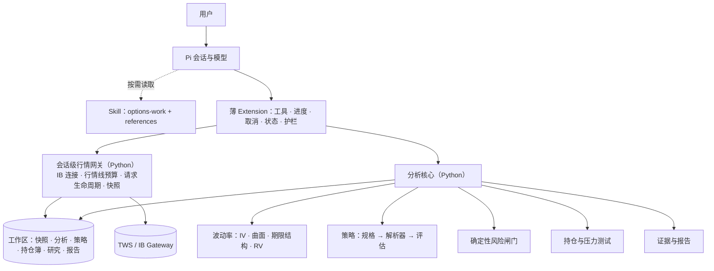

# Pi 期权 package 第一版研究框架（v0.1，工作名 `pi-options`）

| 项 | 内容 |
| --- | --- |
| 日期 | 2026-09-30 |
| 性质 | **研究框架草案**，用于后续对话逐步收敛需求，不是最终设计。文中的"建议"都可以推翻，§13 列出了需要你确认的问题 |
| 事实基线 | IBKR TWS API 官方文档（2026-09-30 抓取）；ib_async 2.1.0 wheel 源码；Pi 0.99.1（2026-09-29 发布）与 0.87.1；QuantLib 1.43、vollib 1.0.11；论文 LiveOption（arXiv 2609.33470，2026-09-27）与 OQL（arXiv 2603.16434）；DoltHub `post-no-preference/options`（数据截至 2026-09-28） |
| 继承 | Qlib package 的 A v2.1 规范（下称"Qlib 包"）中的工程、证据与交易边界合同，以及上轮审计的细节建议 D-1–D-12 |
| 证据 | 实验 E11–E13 见 `docs/evidence/2026-09-30_options_lab/`；沿用 E7（ib_async 连接行为） |

**标记**：「已核实」= 官方文档或源码确认；「已实测」= 本次实验复现；「判断」= 本文评估；「待确认」= 需要你回答。

> **勘误（2026-09-30）**：与 Codex v0.2 对比后，本文有 10 处错误或不精确，见 `docs/2026-09-30_pi_options_proposals_comparison.md` §6.1。主要包括：
>
> - 数据类型应以 `marketDataType` 回调为准，而不是"收盘后的分析一律标为 frozen"；
> - 行权方式不能从合约详情读取；
> - 单个合约的成交量是默认字段，不需要流式请求；
> - 裸卖看跌的风险有界，不属于"无限风险"；
> - 当前 IV 和希腊值应直接用 IB 原生值，情景的基准与冲击要用同一个本地模型。
>
> 正文保留原样作为历史参考；实施以 Codex v0.2 及其数据矩阵为准。后续版本：`docs/2026-10-01_pi_options_package_proposal_v0.2.md`（Claude v0.2，已并入上述修正）。

---

## 0. 一页结论

**建议定位**：让 Pi 具备"期权分析师 + 交易辅助"的工作能力：
- 读懂期权链和波动率；
- 把一个市场观点变成几种可以并列比较的期权结构；
- 算清一笔交易和整个持仓的风险；
- 给出不可执行的交易单草稿（`executable:false`，不下单）。

历史回测受数据条件约束，作为研究能力分期引入。

**七个关键发现**

1. **IBKR 适合看"现在"，不适合看"过去"**（已核实）。能拿到的：期权链参数、实时或延迟报价、IB 模型希腊值、持仓量和成交量，以及标的的 30 天隐含波动率和历史波动率日线。拿不到的：已到期期权的历史，以及任何期权的日线历史（日线请求返回错误 162 "No data of type EODChart"）。因此 v1 的重心应该是分析与决策，而不是期权回测。
2. **行情线是硬约束**（已核实）。默认只有 100 条并发行情线，而且与 TWS 界面共享；API 请求速率上限 = 行情线数 ÷ 2 每秒。Snapshot 请求不能带持仓量、成交量等附加字段，并且要约 11 秒才结束。所以必须"先筛选、再取报价"，并给本包设一个行情线预算。
3. **实时希腊值需要两份订阅**（已核实）：期权本身和标的的行情订阅都要有。没有订阅时可用免费的 15–20 分钟延迟数据，收盘后可用 frozen 数据，因此每个报价都必须标注数据类型。
4. **期权领域没有 Qlib 那样的一体化研究框架**（已核实）。成熟可用的是定价层：QuantLib 1.43（BSD 许可，全平台有预编译 wheel）和 vollib 1.0.11（MIT 许可）。策略、风险和回测层需要本包自己实现。可参考的 optopsy 是 AGPL-3.0、financepy 是 GPL-3.0，不宜进入核心。
5. **隐含波动率并不总能算出来**（已实测）。
   - 价格对波动率不敏感（每个波动率点价格变化不足 1 美分）的合约，求出的误差可达 39 个波动率点；
   - 美式期权价格等于内在价值时无解；
   - 用欧式公式算美式实值看跌，会高估 4–8 个波动率点。

   因此需要"可识别性闸门"，并采用"曲面只用虚值合约、单合约估值用美式模型"的规则。
6. **前沿研究的两条教训**（已核实）。
   - LiveOption（2026-09）：现有 LLM Agent 在各项期权任务中的典型收益都是负的；去掉持仓状态信息后，平均最大回撤约翻三倍。作者的结论是：执行前的确定性风险校验应当是基础设施，不能靠提示词。
   - OQL（2026-03）：让 LLM 只写结构化意图、由确定性引擎解析到具体合约，比让 LLM 直接在原始期权链里挑合约可靠得多。
7. **Pi 0.99.0（2026-09-29 发布）的新工具 API 正好契合期权包的需要**（已核实）：工具暴露级别（如 `deferred`）、结构化输出（`outputSchema`）、失败时仍可携带数据（`isError`）、只读注解、嵌套工具调用、MCP 注册。期权包工具多、数据量大、需要结构化结果，这些都用得上。不过 Qlib 包固定在 0.87.1，需要决定新包采用哪个基线。

**建议的 v1 能力范围**（待确认，详见 §7）：
- v1：
  - C1 期权链与行情；
  - C2 波动率分析；
  - C3 定价与希腊值；
  - C4 策略构造与评估，含风险闸门和交易单草稿；
  - C5 持仓风险，先支持文件导入；
  - C6 研究：只做标的 IV 指数研究和快照日志；
  - C7 按需复评与报告。
- v1.x：外部历史期权数据导入与期权回测。
- v2：定时监控。

**建议的架构**：沿用 Qlib 包的骨架（1 个 Skill + 薄 Extension + 单一 Python 项目 + 证据与报告纪律 + 不下单），新增三个期权特有组件：
1. 会话级行情网关；
2. 结构化策略规格及其确定性解析器；
3. 确定性风险闸门。

**请你先回答的五个问题**（完整列表见 §13）：
1. 定位选哪种（分析助手、研究员，还是持仓风控）？
2. 标的范围：美股个股/ETF 期权、指数期权（SPX/XSP），还是期货期权？
3. 你最常用的策略类型是什么？
4. 是否分析真实持仓？如果分析，用文件导入还是只读 API？
5. 是否愿意为历史期权数据付费？

---

## 1. 从 Qlib 包到期权包：变与不变

| 维度 | Qlib 包（A v2.1） | 期权包 | 设计含义 |
| --- | --- | --- | --- |
| 工作重心 | 历史研究与回测，产出研究结论 | 当下的期权链与波动率、结构选择、交易与持仓风险；研究是次要能力，而且受数据约束 | 产品按"分析与决策"组织，而不是按回测流水线组织 |
| 核心数据 | 标的日线历史（IBKR 可得） | 期权链快照（报价、IV、希腊值、持仓量）；IBKR 不提供已到期期权历史 | 快照必须带时间戳、数据类型和质量标签；历史数据另选路线（§10） |
| 计算权威 | Qlib 原生账户与 Recorder | 行情快照 + 声明的定价模型 + 确定性计算；IB 模型值作为对照 | 每个数字既要记录报价来源，也要记录模型假设 |
| 主要风险 | 过拟合、时间泄漏、编造数字 | 以上都有，另加尾部亏损、流动性、提前行权与派息、事件跳空、合约调整、乘数错误 | 除研究纪律外，还需要确定性风险闸门 |
| 时间尺度 | 天到年 | 分钟到周（剩余天数、到期日、事件） | 按交易所时区和到期规则精确计时 |
| 研究对象 | 研究、尝试、候选、复评 | 同上，另加持仓簿、观察清单、快照日志、交易单草稿 | 研究状态核心（StudyCore）可以沿用，对象需要扩展 |
| 可复用部分 | — | Pi 形态；环境（最终路径 runtime、完整锁、按能力准备依赖）；监督进程与 worker 分进程组；IB 请求生命周期合同（v2.1 §8.6，含上轮审计 D-1）；证据绑定与五类判断；离线报告核验；不下单边界；J/C 式验收 | 复制合同与设计，不共享运行时代码（§9.9） |

---

## 2. 期权研究员与交易员的日常工作

| # | 工作 | 典型问题 | 需要的数据 | 关键输出 | 建议版本 |
| --- | --- | --- | --- | --- | --- |
| W1 | 读懂波动率 | "NVDA 财报前隐含波动率贵吗？市场预期会涨跌多少？" | 期权链快照、标的 IV/HV 历史、事件日历 | IV rank 与百分位、期限结构、偏斜、预期波动幅度、事件隐含波动 | v1 |
| W2 | 从观点到结构 | "我对 AAPL 中性偏多，看 6 周，最多亏 2000 美元，怎么做？" | 期权链快照、波动率曲面 | 3–5 个候选结构的并列比较：盈亏、概率、希腊值、流动性成本、风险闸门结果 | v1 |
| W3 | 评估一笔交易 | "卖 45 天、delta 为 30 的 SPY 看跌怎么样？" | 同上，加保证金规则 | 盈亏图、情景网格、盈亏平衡点、最大亏损、盈利概率（POP）、保证金估算、指派与事件风险 | v1 |
| W4 | 管理持仓 | "SPY 跌 5%、VIX 涨 10 点，我会亏多少？哪些仓位需要处理？" | 持仓（文件或只读 API）、期权链快照 | 组合希腊值、β 加权 delta、压力测试、到期与指派日历、展期方案对比 | v1（文件导入） |
| W5 | 研究与验证 | "IV rank 高的时候卖跨式有没有优势？" | 历史期权数据（IBKR 不提供），或标的 IV 指数历史 | 限定口径的研究报告；数据不足时明确说明 | v1 部分，v1.x 补全 |
| W6 | 复评与盯盘 | "每天帮我看看持仓有没有到止盈、剩余天数或 delta 阈值" | 持仓、期权链快照 | 不可执行的调整建议 | v1 按需；v2 定时 |
| W7 | 交付与复核 | "给我一份可以存档的分析" | 以上各项产物 | 离线 HTML、Markdown、交易单草稿 JSON | v1 |

---

## 3. 基础事实 A：IBKR 期权数据能力与限制（已核实）

| # | 事实 | 来源 | 设计含义 |
| --- | --- | --- | --- |
| I1 | `reqSecDefOptParams` 按交易所和 tradingClass 返回到期日集合、行权价集合和乘数，不受节流。两个集合组合出的合约里可能有无效组合。用 `reqContractDetails` 取完整链会被节流，官方不推荐 | Option Chains 页 | 先用链参数筛选，再对选中的合约逐个确认（qualify） |
| I2 | 期权行情默认附带 tick 10–13（按买价、卖价、最新价和模型价计算），包含 IV、delta、gamma、vega、theta、标的价格和股息现值；模型计算还给出模型 IV | Option Greeks 页 | IB 的希腊值作对照值；本包自算值作主值，口径可控 |
| I3 | 实时希腊值需要**期权和标的两份**行情订阅；缺标的订阅会报 "Market Data Is Not Subscribed" | Option Greeks 页 | 准备阶段检查订阅，并告诉用户具体缺哪一份 |
| I4 | `calculateImpliedVolatility` / `calculateOptionPrice` 用 IB 的模型，按假设价格计算 IV 或理论价 | 同上 | 用于和本包模型对账 |
| I5 | 附加字段（generic tick）：100 为期权成交量（认购/认沽），101 为持仓量（认购/认沽），104 为 30 天历史波动率，106 为 IB 30 天隐含波动率，411 为实时历史波动率，456 为股息 | Tick Types 页 | 取得标的层面的 IV/HV 快照；持仓量和成交量用于流动性筛选 |
| I6 | Snapshot 请求（`snapshot=True`）只返回默认字段，不能带附加字段，约 11 秒后才结束 | Streaming Data Snapshots 页 | 持仓量和成交量必须用短时流式请求取得，取到后立即取消 |
| I7 | 行情线默认 100 条并发，与 TWS 界面共享，可随佣金或账户资产增加；API 请求速率上限 = 行情线 ÷ 2 每秒（默认 50 次/秒） | Market Data Pricing 页；Pacing Limitations 页 | 需要行情线预算和分批取数；与 Qlib 包、TWS 共用同一额度 |
| I8 | 美国期权报价每 100 ms 更新一次（聚合快照，不是逐笔） | Market Data Update Frequency 页 | 不适合做市场微观结构研究 |
| I9 | 延迟数据免费，延迟 15–20 分钟；frozen 返回收盘时记录的最后值；另有 delayed-frozen。延迟数据有对应的延迟期权计算字段 | Delayed Market Data 页；Tick Types 页 | 每个报价标注 live、frozen、delayed 或 delayed-frozen；收盘后的分析一律标为 frozen |
| I10 | Regulatory snapshot 每次收费 0.01 美元（文档表格针对美股 A、B、C 网络），且每秒至多 1 次 | Regulatory Snapshots 页 | 默认不使用 |
| I11 | 已到期期权的历史不可得；期权日线（EOD）不可得（日线请求返回错误 162 "No data of type EODChart"）；存续合约可以取日内 bar（MIDPOINT、BID_ASK 等类型支持期权）；组合（combo）的历史只是各腿之和 | Unavailable Historical Data 页；whatToShow 页；twsapi 社区记录 | **仅凭 IBKR 数据无法做期权策略的历史回测** |
| I12 | 标的的 OPTION_IMPLIED_VOLATILITY 与 HISTORICAL_VOLATILITY 历史 bar 支持股票、ETF 和指数 | whatToShow 页 | 可以做 IV rank/百分位和 IV–RV（波动率风险溢价）研究，但只有"30 天 IV"这一个维度 |
| I13 | API 提供行权接口 `exerciseOptions`；ib_async 提供 `whatIfOrder`（预览保证金和佣金，不实际下单） | Exercise Options 页；ib_async 源码 | 行权不在本包范围内；`whatIfOrder` 走的是下单接口，建议默认不用（待确认，§11） |
| I14 | ib_async 2.1.0 已封装上述能力：`reqSecDefOptParams`、`reqTickers`、`Ticker.bidGreeks/askGreeks/lastGreeks/modelGreeks`、`callOpenInterest/putOpenInterest`、`impliedVolatility/histVolatility`、`calculateImpliedVolatility/OptionPrice`、`reqMarketDataType`。另外，`connectAsync` 总会请求持仓（上轮审计 E7a） | ib_async 源码 | 连接方式沿用上轮审计 D-1 的处理 |

**快照耗时估算（判断，待 M0 实测）**：
- 公式：读取 N 个合约、可用行情线 L 条、每批等待报价和希腊值到齐的时间为 t，总耗时约为 ⌈N/L⌉ × t。
- 例子：N=400、L=60、t=2 秒，约 14 秒；N=4000，约 2 分钟以上。
- 流动性好的标的通常有几十个到期日、几百个行权价（以 `reqSecDefOptParams` 的实际返回为准）。

所以默认只取与问题相关的子集：限定到期窗口、价内外程度或 delta 区间，并设流动性门槛。

---

## 4. 基础事实 B：定价方法与成熟库（已实测）

### 4.1 候选库

| 库 | 版本（发布时间） | 许可 | 平台 | 结论 |
| --- | --- | --- | --- | --- |
| QuantLib | 1.43（2026-07） | BSD-3 | macOS arm64/x86、Linux x86/arm、Windows 均有预编译 wheel | 进入核心：美式定价、股息、利率曲线、波动率曲面 |
| vollib | 1.0.11（2026-06） | MIT | 纯 Python | 进入核心：快速计算欧式/BSM 的 IV 和希腊值。`py_vollib` 已弃用并提示改用 vollib；只接受标量输入 |
| optionlab | 1.9.1（2026-09） | 元数据未声明 | 纯 Python，依赖 jupyter 和 matplotlib | 参考其策略盈亏设计，不作为依赖 |
| optopsy | 2.3.0（2026-03） | AGPL-3.0 | 纯 Python | 可参考其回测设计，不进入核心 |
| financepy | 1.1.2（2026-08） | GPL-3.0 | 锁定 numpy<2.4 | 不进入核心 |
| py_vollib_vectorized | 0.1.1（2021-02） | MIT | 纯 Python | 已停更 |
| mibian | 0.1.3（2016） | GPL | 仅源码包 | 已停更 |

**结论**：期权领域没有 Qlib 那样的一体化研究框架。所谓"成熟库"指的是定价层；策略、风险和回测层才是本包的主要开发量。

### 4.2 实测结果（E11–E13）

| 实验 | 结果 | 由此得出的设计规则 |
| --- | --- | --- |
| E11 欧式 IV | vollib 约 0.019 ms/合约，2000 个合约约 40 ms。vega ≥ 0.01（每个波动率点价格变化至少 1 美分）的合约误差约为 0；vega < 0.01 的合约要么求解失败，要么误差最高达 39 个波动率点 | **可识别性闸门**：如果每个波动率点带来的价格变化小于最小报价单位（或半个买卖价差），就把 IV 记为"不可识别"，不参与曲面拟合 |
| E12 美式偏差 | 半年期、r=4.5% 时，用欧式公式算美式看跌：实值 20% 高估 3.7 点，实值 30% 高估 7.9 点，虚值 20% 只高估 0.15 点；看涨（股息率 3%）偏差 ≤ 0.24 点 | 拟合曲面只用虚值合约（远期价以上用看涨、以下用看跌）；单个合约定价和持仓估值用美式模型 |
| E13 美式引擎 | FD 约 7.5 ms/价；CRR 二叉树（801 步）约 3.4 ms/价；BAW 约 0.014 ms/价，但误差可达 0.14（标的价 100 时）。QuantLib 美式 IV 约 15.5 ms/合约，2000 个合约单线程约 31 秒；价格等于内在价值时无解 | 分两条计算路径：快速路径（欧式或虚值合约，覆盖整条链）和精确路径（美式模型，只算持仓和选中的合约）；BAW 只用于估算 |

### 4.3 v1 采用的方法

- **远期价与贴现因子**：
  - 欧式期权（如指数期权）：用多个行权价上的看涨看跌平价关系做回归，得到隐含远期价和贴现因子；
  - 美式个股期权：使用利率和股息假设（来源必须声明），平价关系只用来检验。
- **利率**：需要一个声明的来源，例如美国国债或 SOFR 曲线（数据源待定）。
- **股息**：取自 IB 的股息字段（tick 456）、用户输入，或由平价关系反推；除息日对看涨期权提前行权的影响单独标出。
- **时间**：按交易所时区的到期时刻计算。PM 结算合约按美东 16:00 计；SPX 月度合约是 AM 结算，按开盘结算价计。
- **波动率曲面**：每个到期日拟合 SVI，并检查蝶式套利和日历套利；只在数据范围内插值，外推时要标记。
- **已实现波动率**：close-to-close、Parkinson、Garman–Klass、Yang–Zhang 四种估计。
- **概率**：风险中性概率（来自曲面）和基于历史波动率的概率分开给出，两者都不是"胜率保证"。

---

## 5. 基础事实 C：LLM 做期权的前沿研究与启示

### 5.1 LiveOption（arXiv 2609.33470，2026-09-27）

LiveOption 是一个评测 LLM 期权交易 Agent 的框架，包含三类任务：组合增强（overlay）、财报事件交易、0DTE 日内交易。评测指标分四层：动作是否有效、决策质量、风险特征、最终收益。主要结论：

- 所有任务中，Agent 的典型收益都是负的；做多重比较校正后，模型之间没有显著差异；
- 去掉持仓状态信息后，平均最大回撤约翻三倍；去掉希腊值后，有一个模型在 95.8% 的交易时段选择不交易；
- 在财报任务中出现了低于 −100% 的收益，直接原因是"杠杆叠加"：通过展期、加仓或覆盖翼部，使实际杠杆超过初始资金分配。

作者提炼的三条设计原则：
1. 执行前必须经过确定性的风险校验，包括单笔最大亏损、组合 VaR、保证金可行性和 gamma 敞口；
2. 报告收益时，要同时报告不交易率、被拒绝率和回撤分布；
3. 判断 Agent 是否真正用到了某项信息，要用干预实验（去掉该信息后重跑），而不是只看收益。

### 5.2 OQL（arXiv 2603.16434）

OQL 是一种期权查询语言，作为中间表示：LLM 只负责把自然语言意图解析成 OQL，再由确定性引擎在期权链上执行，得到具体的策略。这种做法同时缓解了期权链数据量过大导致的"上下文爆炸"和幻觉问题。例如 DeepSeek-Chat 使用 OQL 时，买方 Risk@90 为 18.6%，而直接生成 SQL 时为 46.1%。

### 5.3 对本包的启示：五条设计原则

| # | 原则 | 做法 |
| --- | --- | --- |
| P1 | LLM 不做数值计算 | 价格、希腊值、概率和保证金都由确定性代码计算；报告中的数字绑定证据（沿用 A v2.1 §16） |
| P2 | 意图用结构化规格表达，由确定性引擎落地 | LLM 填写策略规格（到期窗口、delta 或价内外、各腿比例、约束），解析器把它映射到具体 conId。LLM 不直接从原始期权链里挑合约。用的是参数 schema，不是新语言，与"不发明 DSL"的原则一致 |
| P3 | 风险闸门是基础设施 | 每张交易单草稿都经过同一套确定性检查，结果写进交易单；不能用提示词代替 |
| P4 | 期权链数据不进上下文 | 工具只返回摘要和查询结果；完整的链保存在工作区文件中 |
| P5 | 评测既看行为也看尾部 | 验收除了"是否答对"，还统计拒绝率、不交易率和尾部亏损分布，并用消融实验（去掉希腊值、去掉持仓状态）检验 Agent 是否真的用到了这些信息 |

### 5.4 Pi 生态现状

2026-09-30 在 npm 上用 `pi-package` 关键词检索 options、ibkr、volatility，没有找到期权或 IBKR 相关的 Pi 包。Node 侧有 IBKR 客户端库（如 `@stoqey/ib`），但本包的 Python 侧沿用 ib_async，与 Qlib 包保持一致。

---

## 6. 期权特有的风险清单

| 风险 | 为什么重要 | 本包的处理 |
| --- | --- | --- |
| 成交价假设 | 按中间价成交过于乐观，买卖价差可能占权利金的很大比例 | 默认按对手价（natural）评估，同时给出中间价和"中间价 + x%"两种情景；流动性成本单独列出 |
| 报价质量 | 过期、交叉、零买价、收盘后冻结的报价会让 IV 和希腊值失真 | 给每个报价打质量标签（时间、数据类型、价差比例、零买价）；不合格的报价不参与曲面拟合 |
| IV 不可识别 | 见 E11、E13 | 可识别性闸门 |
| 美式提前行权与派息 | 实值看涨在除息前可能被指派，实值看跌可能被提前行权 | 使用美式模型；标记指派风险（例如临近除息日、剩余时间价值低于股息） |
| 行权方式与结算 | SPX 是欧式、现金结算，月度合约 AM 结算；个股期权是美式、实物交割 | 这些属性一律取自合约详情，不由 LLM 推断 |
| 非标准合约 | 拆股或特别股息后，乘数或交割物会变化，tradingClass 也不同 | 识别并标记；默认排除，确需使用时单独确认 |
| 乘数与单位 | 权利金按每股报价，一张合约通常是 100 股；IV 有 0.25 和 25 两种写法 | 统一在代码中换算；报告同时显示"每股"和"每张/总额" |
| 时间与事件 | 财报、除息、FOMC 会造成期限结构拐点和价格跳空 | 事件日历纳入评估；持有期内有事件时显著标注 |
| 利率、股息、借券 | 影响远期价和平价关系；难借股票的平价会出现偏离 | 假设必须声明来源；平价偏离作为数据信号展示，不被当成错误隐藏 |
| 尾部风险 | 卖出期权的亏损可能远超收到的权利金 | 风险闸门检查：最大亏损、是否为有限风险、保证金估算、压力测试 |
| 保证金 | Reg-T 与组合保证金的差别很大 | v1 只给基于规则的估算并明确标注；是否使用 `whatIfOrder` 待确认 |
| 模型风险 | IB 模型与本包模型不同；曲面外推不可靠 | 两种结果并列展示，差异超过阈值时标记 |
| 历史数据缺失 | IBKR 没有已到期合约的数据 | 历史研究路线见 §10；不做"基于 IBKR 的回测" |
| LLM 特有错误 | 心算出错、混淆认购与认沽、编造行权价或到期日、忽略乘数 | 原则 P1 和 P2：数值由代码计算，合约只能来自解析器 |

---

## 7. 能力地图（v1 候选，待确认）

### C1 期权链与行情

| 能力 | 说明 | 版本 |
| --- | --- | --- |
| 标的解析与合约确认 | 从代码解析到 conId；确认期权合约的属性（乘数、行权方式、结算方式、tradingClass） | v1 |
| 链参数与筛选 | 按到期窗口、价内外程度或 delta、流动性门槛筛选 | v1 |
| 报价快照 | 买卖价、IV、希腊值、持仓量、成交量；每个报价带数据类型和质量标签；遵守行情线预算 | v1 |
| 订阅与权限诊断 | 说明缺哪份订阅、当前是延迟还是实时数据 | v1 |
| 快照日志 | 把快照存为 Parquet，逐步积累自己的历史数据 | v1 |
| 持续流式监控 | 长时间订阅行情 | v2 |

### C2 波动率分析

| 能力 | 说明 | 版本 |
| --- | --- | --- |
| IV 计算与对照 | 本包自算 IV（经过可识别性闸门）与 IB 模型 IV 并列 | v1 |
| 微笑与偏斜 | 25 delta 风险逆转、蝶式价差等指标 | v1 |
| 期限结构 | 各到期日的平值 IV；识别事件造成的拐点 | v1 |
| 波动率曲面 | 每个到期日拟合 SVI，并做套利检查 | v1（基础版） |
| IV rank 与百分位 | 基于标的 30 天 IV 的历史（I12） | v1 |
| 已实现波动率与 IV–RV 差 | 四种已实现波动率估计 | v1 |
| 预期波动与事件隐含波动 | 由跨式价格或期限结构推算；事件日历来源待定 | v1 |
| 风险中性密度 | Breeden–Litzenberger 方法 | v1.x |

### C3 定价与希腊值

| 能力 | 说明 | 版本 |
| --- | --- | --- |
| 欧式与美式定价 | 两条计算路径（§4.2）；股息与利率假设须声明 | v1 |
| 一阶与二阶希腊值 | 包括 vanna、volga、charm，并换算成美元金额 | v1 |
| 情景重估 | 标的价格 × 波动率 × 时间三维网格 | v1 |

### C4 策略构造与评估

| 能力 | 说明 | 版本 |
| --- | --- | --- |
| 结构化策略规格与解析器 | 模板包括垂直价差、跨式与宽跨式、铁鹰、蝶式、日历与对角价差、备兑、现金担保看跌、领口、比率价差；也支持自定义各腿 | v1 |
| 策略评估 | 盈亏图、情景网格、盈亏平衡点、最大盈亏、两种口径的 POP、声明分布下的期望值、希腊值、流动性成本、保证金估算、事件与指派风险 | v1 |
| 并列比较 | 同一观点下的多个结构放在一起比较 | v1 |
| 风险闸门 | 检查项见 §9.5 | v1 |
| 交易单草稿 | 精确合约、数量和限价区间建议，标注 `executable:false` | v1 |
| 展期与调整分析 | 为现有持仓生成展期或调整方案 | v1（配合 C5） |

### C5 持仓与组合风险

| 能力 | 说明 | 版本 |
| --- | --- | --- |
| 持仓导入 | CSV 或 IB Flex 报表 | v1 |
| 通过只读 API 读取持仓 | 需要你单独授权 | v1 可选（待确认） |
| 组合希腊值与 β 加权 delta | 按标的和到期日汇总 | v1 |
| 压力测试 | 标的价格与波动率冲击、时间流逝 | v1 |
| 到期与指派日历 | 列出即将到期和可能被指派的仓位 | v1 |

### C6 研究与验证

| 能力 | 说明 | 版本 |
| --- | --- | --- |
| 标的 IV 指数研究 | 例如 IV rank 规则、IV–RV 差；只用 30 天 IV 这一个维度，结论必须限定口径 | v1 |
| 基于快照日志的研究 | 随数据积累逐步可用 | v1 |
| 外部历史期权数据导入 | 从 DoltHub 免费数据起步，用通用 CSV 格式对接付费数据源 | v1.x |
| 期权策略回测引擎 | 按对手价成交；考虑提前行权、股息和保证金 | v1.x |
| 模型合成回测 | 用标的历史、IV 指数和偏斜假设给期权定价，明确标注为"合成" | v1.x（可选） |

### C7 复评与交付

| 能力 | 说明 | 版本 |
| --- | --- | --- |
| 按需复评 | 检查止盈、剩余天数、delta 阈值和事件规则 | v1 |
| 报告 | 期权链、波动率、策略、持仓、研究五类视图；数字绑定证据；离线 HTML 经过核验 | v1 |
| 定时复评与提醒 | 需要后台运行 | v2 |

---

## 8. 产品形态

### 8.1 三种定位

| 定位 | 核心工作 | 优点 | 代价 |
| --- | --- | --- | --- |
| A 期权分析与决策助手 | W1–W4、W7 | IBKR 的数据足够支撑；对用户的价值最直接 | 研究能力较弱 |
| B 期权研究员 | 以 W5 为主 | 能验证策略是否真有优势 | 必须购买或长期积累历史数据；开发量最大 |
| C 期权持仓风控助手 | 以 W4、W6 为主 | 每天都用得上 | 依赖持仓数据的授权 |

**建议**：以 A 为主体，把 C 的核心（持仓风险分析）纳入 v1，B 在 v1.x 根据选定的数据路线引入。

### 8.2 交互方式与交付物

- **入口**：
  - 用自然语言提问，由入口 Skill `options-work` 分流（沿用 Qlib 包"一个入口 Skill + 按需读取参考资料"的做法）；
  - `/opt` 命令提供状态查看、环境准备和打开报告等确定性操作。
- **聊天中**：先给结论，再给关键数字（每个都带来源）、主要风险和报告路径。
- **工作区中**：
  - 快照日志；
  - 分析结果与证据；
  - 策略规格、解析结果和交易单草稿；
  - 离线 HTML 报告。

### 8.3 四个典型会话（示意）

1. **读波动率**："NVDA 财报前隐含波动率贵吗？"
   - Agent 先确认订阅和数据类型；
   - 取财报前后三个到期日的筛选链；
   - 给出期限结构拐点、隐含的财报波动幅度、IV rank（基于 IB 的 30 天 IV 历史）以及与已实现波动率的差；
   - 所有数字标注快照时间和数据类型。
2. **从观点到结构**："我对 AAPL 中性偏多，看 6 周，最多亏 2000 美元。"
   - Agent 生成 3–4 个策略规格（例如牛市看跌价差、看涨借记价差、备兑）；
   - 解析器把规格落到具体合约，风险闸门逐一检查；
   - 最后并列比较它们的盈亏、概率、希腊值和流动性成本，并附上交易单草稿（`executable:false`）。
3. **持仓压力测试**：用户导入持仓 CSV，问"SPY 跌 5% 且 VIX 涨 10 点会怎样？"
   - Agent 输出组合希腊值、情景下的盈亏、到期与指派日历，以及需要处理的仓位清单；
   - 其中的调整建议不可执行。
4. **研究问题**："卖 delta 为 30 的 SPY 看跌期权，历史上有没有优势？"
   - Agent 说明 IBKR 没有历史期权数据；
   - 列出三条路线：用 IV 指数做近似研究、导入 DoltHub 免费数据、购买付费数据；
   - 由用户选择后再执行，结论按所选数据的口径限定。

---

## 9. 产品架构草案

### 9.1 分层视图



### 9.2 组件职责

| 组件 | 负责 | 不做 |
| --- | --- | --- |
| Skill | 工作分流、波动率与策略方法、风险清单、IBKR 操作指引、报告措辞 | 不产生任何数字 |
| Extension | 工具注册（含暴露级别和结构化输出）、进度、取消、状态、受保护路径护栏 | 不实现任何金融逻辑 |
| 行情网关 | 持有 IB 连接；分配行情线；管理请求生命周期（沿用 v2.1 §8.6 与 D-1）；给报价打质量和数据类型标签；写快照 | 不做定价，也不做策略判断 |
| 分析核心 | 定价、IV、曲面、希腊值、情景、策略解析与评估、持仓风险 | 不连 IB，只读取快照 |
| 风险闸门 | 对每个策略和交易单做确定性检查 | 不能被提示词绕过 |
| 证据与报告 | 数字绑定证据、五类判断分开记录、离线 HTML 核验 | 不重新取数 |

### 9.3 工具草案

| 工具 | 动作 | 暴露级别（Pi ≥ 0.99） | 注解 |
| --- | --- | --- | --- |
| `opt_prepare` | check / setup / capabilities / doctor（订阅、行情线、数据类型） | direct | 写入工作区 |
| `opt_market` | resolve / chain / snapshot / underlying_history / journal | direct | 访问外部，其余只读 |
| `opt_analyze` | iv / smile / term / surface / rv / expected_move / price / greeks / scenario | direct | 只读 |
| `opt_strategy` | build / resolve / evaluate / compare / gate / ticket | direct | 写入策略目录 |
| `opt_portfolio` | import / read_api（需授权）/ risk / stress / review / roll | direct | 写入持仓簿 |
| `opt_report` | render / verify / open | direct | 写入报告目录 |
| `opt_research` | import_history / backtest / iv_index_study | deferred（v1.x） | 写入研究目录 |

说明：
- 工具结果同时提供 `content`（给模型的摘要）和 `structuredContent`（结构化数据），这样 codemode 脚本也能直接使用。
- 风险闸门拦下的交易单用 `isError` 返回，失败原因和已算出的数据一并保留。
- 如果基线仍停在 Pi 0.87.1，则去掉暴露级别和结构化输出，沿用 Qlib 包"先落盘事实、再抛出异常"的做法。

### 9.4 结构化策略规格（示意）

```yaml
schema: piopt.strategy_spec/0
underlying: {symbol: XYZ, sec_type: STK}          # conId 由解析器确认
intent: "中性偏多，约 6 周，风险有限"
structure: bull_put_spread                        # 模板名，或 custom
legs:
  - {right: P, side: sell, ratio: 1,
     expiry: {dte_target: 42, dte_range: [35, 49], prefer: monthly},
     strike: {delta: -0.30}}
  - {right: P, side: buy, ratio: 1,
     expiry: {same_as_leg: 0},
     strike: {offset_from_leg: 0, points: -5}}
quantity: {contracts: 2}
constraints:
  max_loss_usd: 2000
  min_open_interest: 500
  max_spread_pct_of_mid: 10
  no_earnings_before_expiry: true
pricing: {fill: natural, also_show: [mid, mid_plus_25pct_of_spread]}
scenarios: {spot_pct: [-10, -5, 0, 5, 10], vol_pts: [-5, 0, 5], days_forward: [0, 14, 28]}
```

解析器的输出：
- 选中的具体合约：conId、localSymbol、到期日、行权价、认购或认沽、乘数、tradingClass；
- 选择依据：实际 delta、持仓量、价差、报价时间和数据类型；
- 如果无法满足约束，逐条列出原因（例如"满足 delta 条件的合约持仓量都低于 500"）。

数字全部由代码计算，LLM 只能引用。

### 9.5 确定性风险闸门

| 检查 | 规则（阈值可配置） | 结果 |
| --- | --- | --- |
| 最大亏损 | 按乘数和数量计算，不超过规格或用户设定的预算 | 通过 / 拦截 |
| 风险是否有限 | 默认拦截裸卖出等无限风险结构，除非用户明确允许 | 拦截 / 警告 |
| 保证金 | 规则估算值不超过已知的可用额度 | 警告 |
| 流动性 | 持仓量、价差占比、报价时效 | 警告 / 拦截 |
| 事件 | 持有期内有财报或除息 | 警告 |
| 指派风险 | 卖出腿为实值且时间价值低于股息，或临近到期 | 警告 |
| 希腊值与集中度 | 组合 delta、gamma、vega 以及单一标的占比 | 警告 |
| 数据质量 | 所用报价的数据类型（live/frozen/delayed）和时效；IV 是否可识别 | 警告 / 拦截 |

闸门结果写进每一张交易单草稿。被拦截的方案保留分析结果和拦截原因，但不生成交易单。

### 9.6 数据对象

| 对象 | 关键字段 |
| --- | --- |
| ContractRef | conId、代码、tradingClass、乘数、认购或认沽、行权价、到期日与到期时刻、行权方式、结算方式、非标准标记 |
| ChainSnapshot | 快照 ID、标的报价、各合约报价（买价、卖价、最新价、持仓量、成交量）、IB 希腊值、数据类型、时间戳、质量标签、行情线用量 |
| VolSurface | 方法与参数、输入快照、可识别性过滤结果、套利诊断、利率与股息假设 |
| StrategySpec / ResolvedStrategy | 规格、解析出的合约、选择依据、无法满足约束的原因 |
| Evaluation | 盈亏、情景网格、概率（注明口径）、希腊值、流动性成本、保证金估算、事件与指派风险、证据 ID |
| GateResult | 各项检查的结果、阈值和实际值 |
| TradeTicket | 合约、方向、数量、限价区间建议、闸门结果、`executable:false`、有效期 |
| Book | 持仓来源（文件或 API）、时间、估值、组合希腊值、压力测试结果 |

### 9.7 进程与连接模型（关键决策）

| 方案 | 做法 | 优点 | 缺点 |
| --- | --- | --- | --- |
| P1 每次调用启动新进程（与 Qlib 包相同） | 每个工具调用都启动 Python 并自己连接 IB | 与 A v2.1 一致，最简单 | 每次都要重连，还会触发 ib_async 的启动请求；行情线无法跨调用统一调度 |
| P2 会话级 sidecar | Extension 在首次需要时启动一个 Python 进程（stdio JSON-RPC），由它持有 IB 连接和行情线预算；Pi 会话结束时退出 | 连接复用、统一调度行情线、响应快 | 需要处理好崩溃恢复和清理 |
| P3 注册为 MCP 服务器 | 与 P2 相同，但通过 `pi.registerMcpServer()` 暴露 Python 工具 | 其他 MCP 客户端也能复用；TS 层更薄 | Pi 特有能力（onUpdate 进度、details 渲染、交互确认）如何映射尚需验证；工具描述改由 Python 侧维护 |

**建议**：
- 数据层（IB 连接）采用 P2；
- 较重的分析和回测仍按"监督进程 + worker"的每次调用模型执行；
- P3 等 M0 验证 MCP 映射后再决定。

P2 与 Qlib 包"不常驻"的原则并不冲突：sidecar 的生命周期绑定在 Pi 会话上，会话结束即退出，不是后台服务。

### 9.8 工作区布局

```text
<workspace>/
├── .options/                                   # 设置、锁、runtime、网关状态
├── snapshots/<underlying>/<date>/<snapshot_id>/  # 快照日志（Parquet + manifest）
├── analyses/<analysis_id>/                     # 波动率分析：输入快照引用、结果、证据
├── strategies/<spec_id>/                       # 规格、解析结果、评估、闸门结果、交易单草稿
├── books/<book_id>/                            # 持仓簿、压力测试、复评记录
├── research/<study_id>/                        # 研究（沿用 StudyCore：revision/attempt/candidate/review）
└── reports/<report_id>/                        # HTML、Markdown、核验记录
```

### 9.9 与 Qlib 包的关系

- **独立安装与卸载**：两个包在运行时互不依赖。
- **复制合同，不共享代码**：v1 复制以下设计合同：runtime 构建、监督进程与 worker、IB 请求生命周期、证据与报告、`executable:false`。以后可以考虑抽出共享的 `ibkr-core` Python 库，或在 monorepo 中构建时各自带一份。
- **共享 IB 资源必须协调**：
  - clientId 使用互不重叠的区间；
  - 行情线设预算，例如期权包默认最多用 60 条（可配置），并在用完后及时释放；
  - 两个包合计不超过请求速率上限。
- **互操作**：Qlib 包产出的方向性信号（candidate/review，均不可执行）可以作为期权包的"观点输入"，通过文件引用传递。

### 9.10 Pi 版本基线

Pi 0.99.0 于 2026-09-29 发布，其中与本包相关的新能力：
- 暴露级别：`deferred` 适合不常用的研究工具；
- `outputSchema` / `structuredContent`：让链数据和指标以结构化形式返回；
- `isError`：失败时仍可携带数据；
- `annotations`：只读、开放世界等注解，权限类扩展可据此决定是否需要确认；
- `ctx.executeTool`：嵌套调用其他工具；
- `registerMcpServer`：对应方案 P3。

Qlib 包固定在 0.87.1。**建议**：
- 期权包以 ≥ 0.99.1 为目标；
- 同时告知 Qlib 包团队：`deferred` 暴露级别可以替代他们关于"动态激活工具"的讨论；`isError` 改变了"失败时抛出异常"的做法。

这是一个待确认的决策。

---

## 10. 历史数据与回测路线（关键决策）

| 路线 | 能做什么 | 成本 | 限制 | 建议 |
| --- | --- | --- | --- | --- |
| R1 只用 IB 的标的 IV/HV 历史 | IV rank 与百分位、IV–RV 研究 | 免费 | 只有 30 天 IV，没有行权价层面的信息，无法回测具体期权结构 | v1 |
| R2 前向积累快照日志 | 自己的期权链历史，口径一致 | 免费 | 需要时间积累；Pi 只在前台运行，要么每天打开 Pi 执行一次，要么由你用系统定时任务调用命令行（待确认） | v1 |
| R3a DoltHub 免费数据 | 美股期权的日终快照：买卖价、IV、希腊值 | 免费；Creative Commons 许可（具体条款需核对） | 数据始于 2019-02（早期每周一次，后为每周三次，近年为每个交易日）；覆盖 SPDR 系列 ETF 以及 SPY、MDY、SPSM 的成分股；**每个标的每天只有约 190–210 个合约、4 个到期日**（2026-09-28 实测：SPY 210、AAPL 192、NVDA 184、XLE 190）；没有成交量和持仓量 | v1.x 首选的起步数据 |
| R3b 付费数据 | ORATS（日终数据自 2007 年起，5000+ 标的）；Cboe DataShop（15:45 与收盘两个快照，含 NBBO，IV 和希腊值需加购）；ThetaData（日终希腊值；文档提示 2023-12-01 之前可能没有报价字段）；Databento（OPRA 逐笔数据，自 2013 年起，按数据量计费） | 付费 | 需要比较价格和许可条款 | v1.x，看预算 |
| R4 模型合成回测 | 粗略的假设分析 | 免费 | 没有真实的偏斜和期限结构动态，也没有买卖价差，模型风险大 | 可选，必须标注"合成" |

**回测引擎的基本要求**（v1.x）：
- 按对手价成交，而不是中间价；
- 模拟提前行权与指派，处理股息；
- 占用保证金；
- 在数据中处理合约自然到期（不能只看存续合约）；
- 对过期报价做质量控制；
- 使用的快照时点必须早于决策时点（例如 Cboe 的 15:45 快照），避免前视偏差；
- 沿用 Qlib 包的研究纪律：冻结协议、正式评价、暴露记录、判定模板、多重比较校正（上轮审计 D-2）。

---

## 11. 安全与交易边界

- **不下单、不行权、不改单**：不注册任何交易工具；交易单一律标注 `executable:false`，并带有效期和闸门结果；CI 静态检查禁止调用下单和行权 API。
- **`whatIfOrder`（保证金预览）**：它虽然不会成交，但走的是下单接口。建议 v1 默认不用，只用规则估算；是否开放由你决定（待确认）。
- **持仓读取**：默认只支持文件导入。如果开放只读 API，需要单独授权。注意 ib_async 的 `connectAsync` 无论如何都会请求持仓（E7a），所以要按上轮审计 D-1 的方式处理连接。报告中隐去账户号。
- **免责**：分析结果不构成投资建议；概率与期望值都只在所声明的模型假设下成立。

---

## 12. 版本路线（草案）

| 阶段 | 用户能看到的结果 | 退出标准（须有运行证据） |
| --- | --- | --- |
| M0 薄切片 | 装好包、连上 IB、读取一个标的的筛选链、算出 IV、生成一份报告 | 三种安装路径均可用；订阅诊断正确；行情线预算生效；快照带数据类型标签；自算 IV 与 IB 模型值对照；可识别性闸门生效；快照耗时有实测 |
| M1 期权分析师 | 完成 W1–W3 | 波动率分析；策略规格、解析器与评估；风险闸门；交易单草稿；报告核验；Agent 评测（包括"不该交易时不交易"的用例和消融实验） |
| M2 持仓与复评 | 完成 W4、W6（按需） | 持仓导入；组合风险与压力测试；按需复评；快照日志 |
| M3 研究 | 完成 W5 | IV 指数研究；外部数据导入与回测（可并入 v1.x） |
| v2 | 定时复评、流式监控；模拟盘可选 | 单独评审 |

---

## 13. 待你确认的问题

| # | 问题 | 选项 | 我的建议 |
| --- | --- | --- | --- |
| Q1 | 产品定位 | A 分析助手 / B 研究员 / C 持仓风控 | A 为主体，纳入 C 的核心，B 放到 v1.x |
| Q2 | 标的范围 | 美股个股与 ETF 期权 / 指数期权（SPX、XSP、NDX）/ 期货期权 | 先做美股个股与 ETF；指数期权作为第二批（结算规则不同）；期货期权以后再做 |
| Q3 | 常用策略 | 卖权收租（备兑、现金担保看跌、铁鹰）/ 方向性价差 / 对冲 / 事件交易 / 0DTE | 请告诉我你最常用的 2–3 类，它们会决定 v1 的模板和验收用例 |
| Q4 | 持仓来源 | 不分析持仓 / 文件导入 / 只读 API | 文件导入；只读 API 作为可选项 |
| Q5 | 历史数据预算 | 不付费（R1+R2+R3a）/ 付费（R3b） | 先走免费路线，等研究需求明确后再评估付费数据 |
| Q6 | 行情订阅 | 是否已订阅美国期权实时行情和标的行情？是否只用延迟数据？ | 请告诉我现状，它决定 M0 的默认数据类型 |
| Q7 | 时间尺度 | 波段（数周）/ 短线（数天）/ 日内与 0DTE | 波段优先；0DTE 需要日内数据和更低的延迟，建议放到以后 |
| Q8 | 保证金预览 | 只用规则估算 / 允许调用 `whatIfOrder` | 只用规则估算 |
| Q9 | 事件日历来源 | 用户提供 / 第三方数据 / IB 相关订阅 | 先支持用户提供或导入，其他来源等调研后再定 |
| Q10 | 盯盘方式 | 按需复评 / 系统定时任务调用命令行 / 等 v2 后台能力 | 按需复评 |
| Q11 | 与 Qlib 包的关系 | 完全独立 / 共享仓库 / 共享 IB 基础库 | v1 独立，共享设计合同；以后再评估共享基础库 |
| Q12 | Pi 基线 | 0.87.1 / ≥ 0.99.1 | ≥ 0.99.1 |

---

## 14. 下一轮对话建议

1. 你回答 Q1–Q6（可以只回答选项）。
2. 我们一起走 2–3 个你真实会遇到的场景，把它们写成 v1 的岗位验收任务（J 类用例），包括"应该拒绝或不交易"的场景。
3. 确定历史数据路线（R1–R4）和行情订阅现状。
4. 之后我产出 v0.2：产品规格（能力清单与验收）加上架构契约（工具参数、数据对象、闸门规则）。

---

## 附录 A　实验

E11–E13 的脚本与结果见 `docs/evidence/2026-09-30_options_lab/`；E7（ib_async 连接行为）见 `docs/evidence/2026-09-29_v2.1_audit_lab/`。

## 附录 B　来源（2026-09-30 访问）

- **IBKR TWS API**：
  - Option Chains：<https://www.interactivebrokers.com/docs/tws-api/doc/contracts-financial-instruments/option-chains/introduction>
  - Option Greeks：<https://www.interactivebrokers.com/docs/tws-api/doc/market-data-live/option-greeks/introduction>
  - Tick Types：<https://www.interactivebrokers.com/docs/tws-api/doc/market-data-live/available-tick-types/introduction>
  - Streaming Data Snapshots：<https://www.interactivebrokers.com/docs/tws-api/doc/market-data-live/top-of-book-l-1/streaming-data-snapshots>
  - Regulatory Snapshots：<https://www.interactivebrokers.com/docs/tws-api/doc/market-data-live/top-of-book-l-1/regulatory-snapshots>
  - Market Data Update Frequency：<https://www.interactivebrokers.com/docs/tws-api/doc/market-data-live/top-of-book-l-1/market-data-update-frequency>
  - Delayed Market Data：<https://www.interactivebrokers.com/docs/tws-api/doc/market-data-delayed/introduction>
  - Pacing Limitations：<https://www.interactivebrokers.com/docs/tws-api/doc/pacing-limitations/introduction>
  - Unavailable Historical Data：<https://www.interactivebrokers.com/docs/tws-api/doc/market-data-historical/historical-data-limitations/unavailable-historical-data>
  - OPTION_IMPLIED_VOLATILITY：<https://www.interactivebrokers.com/docs/tws-api/doc/market-data-historical/historical-bar-what-to-show/option-implied-volatility>
  - Exercise Options：<https://www.interactivebrokers.com/docs/tws-api/doc/orders/exercise-options>
- **IBKR 行情线分配**（Market Data Pricing）：<https://investors.interactivebrokers.com/en/index.php?f=14193>
- **期权日线不可得的社区记录**（错误 162 "No data of type EODChart"）：<https://groups.io/g/twsapi/topic/no_data_of_type_eodchart/4044897>
- **ib_async 2.1.0**：<https://pypi.org/project/ib_async/2.1.0/>（`ib.py`、`ticker.py`、`objects.py`）
- **Pi**：0.99.x CHANGELOG 与文档（`packages/coding-agent/CHANGELOG.md`、`docs/extensions.md` 中的 Tool exposure 与 MCP servers 两节），<https://github.com/earendil-works/pi>（主干 `d2931ad`）
- **定价库**：QuantLib 1.43 <https://pypi.org/project/QuantLib/>；vollib 1.0.11 <https://pypi.org/project/vollib/>
- **论文**：
  - LiveOption <https://arxiv.org/abs/2609.33470>
  - OQL <https://arxiv.org/abs/2603.16434>
- **历史数据**：
  - DoltHub <https://www.dolthub.com/repositories/post-no-preference/options>
  - ORATS <https://orats.com/data-api>
  - Cboe DataShop <https://datashop.cboe.com/option-eod-summary>
  - Databento <https://databento.com/options>
  - ThetaData 文档

---

*本文是研究框架，不是设计定稿，也不是运行验收。实验只使用合成输入，没有连接 IBKR。*
