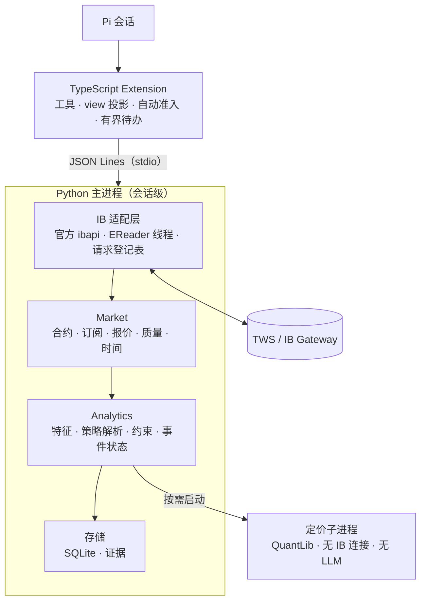

# Pi 期权 package 方案（Claude v0.2，工作名 `pi-options`）

| 项 | 内容 |
| --- | --- |
| 版本 | Claude v0.2，替代 Claude v0.1 研究框架（`docs/2026-09-30_pi_options_package_research_v0.1.md`） |
| 日期 | 2026-10-01 |
| 性质 | 产品与架构方案。尚无实现，所有实施阶段均为 NOT_RUN；文中耗时是实验室量级，正式数字待实测 |
| 依据 | Codex v0.2（《Option Package 产品规划与架构方案 v0.2》与《IBKR 数据获取与计算责任矩阵 v0.2》）；《Pi 期权 package 两套方案全景对比》（`docs/2026-09-30_pi_options_proposals_comparison.md`）的融合建议与缺陷登记；本轮核查 S4 与实验 E17 |
| 与 Codex v0.2 的关系 | **不另立平行规范**。产品骨架、工具、数据语义和计算归属沿用 Codex v0.2；字段级的请求、回调与计算归属以 Codex 的数据矩阵为唯一详细定义（本文用"矩阵 I01""矩阵 Q05"等引用其条目）。本文给出完整的产品与架构描述，并标出增补与修正，便于直接并入 Codex 方案 |
| 证据 | E11–E13：`docs/evidence/2026-09-30_options_lab/`；S1–S3、E14–E16：`docs/evidence/2026-09-30_options_comparison_lab/`；S4、E17：`docs/evidence/2026-10-01_options_v0.2_lab/` |

**标记**：未加标记的设计沿用 Codex v0.2；「＋」为本版增补；「△」为对 Claude v0.1 的修正。「已核实」= 官方文档或源码确认；「已实测」= 本地实验复现；「待实测」= 只能在实施后测量。

---

## 0. 一页结论

**定位**：让现有 Pi 员工具备期权市场研究、合约与策略构造及评估、按需持仓风险分析，以及会话内由重要变化驱动研究的能力；也可以独立使用。不下单、不行权、不调仓。

**相对 v0.1 的变化**

1. **骨架改用 Codex v0.2**：
   - v1 策略范围收窄为单腿加四种同到期垂直价差；波动率曲面、POP、β 加权、跨期结构设加入条件；
   - 当前 IV 与希腊值直接使用 IBKR 原生值，本地模型只处理 IBKR 接口覆盖不了的未来情景；
   - 一个会话级 Python 主进程持有唯一的 IB 连接，重计算放在按需启动的定价子进程；
   - 会话内持续关注（watch）进入 v1，默认关闭，显式启动。
2. **△ 修正 v0.1 的 10 处错误**（对比文档 §6.1 的 C-1–C-10），涉及数据类型、行权方式、成交量字段、裸卖看跌风险、"自算为主"等。
3. **＋ 本版增补**（Codex v0.2 没有，或只有原则）：
   - **情景基准规则**：先把每条腿的本地波动率校准到该腿的标记价，再在同一模型里施加冲击（E17）；
   - **IV 可识别性的具体规则**：直接用 IBKR 原生的 Bid/Ask IV 区间宽度判断，缺一侧时用"半价差 ÷ vega"近似（E15，相关系数 0.996）；
   - **组合层硬约束**：加入候选后，组合的最大理论亏损、名义杠杆和集中度不得越限（针对 LiveOption 发现的"杠杆叠加"）；
   - **Agent 行为评测**：统计不交易率、被拒绝率和尾部分布，并做去掉希腊值、去掉持仓状态的消融实验；
   - **持续关注的成本护栏**：行情线预算、自动研究的模型回合预算、阈值滞后；
   - **官方 `ibapi` 的许可与安装路线**：许可为 GPL-3.0-or-later；uv 无法直接安装官方 zip，需要"下载 → 校验哈希 → 本地构建 wheel → 按哈希锁定"，已实测可行（S4）；
   - **与 Qlib 包的协调约定**：clientId 区间、行情线预算、Pi 版本，以及 IB 客户端的统一决定；
   - **具体样例**：StrategySpec、ResolvedStrategy、GateResult、研究草稿。

**需要你确认的事项**（§14，都给了默认答案，可以直接回复"按默认"）：
1. 持续关注是否进 v1（默认：进，默认关闭）；
2. IB 客户端（默认：官方 `ibapi`，并评估 Qlib 包是否同步切换）；
3. 是否公开发布（默认：团队内部使用）；
4. 第二批策略（请告诉我你常用的 2–3 类）；
5. 行情订阅现状（实时还是延迟）。

---

## 1. 版本关系与采纳记录

| 来源 | 内容 | 本文位置 |
| --- | --- | --- |
| 沿用 Codex v0.2 | 定位与岗位任务 W1–W6；v1 范围与加入条件；数据与计算分工及矩阵；固定 view；三条定价路径；IV 可识别性思路；两阶段解析；GateResult 四种状态；文件持仓；持续关注与操作合同；一个主进程加定价子进程；六个工具；SQLite + 不可变证据 + Markdown；OP0–OP5；验收 V01–V28；探针 P01–P12 | §2–§12 |
| 保留自 Claude v0.1 | LiveOption 与 OQL 的教训；实验 E11–E13；历史数据路线 R1–R4（转为研究立项的输入）；行情线耗时估算；可选的 HTML 报告 | §5、§6、§11、§12 |
| △ 修正 Claude v0.1 | C-1 数据类型以 `marketDataType` 回调为准；C-2 行权方式来自受控规格，结算方式读 `settlementMethod`；C-3 单合约成交量是默认 tick 8；C-4 裸卖看涨风险无界、裸卖看跌有界；C-5 按用途选择数值来源；C-6 可识别性按价差衡量；C-7 跨期结构另设条件、波动率冲击逐项定义；C-8 约束不满足是业务结果；C-9 只保留一条生产定价路径；C-10 IV Rank 只用同口径序列 | §4–§6 |
| ＋ 本版新增 | E17 情景基准规则；S4 安装路线；组合层约束；行为评测；持续关注成本护栏；跨包协调；具体样例 | §5.5、§6、§8、§9、§12 |

---

## 2. 产品定位与岗位任务

### 2.1 在团队中的位置

| 单元 | 责任 |
| --- | --- |
| 现有团队／启动器 | 员工身份、会话启动、给员工加载哪些包 |
| Pi 原生会话 | 模型、推理、工具循环、上下文、压缩与对话历史 |
| pi-intercom | 员工之间的委派、沟通与文件交接 |
| pi-options（本包） | IBKR 期权数据、确定性分析、策略与持仓研究工具、会话内自动研究入口 |
| 其他专业包（Technical、Quant 等） | 各自独立，不是本包的运行依赖 |

本包不写死员工姓名，不决定团队层级，不读取其他包的内部状态；需要交接时输出文件引用。

### 2.2 岗位任务

| 工作 | 典型问题 | 完成结果 |
| --- | --- | --- |
| W1 市场研究 | "这只股票哪些期限的风险定价值得关注？" | 带范围、时点、数据质量和反证的波动率与活跃度简报 |
| W2 合约与策略构造 | "在给定观点、期限和预算下，比较几种表达方式" | 由真实合约组成的候选、选择依据，以及无法满足的条件 |
| W3 风险与情景评估 | "标的价格、IV 和时间变化后，这个结构会怎样？" | 成本、到期盈亏、当前敏感度、受支持的情景及其局限 |
| W4 持仓研究 | "加入这个候选后，这份持仓的风险怎么变？" | 同一来源、同一时点下的前后比较与集中度 |
| W5 持续关注 | "这些条件发生重要变化时，让员工去研究" | 程序发现变化原因，在当前 Pi 会话中开展研究；普通变化保持安静 |
| W6 正式交付与复核 | "保存这次比较，之后能复核依据" | 输入和方法可追溯的报告，并说明哪些记录能跨重启保留 |

### 2.3 非目标

- 下单、撤单、行权、调仓；
- Pi 退出后仍运行的后台服务；
- 全市场扫描、全链常驻订阅；
- 完整的历史期权回测（另行立项，见 §3.3）；
- 承诺收益的交易建议；
- 把无法观测的事实当作结论（例如做市商净 Gamma、真实资金流方向）。

---

## 3. v1 能力范围

### 3.1 核心能力

| 能力 | v1 交付深度 |
| --- | --- |
| 合约与行情 | 标准美股与 ETF 期权：有限范围的发现与确认；报价；IBKR 原生 IV 与希腊值（按侧别）；成交量（默认 tick 8）；OI（generic 101，回调 27/28） |
| 市场研究 | 报价流动性；各到期日 ATM 附近的 IV；同一来源侧别下的偏斜与期限关系；OI 与成交量分布 |
| 历史背景 | IBKR 标的 IV/HV 历史；同口径的 Rank 与 Percentile；收盘收益的已实现波动率 |
| 策略研究 | 单腿，以及四种同到期垂直价差（牛市看涨、熊市看涨、牛市看跌、熊市看跌）的解析、比较、成本、到期盈亏和约束检查 |
| 情景重估 | 对选中合约做本地美式或欧式重估，覆盖标的价格、IV 与日期情景；＋ 基准校准到标记价（§5.5） |
| 持仓集合 | 从文件或腿列表导入；分标的敏感度、集中度、加入候选前后的比较；＋ 组合层硬约束（§6.5） |
| 会话内持续关注 | 当前基线、指标越界、组合条件变化、已知日期窗口、依据修订；＋ 成本护栏（§8.4） |
| 输出 | 默认在会话中回答；正式保存为 Markdown 报告加证据目录；非执行的研究草稿 |

### 3.2 加入条件（不是 v1 的隐含义务）

| 能力 | 加入条件 |
| --- | --- |
| 长跨式与宽跨式、备兑与保护性股票组合、四腿结构（铁鹰、蝶式） | 有真实任务需要；补齐该结构专用的成本、尾部与指派测试 |
| 跨期结构（日历、对角价差） | 明确每个到期日的现金流、剩余腿和估值时点 |
| SVI 或完整曲面拟合 | 输入覆盖、稳健校准、失效时的返回方式和套利诊断都通过验收 |
| POP 与期望值 | 明确概率测度、退出时点、分布假设、费用和样本 |
| 0DTE | 日内剩余期限、行权与结算截止、数据时效和数值误差专门验收 |
| β 加权与因子压力 | 基准行情、估计窗口和定义明确；"VIX 涨 10 点"到各合约 IV 的映射另行定义 |
| 通过 API 读取持仓与 P&L | 用户明确授权；验证请求范围和口径 |
| WhatIf 保证金预览 | 显式启用；只对少数选中的候选使用；遵守官方的频率建议 |
| ＋ HTML 报告 | 需要盈亏图、微笑曲线等图表时启用（§11） |

### 3.3 范围说明

- 先用一个标的完成数值与完整工作流的验收，再验证多个研究范围之间的隔离。可同时关注的标的数、到期日数和合约数不写成固定上限，实际规模受行情权限、共享额度、请求速率和计算能力约束。
- 不假定乘数恒为 100。非标准交割、指数期权、期货期权、跨币种各有独立的支持门槛。
- ＋ **规则检验类研究**（例如"IV rank 高时卖权是否有优势"）和完整回测另行立项。IBKR 不提供已到期期权的历史和期权日终数据，只有标的 IV 历史而没有期权价格，无法检验具体的期权结构。立项时的数据选项沿用 v0.1 的 R1–R4（标的 IV 指数研究、前向积累快照、DoltHub 免费数据、付费数据），其中 DoltHub 每个标的每天约 190–210 个合约、4 个到期日（2026-09-28 实测）。

---

## 4. 数据与计算分工

### 4.1 原则

直接取得来源能明确提供的值；本地计算研究任务需要的派生结果；用独立模型处理可控的未来情景；额外事实和假设显式进入；数据支持不了的结论，不伪装成精确指标。"IBKR 已经算好的，不为展示再造一遍。"

### 4.2 来源标记

每个值用两个维度标识，不建设来源注册平台：
- **传输来源**：`ibkr_api`、`user_input`、`local` 或明确的规格来源；
- **语义类别**：观测与合约资料、供应商模型或统计、本地确定性结果、显式假设。

例如：bid 是 IBKR 传来的观测；Model IV 是 IBKR 传来的模型结果；中间价是本地由报价算出的参考；未来情景价格是本地模型在假设下的输出。四者不能都叫 `market_price`。

### 4.3 关键数据事实（字段级细节见矩阵）

| 内容 | 来源与说明 | 矩阵条目 |
| --- | --- | --- |
| 到期日、行权价候选、乘数 | `reqSecDefOptParams`：只用于发现范围；组合可能无效；没有报价，也没有 delta | I01 |
| 实际合约 | `reqContractDetails`：conId、乘数、tradingClass、到期字段、时区与交易时段 | I02–I06 |
| 结算方式 | `ContractDetails.settlementMethod`（Physical/Cash）；**只有官方客户端能解析**（S1、S3） | I07 |
| 行权方式 | 没有可通用的字段，由受控规格表提供；`nextOptionType` 是债券字段，不能借用 | I08 |
| 报价与当日成交量 | 默认字段：bid/ask（tick 1/2）、数量（0/3）、last、单合约当日成交量（tick 8） | Q01–Q04 |
| 持仓量（OI） | 请求 generic 101，回调 27/28（旧的 22 已弃用）；业务日期常常未知 | Q05 |
| Call/Put 汇总成交量 | 请求 generic 100，回调 29/30，与 tick 8 不同 | Q06 |
| 当前 IV 与希腊值 | tick 10–13，分 Bid/Ask/Last/Model 四个侧别，同时给出 optPrice、undPrice、pvDividend、tickAttrib；实时值需要期权和标的两份订阅 | G01–G04 |
| IBKR 按需计算 | `calculateImpliedVolatility`、`calculateOptionPrice`：没有未来日期、利率曲线和股息路径参数 | G05–G07 |
| 标的 IV/HV | 实时：106→24、104→23、411→58；历史 bar：`OPTION_IMPLIED_VOLATILITY`、`HISTORICAL_VOLATILITY`。实时字段与历史序列在验证可比之前不拼接 | H01–H05 |
| 股息 | 456→59 只是概要（其中是"下次股息日期"，不一定是除息日）；`pvDividend` 是现值 | D01–D02 |
| 事件 | 需要 Wall Street Horizon 研究订阅；缺失时为 UNKNOWN | D03 |
| 利率 | 没有可控曲线，需显式来源或用户假设，不默认 r=0、q=0 | D05 |
| 数据类型 | 以 `marketDataType` 回调为准，市场时段另行记录（△ C-1） | Q11 |
| 无法取得 | 期权实时逐笔、已到期期权历史与日终数据、真实主动买卖方向、做市商净 Gamma | Q13–Q14、H08、S17 |

### 4.4 运行限制（已核实）

- **行情线**：默认 100 条，TWS 界面与所有 API 连接共享，换 clientId 不会增加额度；超限返回错误 101（Max number of tickers has been reached）。
- **请求速率**：上限为行情线数 ÷ 2 每秒；超限返回错误 100。本包自我限速，默认远低于上限（例如 10 次/秒，可配置）。
- **snapshot**：只有默认字段，约 11 秒后结束，不保证字段齐全；需要 OI、标的 IV/HV 或股息时，用有界的流式请求，取到后立即取消。
- **订阅状态**：错误 354 表示未订阅，10090 表示部分未订阅，10197 表示存在竞争会话（同一用户名在别处登录）。没有实时订阅时可以使用延迟数据，延迟数据也有对应的期权计算字段。
- **耗时估算**（待实测）：读取 N 个合约、可用行情线为 L、每批等待报价与希腊值到齐的时间为 t，总耗时约为 ⌈N/L⌉ × t。例如 N=400、L=40、t=2 秒时约 20 秒，所以默认只取与问题相关的子集。

---

## 5. 分析方法

### 5.1 报价质量

- 零买价可以是真实观测，不等于缺失；缺失、未设置和非有限值在归一化时分开处理。
- 买卖两侧时间不同时保留时间差；报价交叉时，中间价不再视为正常参考。
- 流动性报告给出价差、数量、时效和成交背景，而不是只给一个分数；OI 高不等于能按当前价格成交。

### 5.2 波动率观察点与可识别性

- **观察点的口径**：偏斜和期限比较默认使用同一 view 中 IBKR 同一侧别的 IV（默认 Model IV），不混用侧别。需要单一的中间价 IV 时（例如 ATM 期限点），用 IBKR 的 `calculateImpliedVolatility` 对中间价反解，使所有观察点来自同一个供应商模型；不平均两侧 IV（E14：多数情况差异很小，实值、低 vega 的合约最多差 2.2 个波动率点）。
- **ATM**：取合格合约中 |K−S| 最小者，看涨与看跌分别记录；改用远期平值需要远期输入。ATM 合约更换、近月到期滚动、方法切换都记录为"样本或方法变化"，不当作 IV 冲击。
- ＋ **可识别性规则**：
  - IV 区间取 IBKR 原生的 [Bid IV, Ask IV]（同一供应商模型）；缺一侧时用"半价差 ÷ 每波动率点 vega"近似半宽（E15：与精确半宽的相关系数为 0.996）；
  - 初始阈值（待 OP0 用代表性数据校准，校准结果及其来源写入配置）：区间全宽 ≤ 3 个波动率点，可用于偏斜、期限比较和自动阈值；3–8 点，只展示；> 8 点或某一侧无法求解，标为"不可用于精度比较"；
  - 价格处于内在价值平台的美式合约，IV 不可识别（E13、E17b）；
  - 不可识别只影响依赖 IV 精度的能力，该合约的报价和到期盈亏照常可用。

### 5.3 历史位置与已实现波动率

- **Rank 与 Percentile**：只在一条同口径序列上计算，公式见矩阵 §5.3；同时给出窗口、截止日、样本数和缺口（△ C-10）。
- **已实现波动率**：默认用收盘对数收益，`RV = sample_std(ln(C_i/C_{i−1})) × sqrt(A)`，需要 N+1 个价格；A=252 作为美股交易日口径的显式参数。其他估计方法按任务加入。
- IBKR 原生 HV 直接展示，不与自定义 RV 混名。

### 5.4 活跃度与 OI

按到期日、行权价和认购/认沽展示，每个比率都带分母和覆盖范围；部分链不能叫"全市场 Put/Call Ratio"。OI 不代表做市商方向，新的 OI 值不代表刚刚发生同等数量的开仓。OI×Gamma 只能作为无方向的敏感度分布；若要给出 GEX，必须带持仓方向假设并标为估计，不进 v1 核心。

### 5.5 定价路径与情景引擎

| 路径 | 用途 | 输出标识 |
| --- | --- | --- |
| IBKR 原生 | 描述当前的 IV 与希腊值 | `ibkr_native`：侧别、原始值、观测时间 |
| IBKR 按需计算 | 当前时点下，给定价格求 IV，或给定 IV 与标的价格求价格 | `ibkr_custom`：请求参数与结果 |
| 本地模型（QuantLib，唯一的生产引擎，△ C-9） | 未来估值日期、显式的利率与股息、重复情景、扩展希腊值 | `local_model`：模型、输入、方法版本、精度诊断 |

＋ **情景基准规则**（E17）：
1. 每条腿选定标记价：默认为中间价；评估进场成本时用对手价，并注明。
2. 在声明的利率、股息和日期下，反解本地波动率，使本地模型在基准点上恰好复现标记价。
3. 所有冲击都在同一个本地模型里计算：情景盈亏 = V_local(冲击后) − 标记价。
4. 无法校准的腿（标记价处于内在价值平台，或在边界内无解）：默认拒绝该腿的跨日情景并说明原因；用户可以显式选择用 IBKR Model IV 作为输入，结果标为"未校准"。

E17 的验证（美式看跌 K=100、45 天；标记价来自另一套模型输入）：校准后基准误差为 3×10⁻⁶ 美元/张。"时间推进 1 天"的情景：校准法 −4.21 美元，供应商模型参照 −4.26，混用两个模型 −9.10。标的下跌 5% 的情景：校准法 280.64，参照 282.25，混用 276.33。剩下的差异来自声明的利率和股息不同，这是合理的假设差异，必须在报告中写明。

**情景对象**：标的价格冲击；IV 冲击（注明是绝对波动率点还是相对比例）；估值日期；利率与股息设置；费用；波动率曲线的移动假设。"VIX 涨 10 点"不自动等于每张合约的 IV 都加 10 个点（△ C-7）。情景日期如果越过某条腿的到期日，必须处理已发生的现金流或交割；不支持时明确拒绝该情景。

**引擎与计算量**：美式期权默认用 FD 400×400（约 7.6 ms/次）；CRR 801 步作为较快的替代（约 3.4 ms/次，与 FD 最大差 0.005）；BAW 只用于估算（误差可达 0.14）。两腿价差在 45 点网格上计算 90 次：FD 约 0.68 秒，CRR 约 0.31 秒，加上两条腿的校准约 0.13 秒（E17c，单线程）。

### 5.6 希腊值单位与聚合

- 输出单位：Delta 为每 1 美元标的价格变化对应的每张合约价值变化（含乘数）；Vega 为每 1 个波动率点；Theta 为每个日历日。
- 保留 IBKR 原始值；归一化公式在探针 P04（官方定义、TWS 对照、小扰动验证）通过后固定，不凭字段名把所有数值乘 100。
- 组合希腊值由逐腿值、符号、数量和乘数换算而来。不同标的的原始 Delta 不相加；同币种的美元 Delta 可以汇总，但保留按标的拆分。

---

## 6. 策略链路

### 6.1 LLM 与程序的分工

```text
研究问题／用户条件
  → LLM 形成候选结构，写成 StrategySpec
  → 程序发现有限的合约范围，取得必要数据（固定 view）
  → 确定性解析到真实合约与数量
  → 本地评估成本、风险、情景与约束（GateResult）
  → LLM 比较、解释冲突、提出替代假设
  → 按需保存报告与非执行的研究草稿
```

LLM 不从原始期权链里挑合约，也不计算价格、希腊值或概率（依据 OQL 与 LiveOption 的结论）；但不限于"填表"，输入已经是精确合约时，直接进入确认和评估。

### 6.2 StrategySpec（＋ 样例）

```yaml
schema: piopt.strategy_spec/1
research:
  underlying: {symbol: XYZ, sec_type: STK, currency: USD}   # 由程序确认为唯一 conId
  view: "中性偏多，预计 6 周内不跌破近期支撑"              # 研究假设，由用户或 LLM 提出
  horizon_days: 42                                           # 目标持有期，与到期范围分开
structure:
  template: bull_put_spread                                  # 或 custom，配合 legs 使用
  legs:
    - {right: P, side: sell, ratio: 1,
       expiry: {dte_range: [35, 56], prefer: monthly},
       strike: {delta_abs: 0.30, delta_tolerance: 0.05}}     # Delta 按绝对值表达
    - {right: P, side: buy, ratio: 1,
       expiry: {same_as_leg: 0},
       strike: {offset_from_leg: 0, points: -5}}
  quantity: {contracts: 2}
hard_constraints:
  max_theoretical_loss_usd: 2000
  allowed_risk_classes: [defined_risk]                       # 不允许无界风险结构
  min_open_interest: 500
  max_relative_spread: 0.10                                  # (ask − bid) / mid
  no_earnings_before_expiry: true                            # 没有事件数据时结果为 UNKNOWN
soft_preferences: [lower_cost, robust_to_iv_change]
evaluation:
  entry_pricing: natural                                     # 进场成本按对手价，另附中间价参考
  scenarios: {spot_pct: [-10, -5, 0, 5, 10], vol_pts: [-5, 0, 5], days_forward: [0, 14, 28]}
  fees: {per_contract_usd: 0.65}                             # 用户声明的费用假设（示例值）
  book_ref: null                                             # 关联持仓时启用组合层约束（§6.5）
```

不要求每次填满所有字段；未填写的约束不检查，并在结果中标为 NOT_APPLICABLE。

### 6.3 两阶段解析

1. **静态缩小**：按身份、方向、到期范围和行权价范围缩小候选。链参数里没有 delta，不能只靠链参数选出目标 delta 的合约。
2. **取得报价后筛选**：按 delta、OI、价差和报价时效筛选。候选数和查询预算都有上限；数据不足时说明可比较的范围，不把缺失当作零，也不自动无限扩大订阅。
3. **输出**：选中的 conId、数量、真实指标、所用 view、硬约束结果和选择理由。并列时按声明的规则稳定排序，"最优"只指搜索范围内的最优。
4. 新增的腿不在当前 view 中时，显式取得一个包含全部所需腿的新 view，不能暗中补报价后继续用旧的 view。

＋ ResolvedStrategy 样例（字段示意，数值为虚构）：

```json
{
  "schema": "piopt.resolved_strategy/1",
  "spec_ref": "spec_0001",
  "view_id": "view_0007",
  "legs": [
    {"conId": 111111, "right": "P", "strike": 95.0, "expiry": "20261120", "multiplier": 100,
     "side": "sell", "quantity": 2,
     "selection": {"ibkr_model_delta": -0.29, "open_interest": 1800, "relative_spread": 0.06,
                   "quote_age_s": 3, "market_data_type": 1}},
    {"conId": 222222, "right": "P", "strike": 90.0, "expiry": "20261120", "multiplier": 100,
     "side": "buy", "quantity": 2,
     "selection": {"ibkr_model_delta": -0.18, "open_interest": 950, "relative_spread": 0.08,
                   "quote_age_s": 3, "market_data_type": 1}}
  ],
  "tie_break": "|delta − 目标| 最小 → OI 较高 → conId 较小",
  "unmet": []
}
```

### 6.4 结果语义

"候选不满足约束"是成功完成评估的业务结果，在结构化结果中返回 GateResult，而不是工具异常（△ C-8）。只有请求的后续产物无法合法生成时（例如要求生成合格草稿，但存在 FAIL），才返回带原因和数据的失败，避免模型反复重试同一个候选。

### 6.5 GateResult：策略层与组合层

每项检查返回 PASS、FAIL、UNKNOWN 或 NOT_APPLICABLE，并附实际值、阈值和理由；硬约束与一般警告分开。用户禁止持有期内有财报而日期未知时，结果是 UNKNOWN，不能改写为"未发现财报，因此通过"。

**策略层**

| 检查 | 类型 | 规则 |
| --- | --- | --- |
| 最大理论亏损 | 硬约束 | 不超过规格预算；按乘数、数量和费用假设计算 |
| 风险类别 | 硬约束 | 程序分类：有限风险；裸卖看跌（有界但可能很大，同时报告被指派后的现金需求）；裸卖看涨（无界）。只允许规格列出的类别（△ C-4） |
| 流动性 | 按规格 | OI、相对价差、报价时效 |
| 数据质量 | 硬约束 | 所用报价的数据类型和时效；依赖 IV 精度的检查要求 IV 可识别 |
| 事件 | 按规格 | 持有期内是否有财报或除息；没有数据时为 UNKNOWN |
| 指派与到期 | 警告 | 卖出腿为实值且时间价值低于预计股息；临近到期 |
| 保证金 | 警告 | 本地规则估算，标明"不是 IBKR 账户保证金"；WhatIf 默认关闭 |

＋ **组合层**（关联持仓时启用，针对 LiveOption 发现的"杠杆叠加"）

| 检查 | 类型 | 规则 |
| --- | --- | --- |
| 组合最大理论亏损 | 硬约束 | 加入候选后，组合在情景网格上的最大亏损不超过组合预算；网格上的极值不称为"全局最大" |
| 名义杠杆 | 硬约束 | Delta 调整后的期权名义金额 ÷ 声明资金不超过上限；没有声明资金时为 UNKNOWN |
| 展期与加仓 | 硬约束 | 视为新的候选，重新执行组合层检查，不能借展期绕过预算 |
| 集中度 | 警告或按规格 | 单一标的、单一到期日的占比 |
| 净卖出 Gamma 与 Vega | 警告 | 组合净卖出 Gamma、Vega 超过阈值时提示 |

### 6.6 研究草稿

只有全部硬约束为 PASS 时，才生成"合格"的研究草稿；FAIL 或 UNKNOWN 时保留分析和拒绝原因，不生成合格草稿。`executable:false` 是产品声明，不是会话的权限沙箱；本包不提供任何交易执行工具。

```json
{
  "schema": "piopt.research_draft/1",
  "executable": false,
  "resolved_ref": "resolved_0003",
  "gate_ref": "gate_0003",
  "hard_constraints": "all PASS",
  "entry_pricing": "natural",
  "reference_net_credit_per_spread": {"natural": 1.05, "mid": 1.18},
  "view_id": "view_0007",
  "valid_until": "2026-10-01T20:00:00Z",
  "note": "研究草稿，不是订单，本包不会提交"
}
```

---

## 7. 持仓研究

- **输入**：用户选定的 CSV/JSON 文件或结构化腿列表。至少包含合约身份、带符号的数量、币种和数据截至时点；需要计算进场以来的盈亏时，再要求成本及其单位。程序逐行确认合约，错误行不静默跳过。
- **来源区分**：真实持仓导出、模拟组合和研究情景要分开标记。没有提供现金和其他资产时，只评价这份集合，不声称覆盖整个账户。
- **输出**：按标的和到期日汇总成本与敏感度；集中度；情景变化；加入候选前后的差异；依赖缺口；＋ 组合层约束结果（§6.5）。
- **API 读取**（可选，需授权）：`reqPositions`、`reqPnLSingle`、`reqAccountSummary` 可以提供持仓、成本、P&L 和保证金状态。默认不调用，启用时核实账户范围、成本量纲、币种和 P&L 重置口径。
- **隐私**：报告中隐去账户号，不复制持仓原件。

---

## 8. 会话内持续关注

### 8.1 事件类型

| 事件 | 研究原因 | 防误判条件 |
| --- | --- | --- |
| 当前基线 | start、resume 或研究范围真正改变后，说明当前事实 | 相同的启动不重复；不把基线称为新行情 |
| 指标越界 | 选定的同口径 IV、期限差或偏斜越过明确阈值 | 来源和样本可比；报价质量合格；IV 可识别；单位明确 |
| 组合条件变化 | 关注的候选或持仓的成本、敏感度、预算条件变化 | 腿与数量固定；输入齐备；重估时点明确 |
| 已知日期窗口 | 到期日、已确认的财报或除息窗口临近 | 日期有来源；没有数据时不报告"无事件" |
| 依据修订 | 新到达的修订改变了当前的重要结论 | 不把修订说成市场刚刚变动；方法更换时重建基线 |

### 8.2 操作合同

| 操作 | 行为 |
| --- | --- |
| 首次手动查询 | 可以准备只读的行情资源；自动研究保持关闭 |
| `start` | 开启明确的观察集合，建立当前基线；幂等 |
| `pause` | 停止自动投递，清空未提交的待办；行情、计算和主动查询照常 |
| `resume` | 按当前事实重建基线，不补跑暂停期间的全部事件 |
| `stop` | 关闭准入，取消本包的请求，清理行情订阅和定价子进程 |
| `status` | 显示当前范围、订阅与计算状态、行情线占用、预算余量；不推进事件 |
| reload、会话替换 | 清理旧运行；新会话需要明确启动 |
| 父通道 EOF 或异常退出 | 子进程定向清理后退出；旧回调不得作用于新运行 |

### 8.3 有界投递

Python 判断金融事件，TypeScript 管理自动开关、Pi 的忙闲和投递。每个会话最多有一份已提交的自动研究和一份有界的合并待办；提交前重新核对依据和事件是否仍然有效。普通的数据更新和工具查询不会自动触发模型请求；quiet 状态下自动提交为零。

### 8.4 ＋ 成本护栏

- **行情线**：观察项和持仓的固定订阅优先，计入本包预算；研究扩展使用剩余额度；`status` 显示占用。
- **模型回合预算**：每个会话每天的自动研究提交次数设上限（默认 8 次，可配置）；达到上限后保持安静并在 `status` 中显示，不能通过合并待办绕过。
- **阈值滞后**：每个越界条件同时定义进入阈值和重置阈值（例如越过 1.0 个波动率点进入，回落 0.5 点重置），避免在阈值附近反复触发。
- **OP1 实测**：行情线占用、quiet 期间的误报次数、每次自动研究的 token 与费用。没有用户给定的数值时，默认阈值必须先在代表性数据上测过噪声与漏报，才能写入正式规格。

---

## 9. 运行架构

### 9.1 运行结构



### 9.2 职责

| 组件 | 拥有 | 不做 |
| --- | --- | --- |
| IB 适配层 | 唯一的 IB 连接；请求登记表；连接代次；取消与超时 | 不挑策略，不做计算 |
| Market | 合约与请求表、订阅预算、报价、来源状态、字段时间、有限的历史输入 | 不调用模型 |
| Analytics | 纯函数、策略解析、约束检查、有限的事件状态、定价任务调度 | 不管理 Pi 队列，不另开行情连接 |
| 定价子进程 | 选中合约的校准与情景重估 | 不连 IB，不调用 LLM，不持久运行 |
| TypeScript Extension | Pi 工具、view 的文本投影、启停、消息投递 | 不重写金融公式，不重新判定风险阈值 |

每个状态只有一个负责者，同一个金融方法只有一个实现。

### 9.3 ＋ IB 客户端：官方 `ibapi`

**选择**：只使用官方 `ibapi` 一套客户端（与 Codex v0.2 一致，替换 v0.1 的 ib_async）。

| 方面 | 官方 `ibapi` 10.50.2 | ib_async 2.1.0 |
| --- | --- | --- |
| 维护 | Stable 1050、Latest 1051 均于 2026-09-29 发布 | 最后一次提交在 2025-12-06 |
| 协议 | 最高客户端版本 226 | 最高客户端版本 178 |
| `settlementMethod` | 能解析 | 不能解析 |
| 许可 | GPL-3.0-or-later | BSD |
| 依赖 | 精确锁定 `protobuf==5.29.5` | 无 protobuf |
| 编程模型 | 线程式 EReader，没有 asyncio 接口 | asyncio |
| 安装 | 不能从 PyPI 安装（同名包是 2020 年的 9.81.1） | PyPI |

**安装路线**（S4 已在 Linux x86_64 实测，macOS arm64 待 OP0 验证）：
1. 从 IBKR 官方下载页取得 zip，按锁定的 sha256 校验，不一致即停止。
2. 用 Python `zipfile` 解压 `IBJts/source/pythonclient`。uv 不能直接把 zip 写成 URL 依赖：zip 中 `META-INF/` 条目的大小字段不一致，uv 解压器会拒绝。
3. 用 `uv build --wheel` 构建 `ibapi-10.50.2-py3-none-any.whl`。
4. 用 `uv pip compile --find-links <wheel 目录> --generate-hashes` 锁定，再用 `uv pip sync --require-hashes` 安装。实测锁定 5 个包（ibapi、protobuf、QuantLib、numpy、scipy），`uv pip check` 通过。

本包不随包分发官方源码或 wheel，而是在用户机器上安装时构建。**许可**：团队内部使用一般不涉及分发义务；如果公开发布，需要按实际发布方式评估与 GPL 的兼容性，这是许可判断，本文不作结论（§14 第 3 项）。

**适配层设计**：
- 只实现所需回调的最小 EWrapper/EClient 子类；EReader 线程把消息放进队列，由单一调度线程处理回调；
- 请求登记表把 reqId 映射到用途、conId、所需字段、截止时间、取消令牌和连接代次；
- 每个任务按"所需字段到齐"判断完成，超时返回已取得的范围和缺口；
- 取消或重连之后迟到的回调，按连接代次丢弃，不依赖日志字符串判断状态；
- 官方附带的 `TWSSyncWrapper` 只作参考：它是阻塞式的，并且自带下单和撤单方法，不作为基类。

**静态检查**：CI 禁止本包代码调用 `placeOrder`、`cancelOrder`、`reqGlobalCancel`、`exerciseOptions`、`place_order_sync`、`cancel_order_sync`。

### 9.4 ＋ 连接卫生与跨包协调

- **clientId**：使用专用区间（默认 700–799，可配置），不用 0（0 会与 TWS 手工下单绑定）；遇到 326（clientId 被占用）时只在本包区间内换号。
- **握手**：官方客户端连接后只发送 startApi；服务端推送 nextValidId 和 managedAccounts（账户号），账户号不写入日志或报告。官方客户端不会自动请求持仓或账户更新，这与 ib_async 的 `connectAsync` 不同（E7a）。
- **行情线预算**：本包上限默认 40 条（可配置）。TWS 界面的占用无法从 API 得知，遇到错误 101 时显式缩小范围，不换 clientId 绕过。
- **与 Qlib 包协调**：
  - clientId 区间互不重叠；
  - Qlib 包以历史请求为主，不常驻行情线，两者的冲突主要来自 TWS 界面的占用；
  - Pi 版本：本包需要 ≥ 0.99.1，Qlib 包的基线是 0.87.1。在同一个 Pi 中同时加载两个包时，需要在 ≥ 0.99.1 上重跑 Qlib 包的共存测试（A v2.1 的 C09）；
  - IB 客户端：Qlib 包使用 ib_async，存在停更和协议落后的风险，建议两个包统一决定。
- 不修改共享 Gateway 的设置，不重启 Gateway；重连只恢复同一来源。

### 9.5 环境与生命周期

- **环境**：runtime 在最终路径构建，使用完整锁并原子发布 READY（沿用 A v2.1 的合同）。按能力分项检查：`ibapi` 能否导入、IB 连通性与订阅状态（通过探针）、QuantLib 微型定价、可选的 HTML 与浏览器核验。
- **主进程**：Extension 工厂只注册资源；主进程在首次允许的查询时启动；父通道 EOF 时退出；reload 或会话替换时清理旧运行。
- **定价子进程**：单次或短批任务，并发数为 1，超时即取消（终止其进程组）。QuantLib 底层非线程安全，估值日期是全局状态，因此不在线程间共享对象。

---

## 10. Pi 集成

- **版本**：目标 ≥ 0.99.1；npm 上的最新版本为 0.99.2（2026-09-30 发布）。OP0 固定具体版本。
- **工具**：

| 工具 | 职责 | 暴露方式 | 注解与写入 |
| --- | --- | --- | --- |
| `options_context` | 确定范围、准备数据，返回概览和 view | direct | 访问外部；不改变已有观察项 |
| `options_details` | 从指定 view 读取期权链、波动率、活跃度、质量等栏目 | direct | 只读，分页时不换数据 |
| `options_strategy` | 根据 StrategySpec 解析并比较有限候选 | direct | 缺少合约时返回数据需求，再显式取新 view |
| `options_evaluate` | 对明确的腿计算成本、到期盈亏、情景和约束 | direct | 不暗中取新报价 |
| `options_portfolio` | 解析持仓集合，分析风险与增量 | deferred | 文件内容版本固定；默认不查询账户 |
| `options_report` | 保存正式研究的证据与研究草稿 | deferred | 写文件；没有合格的约束结果时不生成合格草稿 |

- **结构化结果**：数据型结果使用 `outputSchema` 和 `structuredContent`，同时保留给模型看的 `content`；单位、截止时间、缺口和约束结论必须出现在 `content` 中，不能只藏在结构化字段里。`annotations` 只是行为提示，不是安全隔离。
- **命令**：`/options` 提供 status、start、pause、resume、stop。
- **Skill**：一个入口 Skill `options-work`，加按需读取的参考资料：波动率方法、策略模板、风险清单、IBKR 操作与错误码、报告措辞。

---

## 11. 存储与交付

```text
<工作目录>/.options/
  config.json             # 预算、clientId 区间、阈值及其校准来源；不含任何凭据
  observations.sqlite     # 有限的同口径市场特征与索引，不是任务队列
  evidence/<id>/          # 正式研究实际用到的数据、方法和约束结果
  reports/<id>.md         # 可读报告
```

- **正式评估**至少包含：研究条件、真实腿、引用的数据与时间、原生与本地来源的区分、公式或模型身份、费用与事件和股息假设、结果、约束检查、缺口与反证。
- 没有保存的内存 view 不承诺跨重启存在；被正式引用的依据一并持久化。
- ＋ **HTML 报告**（可选，§14 第 6 项）：需要盈亏图、微笑曲线等图表时启用，沿用 Qlib 包的做法：数字绑定证据，离线 HTML，核验记录绑定 HTML 哈希。
- **数据许可**：IBKR API 下载页说明，未经书面许可，不得把 TWS API 用于向第三方或非 IB 客户传播市场数据等受许可信息。报告用于本人或团队内部，不对外分发原始行情。

---

## 12. 实施路线与验收

### 12.1 阶段

| 阶段 | 工作 | 必须留下的证据 |
| --- | --- | --- |
| OP0 范围与接口门槛 | 固定首版任务和合约规格；依赖安装；矩阵所列原始回调的探针；关键数值向量。＋ 写定许可决定；按 S4 路线在 macOS arm64 与 Linux x86_64 上安装；实现 IB 适配层骨架与请求登记表；把 E11–E17 转为数值测试向量 | 来源、版本、单位、字段可得性、取不到的输入；安装与哈希锁定的记录 |
| OP1 双入口最小闭环 | 主动查询 context/details，加会话自动基线和一个越界研究；最小清理。＋ 测量行情线占用、误报率和每次自动研究的费用 | 真实的 Pi 工具调用、消息消费、固定依据与实际回答 |
| OP2 核心市场与策略 | 行情范围、波动率与 OI、StrategySpec、解析、到期盈亏、约束与一致性 | 选定任务的真实数据路径与正反样例 |
| OP3 精选定价与持仓 | 跨日重估、IV 质量、持仓文件、增量风险。＋ 情景基准校准规则、组合层约束 | 固定的模型输入与容差、数值收敛、覆盖范围声明 |
| OP4 持续工作 | 完整的观察项、忙碌时合并、撤销、时间推进、暂停与恢复、容量与异常清理。＋ 模型回合预算 | quiet、越界、撤销、超时、退出的实际链路 |
| OP5 发行与效果 | 干净安装、目标员工的隔离加载、岗位任务与性能验收。＋ Agent 行为评测与消融（§12.5） | 可安装的发行包、使用说明、真实支持范围与实施记录 |

### 12.2 ＋ 新增验收场景（接在 Codex 的 V01–V28 之后）

| 编号 | 场景 | 通过条件 |
| --- | --- | --- |
| V29 | 情景基准 | 校准后基准与标记价之差 ≤ 0.01 美元/张；不出现混用两个模型的盈亏；无法校准的腿不被静默定价 |
| V30 | IV 区间 | Bid/Ask IV 区间与"半价差 ÷ vega"近似一致；不可用于精度比较的合约不进入偏斜计算和自动阈值 |
| V31 | 组合层约束 | 展期或加仓后组合最大理论亏损超出预算时为 FAIL；没有声明资金时杠杆检查为 UNKNOWN |
| V32 | 行为评测 | 报告不交易率、被拒绝率和尾部分布；约束无法满足或数据不足的题目，Agent 应给出拒绝或"证据不足" |
| V33 | 消融 | 去掉希腊值、去掉持仓状态、去掉 IV 历史后，Agent 的建议按预期改变（用干预检验信息是否被使用） |
| V34 | 安装 | 只从官方 zip 安装；哈希校验失败即停止；不从 PyPI 解析 `ibapi` |
| V35 | 持续关注成本 | 自动研究预算耗尽后保持安静；`status` 显示行情线占用与预算余量 |

### 12.3 ＋ 新增探针（接在 Codex 的 P01–P12 之后）

| 探针 | 检查 | 保存的证据 |
| --- | --- | --- |
| P13 安装路线 | 在 macOS arm64 与 Linux x86_64 上按 S4 路线安装，确认 protobuf 5.29.5 与其他依赖兼容 | 锁文件、哈希、`uv pip check` 输出 |
| P14 连接卫生 | 连接后只出现握手消息；managedAccounts 不进入日志；没有自动的持仓或账户请求 | 脱敏后的原始消息记录 |

### 12.4 数值测试向量

E11–E17 的脚本作为 OP0 数值测试的起点，只借用测试方法，不把实验结果当作本包验收：欧式 IV 的精度与可识别性（E11、E15）、美式与欧式偏差（E12）、美式引擎一致性（E13）、中间价 IV（E14）、模型混用（E16）、情景基准与网格成本（E17）。

### 12.5 ＋ Agent 行为评测

依据 LiveOption 的结论——现有 LLM Agent 在各项期权任务中的典型收益为负，模型之间的差异经多重比较校正后不显著，去掉持仓状态后平均最大回撤约翻三倍——评测不只看"答对没有"：

- **题库**：包括"应当拒绝或不交易"的题目（约束无法满足、数据不足、事件未知），以及"应当给出结构"的题目。题库与接受条件在运行前冻结。
- **指标**：合约、数字、日期和概率口径的正确率；不交易率与被拒绝率；所推荐结构在情景网格上的尾部亏损分布；无谓确认与重试次数。
- **消融**：分别去掉希腊值、持仓状态、IV 历史，重跑同一题目，比较建议的变化（V33）。
- **模型**：至少两个不同家族的模型配置，分别报告；样本量小时报告区间，不出具"可靠"之类的结论。

---

## 13. 风险

| 风险 | 影响 | 缓解 |
| --- | --- | --- |
| 官方客户端的许可与安装 | 公开发布受限；安装链路较长 | 默认团队内部使用；S4 路线加哈希锁定；P13 验证两个平台 |
| ib_async 停更（影响 Qlib 包） | 协议落后，新字段读不到 | 两个包统一决定客户端 |
| 行情线争用 | 研究范围被迫缩小 | 本包预算、固定订阅优先、遇 101 显式缩小范围 |
| 没有实时订阅 | 只能用延迟数据 | 标注数据类型；持续关注默认只使用通过实时门槛的数据 |
| IV 不可识别 | 偏斜和阈值失真 | §5.2 的区间规则与阈值校准 |
| 模型风险（利率、股息、提前行权） | 情景结果偏差 | 校准到标记价；假设显式写明；与 IBKR 值并列 |
| 自动研究的噪声与费用 | 误报、费用失控 | §8.4 成本护栏；OP1 实测 |
| Pi 0.99 新 API 仍在演进 | 适配层变动 | 固定版本；适配层保持薄 |
| 事件数据缺失 | 相关约束只能是 UNKNOWN | 用户提供日期，或启用 WSH 订阅 |
| LLM 期权 Agent 的固有弱点 | 杠杆叠加、尾部亏损 | 组合层硬约束；行为评测与消融 |

---

## 14. 待决策（附默认答案）

| # | 问题 | 默认答案 | 说明 |
| --- | --- | --- | --- |
| 1 | 会话内持续关注是否进 v1？ | 进 v1，默认关闭，显式 start | 会持续占用少量行情线，每次越界触发一次模型回合 |
| 2 | IB 客户端 | 官方 `ibapi` | 同时评估 Qlib 包是否切换 |
| 3 | 是否公开发布？ | 团队内部使用 | 决定 GPL 是否构成约束 |
| 4 | 第二批策略 | 请告诉我你常用的 2–3 类 | 例如：备兑与现金担保看跌、长跨式、铁鹰 |
| 5 | 行情订阅现状 | 按"可能只有延迟数据"设计；有实时订阅时自动使用 | 决定 OP0 的默认数据类型 |
| 6 | 报告格式 | Markdown；需要图表时加 HTML | 影响 OP2 的工作量 |
| 7 | 规则检验类研究 | 另立项目 | 数据路线在立项时选择 |
| 8 | 持仓来源 | 文件导入；只读 API 作为可选项 | API 需要单独授权 |
| 9 | 事件日历 | 用户提供；有 WSH 订阅时使用 | 否则相关约束为 UNKNOWN |

---

## 附录 A　实验与核查

| 编号 | 内容 | 位置 |
| --- | --- | --- |
| E11–E13 | 欧式 IV 精度与速度；美式与欧式偏差；美式引擎一致性 | `docs/evidence/2026-09-30_options_lab/` |
| S1–S3 | 官方 `ibapi` 与 ib_async 的许可、依赖、协议版本、字段支持 | `docs/evidence/2026-09-30_options_comparison_lab/` |
| E14–E16 | 中间价 IV；可识别性规则；模型混用 | 同上 |
| S4 | 官方客户端的安装路线：URL 依赖失败；本地构建 wheel 并按哈希锁定成功 | `docs/evidence/2026-10-01_options_v0.2_lab/` |
| E17 | 情景基准校准规则；不可识别腿；两腿价差网格的计算成本 | 同上 |
| E7 | ib_async `connectAsync` 的启动请求 | `docs/evidence/2026-09-29_v2.1_audit_lab/` |

## 附录 B　来源（访问日期 2026-09-30 至 2026-10-01）

- **Codex v0.2**：《Option Package 产品规划与架构方案 v0.2》《IBKR 数据获取与计算责任矩阵 v0.2》（用户提供的附件）
- **对比文档**：`docs/2026-09-30_pi_options_proposals_comparison.md`
- **IBKR TWS API**：
  - ContractDetails 参考：<https://www.interactivebrokers.com/docs/tws-api/ref/contract-details>
  - Tick Types：<https://www.interactivebrokers.com/docs/tws-api/doc/market-data-live/available-tick-types/introduction>
  - Streaming Data Snapshots：<https://www.interactivebrokers.com/docs/tws-api/doc/market-data-live/top-of-book-l-1/streaming-data-snapshots>
  - Delayed Market Data：<https://www.interactivebrokers.com/docs/tws-api/doc/market-data-delayed/introduction>
  - Market Data Lines：<https://www.interactivebrokers.com/docs/general/market-data-subscriptions/market-data-lines/introduction>
  - Pacing Limitations：<https://www.interactivebrokers.com/docs/tws-api/doc/pacing-limitations/introduction>
  - Error Codes：<https://www.interactivebrokers.com/docs/tws-api/doc/error-handling/error-codes>
  - Unavailable Historical Data：<https://www.interactivebrokers.com/docs/tws-api/doc/market-data-historical/historical-data-limitations/unavailable-historical-data>
  - Test Order Impact（WhatIf）：<https://www.interactivebrokers.com/docs/tws-api/doc/orders/test-order-impact-what-if>
  - Wall Street Horizon：<https://www.interactivebrokers.com/docs/tws-api/doc/wall-street-horizon/introduction>
- **官方 TWS API 下载页**：<https://interactivebrokers.github.io/>
- **PyPI**：ibapi <https://pypi.org/project/ibapi/>；ib_async <https://pypi.org/project/ib_async/>；QuantLib 1.43 <https://pypi.org/project/QuantLib/1.43/>；protobuf 5.29.5 <https://pypi.org/project/protobuf/5.29.5/>
- **Pi**：npm `@earendil-works/pi-coding-agent`（最新 0.99.2）；文档 <https://pi.dev/docs/latest/extensions>
- **论文**：LiveOption <https://arxiv.org/abs/2609.33470>；OQL <https://arxiv.org/abs/2603.16434>

---

*本文是设计方案，不是运行验收。实验只使用合成输入，未连接 IBKR；S4 只在 Linux x86_64 上验证。*
